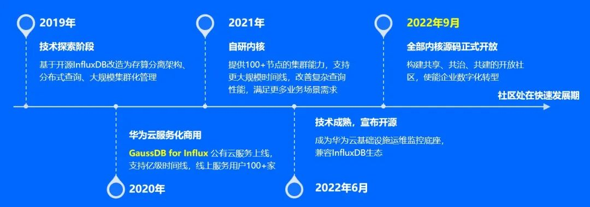
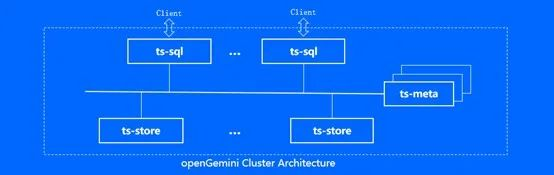
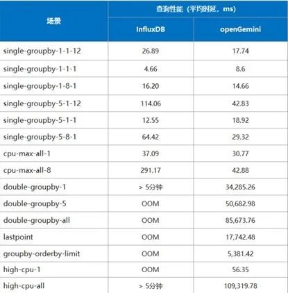
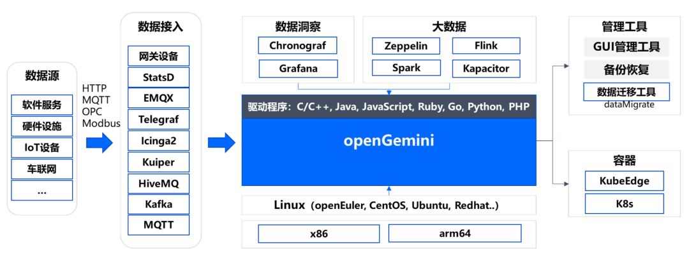

2023年2月，openGemini正式申请加入openEuler DB
SIG，现已完成对openEuler的各项兼容性测试，并计划加入openEuler
23.03版本。openGemini可在物联网、嵌入式、边缘计算、运维监控（AIOps）等领域与openEuler社区展开合作，充分利用自身技术竞争优势，增强openEuler社区的影响力和竞争力的同时，不断挖掘新的机遇和技术创新点，进一步提升openGemini的技术实力和社区品牌知名度。

项目地址

[https://github.com/openGemini](https://github.com/openGemini)

[https://gitee.com/src-openeuler/openGemini](https://gitee.com/src-openeuler/openGemini)

项目官网

[http://opengemini.org](http://opengemini.org)

# openGemini简介

openGemini是由华为云数据库创新实验室自行设计、研发并面向全球开源的一款云原生分布式时序数据库。主要面向物联网和运维监控等场景，提供海量时序数据库处理和分析的开源解决方案，以进一步降低企业运营和运维成本，提升产品质量和生产效率。

# openGemini发展历程

如图所示，openGemini经历了最初由InfluxDB改造的技术探索，到云服务商用、自研内核增强和开源等多个阶段的发展，经受住了华为云内外部100余家用户不同业务场景的打磨和检验，现已开放全部核心源码，全面拥抱开源，打造共享、共治、共建的开发社区，构建全球技术生态和影响力。

**openGemini的架构**

openGemini采用MPP大规模并行处理分层架构，由ts-sql、ts-store、ts-meta组成。

-   **ts-sql**：统一处理客户端请求

数据按照时间线一致性Hash方式打散存储在不同的ts-store中，在查询语句执行期间，从ts-store获取数据并汇总，并返回客户端

-   **ts-meta**：统一元数据管理

数据库集群元数据和数据库元数据管理，如节点信息、数据保留时间、数据分区信息、表信息等

-   **ts-store**：统一数据管理

将原始数据按时序优化的数据格式进行统一组织和存储，查询时，按指定时间范围和时间线ID查询数据，并根据过滤条件，返回目标数据

**openGemini的核心竞争力**

openGemini开源后持续版本迭代，现已发布v1.0.0版本，在高性能、高安全、企业级特性、可扩展性、功能、应用开发等六个方面已全面具备生产环境可使用的完整能力。

● 高性能

openGemini针对物联网、运维监控等领域海量数据管理和分析诉求，对计算引擎和存储引擎做了大量的优化设计，取得了明显效果。

-   支持亿级指标管理

-   每秒千万级指标数据并发写入

-   查询万级指标数据毫秒级响应

在30万指标，259亿条指标测试数据的场景下，采用TSBS（https://github.com/timescale/tsbs）性能测试工具，相比开源的单机版InfluxDB
v1.7，openGemini单机版写入性能提升5倍，简单查询提升2-5倍，复杂查询响应时间缩短60倍以上。

● 高安全

openGemini支持数据传输加密和用户密码鉴权，支持用户弱密码校验和审计日志。此外，openGemini集群的各组件之间通信可配置HTTPS双向认证（Mutual
TLS），确保每一个链接都是可信的。

● 企业级特性

openGemini具备丰富的企业级特性，部分关键特性如下：

**l  高效数据压缩**

采用列式数据存储，不同数据类型对应不同的数据压缩算法，可支持PB级指标数据的长期数据存储。存储成本是传统关系型数据库
1/20，是NoSQL的 1/10

**l  支持数据保留策略**

数据过期后自动删除

**l  支持写前日志（WAL）**

设备掉电后，缓存数据不丢失

**l  流计算**

当数据量较大时，传统降采样工作方式对磁盘I/O消耗过大，I/O放大也很严重。可通过流式计算，写入数据的同时实现数据降采样，该方法具有高性能、网络开销小的优点

**l  数据分级存储**

结合时序数据特点，数据按热、温、冷多级存储，进一步提升查询性能

**l  内核运行状态可观测**

提供了开源监控工具ts-monitor，可采集260余种内核和服务器关键监控指标，更好的观察系统的运行状况，快速排查、定位和解决问题

**l 多级降采样**

可针对不同时间范围的历史数据进行不同方式的降采样，保留历史数据的特征，原地删除其余历史数据，节约存储空间50%，计算资源节约90%

**l  向量化**

充分利用架构的并行处理优势，每次迭代批量返回数据，大数据量下查询性能更好

**l  异常检测和预测**

内置基于AI的时序异常检测和预测分析框架，具备流批一体、严重程度分级等多项能力，支持每秒万级实时指标数据并发检测，内含13种异常检测器，可覆盖常见的离群点、数值变化、阈值、持续上升下降等常见时序异常场景

● 可扩展性

openGemini集群由ts-sql、ts-store、ts-meta组成，支持单一组件独立横向扩展，可支持100+节点的集群规模。

● 功能

openGemini提供丰富的聚合算子（如COUNT、SUM、MAX等）、统计分析算子（如PERCENTILE分位数、DIFFERENCE等）、算术分析算子（如ABS、LN等）、Full
Join、近似统计算子以及字符串算子（如SUBSTR、STR等）共60+个。此外，还支持秒、毫秒、纳秒等多种时间精度以及TAG（分组查询）和嵌套查询。

● 应用开发（技术生态）

如图所示，在时序大数据处理方面，openGemini已初步完成对数据接入、数据存储、数据可视化、数据分析、数据迁移等各环节关键能力构建和技术生态对接。

在云原生方面，openGemini已支持K8s、KubeEdge容器化部署，正在积极和KubeEdge社区进行联合创新。

在底层操作系统方面，openGemini支持主流的Linux系统和x86、arm64等架构。

在应用开发方面，支持C/C++、Java、JavaScript、Ruby、GO、Python、PHP等主流的开发语言。

# 总结

openGemini具备卓越的读写性能和高效的数据分析能力，支持单机和集群，部署形式多样，可边缘、可云、可物理机部署，支持主流开发语言，二进制运行，无第三方组件依赖，带有260+项系统运行指标监控，运维简单。

独木难成林，百川聚江海。openGemini与openEuler共同携手，双方将在IoT、AIOps、嵌入式、边缘计算等领域深化技术解决方案集成，开展线上开源协作和线下社区互动等方面合作，努力为全球开发者提供一流的行业解决方案。

**如果您对openGemini感兴趣，欢迎联系我们**

[https://opengemini.org/contact-us](https://opengemini.org/contact-us)
