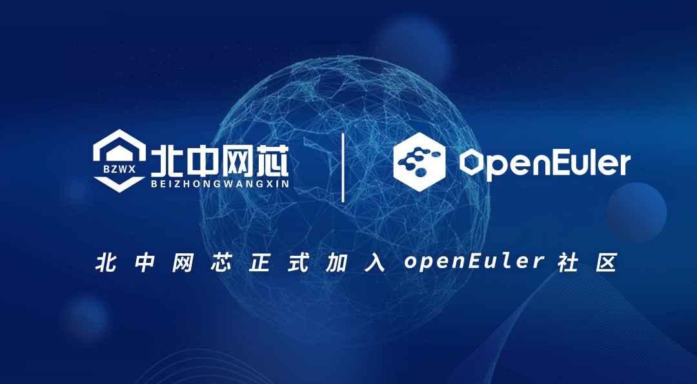

近日，成都北中网芯科技有限公司（简称"北中网芯"）签署 CLA（Contributor
License Agreement 贡献者许可协议），正式加入 openEuler
开源社区。作为国产DPU领域的先行者，北中网芯未来将积极参与 openEuler
社区合作，与行业内的生态伙伴共建创新型开源社区。 

此次北中网芯加入 openEuler
社区，将秉承"开放、多元、创新"的原则，充分利用openEuler操作系统安全、稳定、易用等特性，结合北中网芯鲭鲨NE系列DPU芯片及智能网卡等相关产品在智能网络数据领域的强大优势，积极探索高性能DPU与操作系统系统的融合创新，更好地为云计算、5G、人工智能、边缘计算、物联网等不同业务场景的落地与应用提供强有力的支撑。与此同时，北中网芯还将基于开源，与其他社区贡献者积极互动，定期参与
openEuler SIG-DPU 会议，一起参与并推动DPU的技术创新与发展。

未来，北中网芯将大力支持 openEuler 社区建设，携手社区伙伴共促 openEuler
产业成链，生态成盟。  

# 关于北中网芯

作为专业的智能网络数据处理芯片及系统解决方案提供商，成都北中网芯科技有限公司成立于2020年4月，为北京左江科技股份有限公司（股票代码：300799）控股子公司。北中网芯专注于网络通信与安全领域芯片的设计开发，核心团队来自于业内知名企业，核心人员具有20+年通信行业工作经验，曾经成功开发和量产多款网络处理器芯片与安全芯片。
