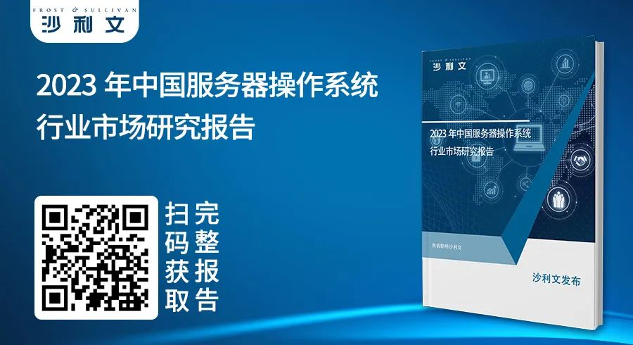

得益于新基建快速推进、政策引导下信创产业的蓬勃发展，国产服务器操作系统正逐步崛起。中国基础软件根技术自主掌控能力重视程度不断提高，越来越多的中国企业已经意识到其重要性，正在以更加积极拥抱的态度面对服务器操作系统领域的国产化替代趋势，本土的openEuler系服务器操作系统厂商迎来黄金发展期。未来中国服务器操作系统有望实现真正的国产化替代，彻底解决卡脖子困境。

**为此，2023年2月23日，弗若斯特沙利文（Frost &
Sullivan，简称"沙利文"）正式发布《2023年中国服务器操作系统行业市场研究报告》，本报告通过对中国服务器操作系统行业演变历程、发展环境的梳理与行业主要玩家的研究，解读当下中国服务器操作系统行业的市场结构和发展关键，通过展望行业未来发展趋势，为相关厂商、用户提供参考建议与启发。**

**长按扫描下方二维码获取报告**

# Part 1 中国服务器操作系统行业综述

广义的操作系统是一组系统软件程序，主要功能是负责管理调度计算机软硬件资源并为用户提供接口，网络服务器是当前操作系统的主要运行核心场景之一。在厂商生态中，闭源操作系统以Windows
Server为代表，开源操作系统以基于Linux
Kernel的各种操作系统为主，其中本土的openEuler系厂商正在迅速崛起。

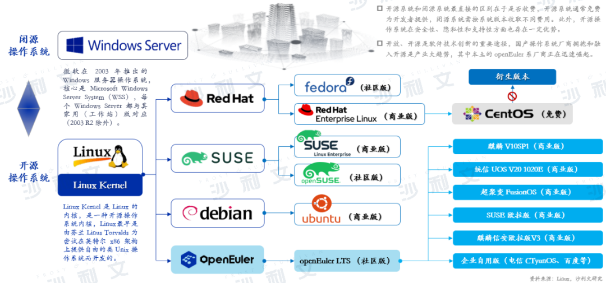

对于多样性算力的支持成为操作系统的普遍需求，云、管、边、端数字全场景的打通成为刚需。一颗芯片一个操作系统，一个场景一个软烟囱，已经不再适合，一个操作系统需要既支持X86，也支持ARM，还能支持RISC-V，对多种指令集都支持，需要操作系统实现多样性算力、全场景支持，数字世界全场景无缝协同。

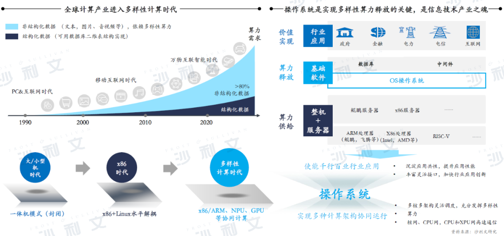

# Part 2 中国服务器操作系统行业发展环境

随着全球数字化转型的加速，数字经济已成为当前中国经济发展的核心议题，新基建则是驱动中国进入"数字经济时代"的重要引擎。一方面，以5G、智能计算中心为代表的新兴基础设施的不断建设，持续推动中国服务器及服务器操作系统需求量增长。另一方面，随着信创产业在国家政策的引导下快速成长，服务器操作系统作为核心基础软件是信创领域中的战略要塞，迎来了良好的政策发展环境。

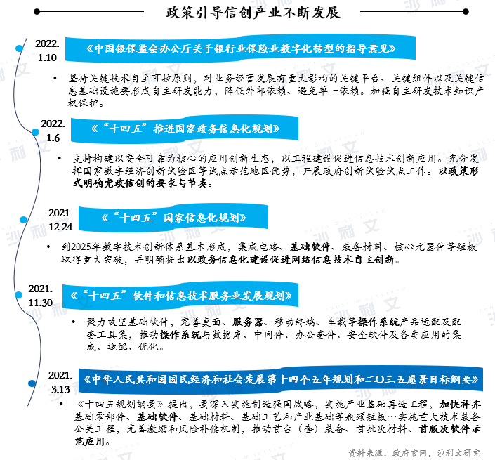

国产应用软件近年来发展迅速，但更为底层的服务操作系统等基础软件还未形成良好的生态圈，无论是开源软件还是闭源软件，根技术仍无法实现自主掌控，对外依存度仍较高。国际不稳定因素日渐增长，提升服务器操作系统根技术的自主掌控能力意义深远，否则突发的"断链"类事件，将会影响社会经济发展进程。

CentOS停止维护，用户迁移已成定局，国产开源操作系统社区迎来绝佳发展机遇。Red
Hat对于停止维护，官方口径是为了适应社区开发的快节奏，构建易于贡献与集成的机制，满足稳定应用、二次开发、场景化开发等多种需求，将所有社区整合成相互促进的生态系统。虽则Red
Hat宣布企业可免费使用CentOS
Stream系统，但来自于政府、金融、电信等领域对于稳定性要求极的用户，仍会迁移至能够满足需求的新的服务器操作系统上，也为本土依托于openEuler等国产开源社区的本土服务器操作系统厂商创造了庞大的市场空间。

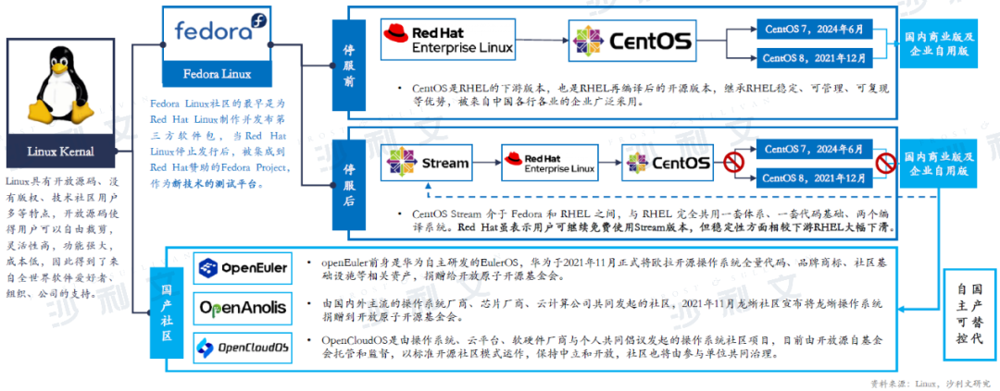

# Part 3 中国服务器操作系统行业主要玩家

服务器操作系统厂商生态中，按代码是否公开分为开源与闭源两类，其中开源系统通常免费为开发者提供，并且凭借在安全性、灵活性、创新性和支持性方面的优势广受用户欢迎。**除Fedora、RHEL（Red
Hat Enterprise
Linux）、SUSE等基于海外发展的开源社区外，本土的openEuler社区正在迅速崛起。**

openEuler开源社区依托华为10多年技术积累，是中国国产自主演进、多样性算力最优的操作系统根技术，自2021年贡献至开放原子开源基金会后高速发展，中国市场接受度高，已构建完整能力并仍在持续演进。openEuler作为数字基础设施的操作系统，目前已广泛应用在国计民生行业，包括政府、电信、金融等行业，欧拉技术路线通过产业共建，支持服务器、云计算、边缘计算、嵌入式等应用场景，构建完备的欧拉全栈生态体系，在中国服务器操作系统引领创新的大趋势下成为用户首选。同时openEuler社区作为共建、共享、共治的开源组织，源于中国融入全球，在欧洲举办的全球顶级开源峰会上的初次亮相，引发了海外开发者的热烈关注。

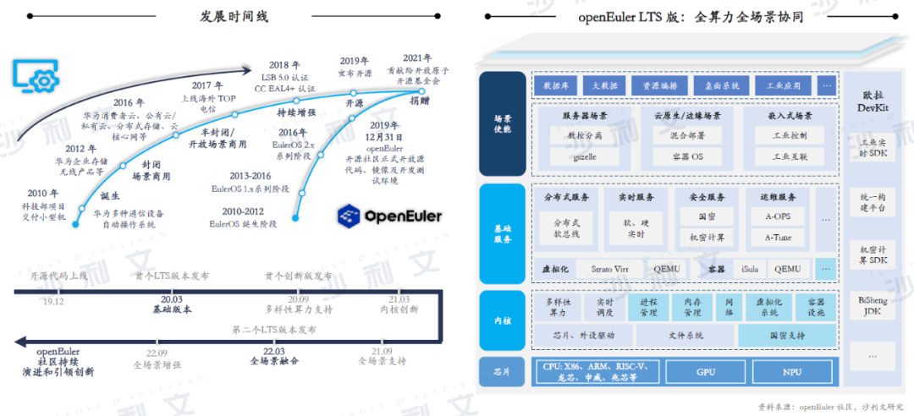

# Part 4 中国服务器操作系统行业市场结构

中国数字经济的持续发展拉动了服务器操作系统装机量的持续增长，2022年中国服务器操作系统行业装机量达401.2万套，相较于2021年的352.3万套同比增长13.9%。从2021--2022年中国市场的装机量份额变化来看，openEuler系服务器操作系统表现十分亮眼，市场份额已由2021年的15.1%提升至25.7%，同比增长约70%，远高于行业年均增速，已经跨越了生态拐点，构建起欧拉全栈生态体系。

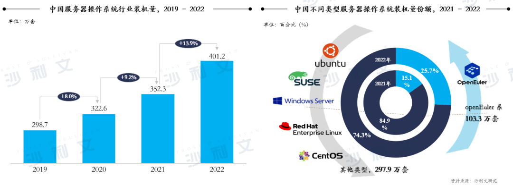

**2020年至今，openEuler系产品在中国市场取得了耀眼的成绩，年度总装机量由2020年的3.5万套已增长至2022年的103.3万套**。openEuler作为目前国内服务器操作系统领域发展领先的开源社区，已在国计民生行业装机使用百万套，成为政府、电信、金融等领域内诸多客户的首要选择，是支撑国产服务器操作系统崛起的中坚力量。**从2022年各细分领域的装机数据来看，政府、电信、金融三大领域是openEuler系产品的主要装配来源，政府领域占比最高，为31.7%**；其次是电信类主体装机量占比19.2%；金融类主体装机量占比11.1%。三大领域关键基础设施领域总装机量可占openEuler系产品2022年中国市场总装机量的62%，其他领域中则包含互联网、能源、医疗、教育、制造等。openEuler系产品在三大领域的高份额占比既是对社区精心耕耘的肯定，更是三大领域内国产基础软件蓬勃发展的见证。

**在政府领域**：2022年openEuler系服务器操作系统产品装机量高速增长，总计约32.7万套，较2021年的20.2万套增长61.6%；openEuler系产品市场份额达到50.3%，稳居第一；2022年新增装机量中64.3%为商业版本，其中openEuler系产品占政府领域商业版总装机份额的66.5%。数字化进程的稳步推进直接带动了政府领域对于基础软硬件需求的高速增长，而政府在对安全性和自主可控的高度重视下，以及对高响应度外部支持团队的强烈需求中，已将作为国产服务器操作系统优秀代表的openEuler系产品作为重点选用对象。

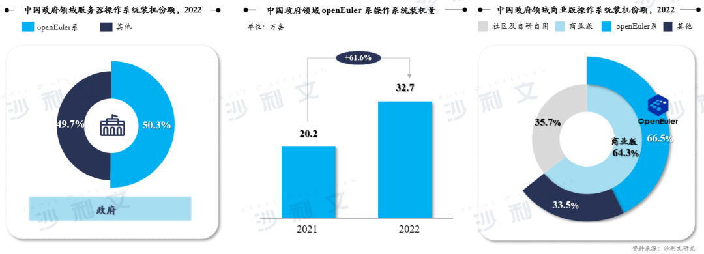

**在电信领域**：2022年openEuler系产品在中国市场的总装机量约为19.8万套，实现了57.1%的增长；openEuler系产品市场份额达到40.6%，稳居第一；商业版服务操作系统的装机份额为41.3%，openEuler系商业版本在电信领域的装机份额较低，仅占23.8%，主要系电信类企业大多通过内部技术团队打造基于openEuler社区版本的自研版本。

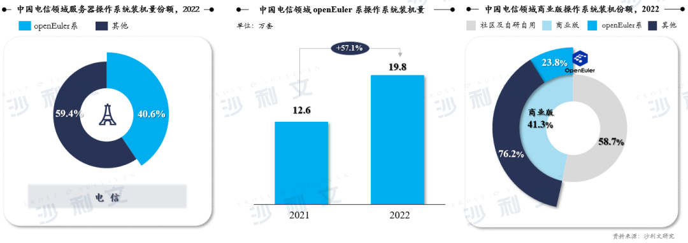

**在金融领域**：2022年openEuler在金融领域中装机量达11.5万套，同比增长61.6%；openEuler系产品市场份额达到30.6%，稳居第一；中国金融类主体对商业版服务器操作系统的偏好十分明显，2022年商业版产品占该行业年总装机量的98.1%，其中openEuler系产品在2022年商业版服务器操作系统市场中共获得了69.4%的份额。

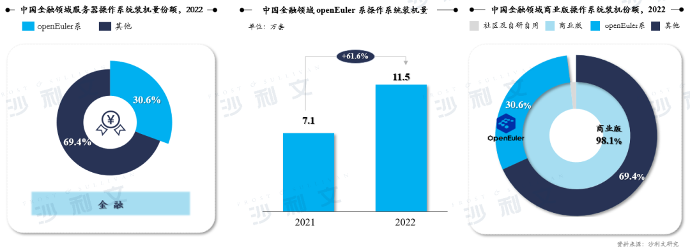

# Part 5 中国服务器操作系统行业发展趋势

**中国服务器操作系统市场蓬勃发展，预计2023年总装机量将达到447.3万套，其中openEuler系产品装机份额或将达到35.1%**，2023--2027年间有望保持约8.6%的年均复合增长率，至2027年总装机量将超过600万套。openEuler系操作系统作为国产操作系统的优秀代表，2023--2027年间装机量年均复合增长率或将超18%。

政府、电信、金融三大关键基础设施领域年装机量也将继续稳步增长，2023年装机量将分别达到74.8万套、60.0万套和44.2万套。在三大关键基础设施领域中，电信领域在信创产业高速发展的推动下，预计呈现最快的增长速度，至2027年该领域中国市场服务器操作系统的年总装机量将超过100万套；政府领域用户向openEuler系产品迁移的意愿度最高，也是openEuler系产品装机量的主要贡献来源。

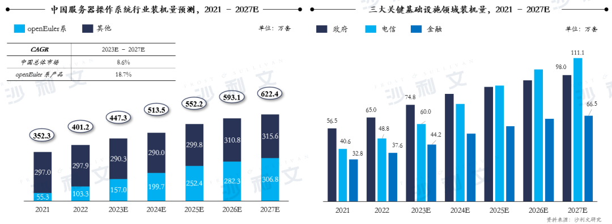

越来越多的中国企业已经意识到基础软件技术自主可控的重要性，正在以更加积极拥抱的态度面对服务器操作系统领域的国产化替代趋势。各行各业的用户们所期待的不仅是模仿跟随，更是从根技术层面的全面彻底的自主研发，热切期盼着国产操作系统可以做出自己的特色，实现服务器操作系统领域真正的国产化替代，彻底解决卡脖子困境。

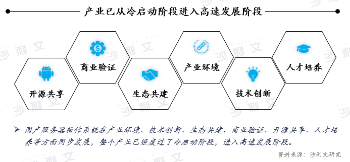

国产服务器操作系统产业已经从冷启动进入高速发展阶段。随着开源软件影响力的不断提升，服务器操作系统市场将越来越向开源倾斜。国产操作系统基本都在Linux内核的基础上，进一步开发形成自主的操作系统版本，通过采用开源内核，省去了重复造轮子的过程，缩短开发周期、节约开发成本，操作系统厂商可以把精力集中于提升用户体验和生态推广方面。海外先行者的发展历程是国产厂商选择技术路线时的良好参照，一定程度上帮助国产厂商降低了试错成本，减少了前期投入，在服务器操作系统向开源系统倾斜的牵引下，目前主流的国产服务器操作系统均是基于基础软件技术自主可控Linux开源架构开发，国产开源操作系统有望随着产业格局的变化扩大影响力。

构成丰富且持续演进的生态系统是一款操作系统最稳固的护城河。如今万物互联已成为新时代特征，多样化的应用场景正在提出差异化的计算需求，国产服务器操作系统厂商正在以此为突破点，提供适应时代技术演进的新产品。人工智能、物联网、云计算等应用场景的高速发展驱动计算架构从通用计算向更加专用的异构计算创新，需要操作系统高效协调不同硬件架构，实现软硬件协同创新。国产厂商可紧跟新时代步伐，加速研发顺应未来发展趋势和针对未来用户需求的新产品，并借此产生先发优势，进一步提升市场渗透水平。

未来随着服务器操作系统市场发展日趋成熟，各类产业资源将向少数头部优秀国产厂商汇聚。率先建立良好品牌力的优秀国产厂商将吸引更广泛的客户群体和更优质的人才团队，从而加快丰富生态圈，被更多用户选择，进入持续发展的良性循环。新技术新趋势带来了新发展机遇，但优秀国产厂商仍应脚踏实地，稳扎稳打，做好国内用户操作系统的切换，为日后出海打好本土基础。
