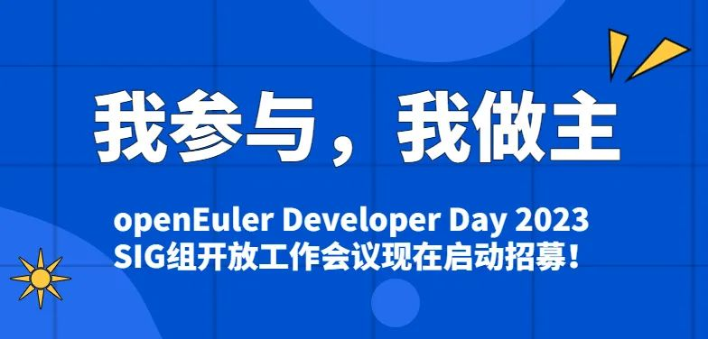
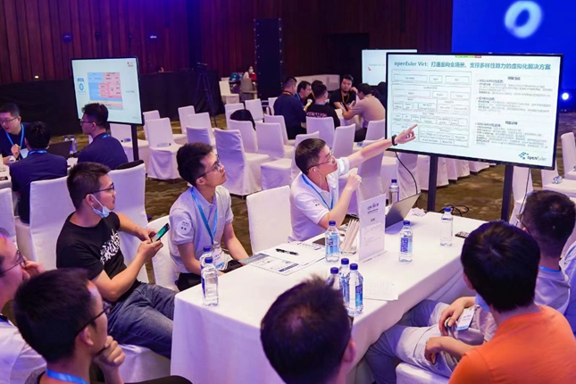
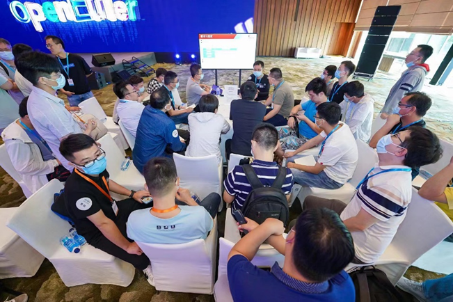
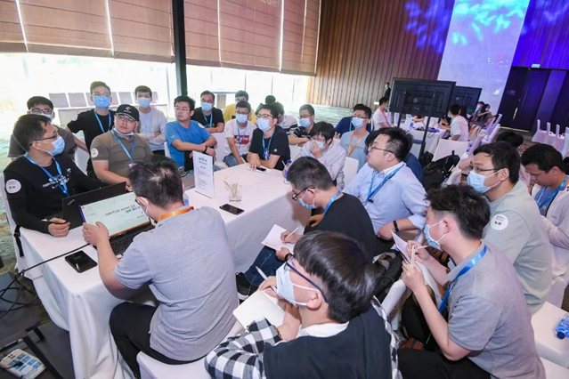
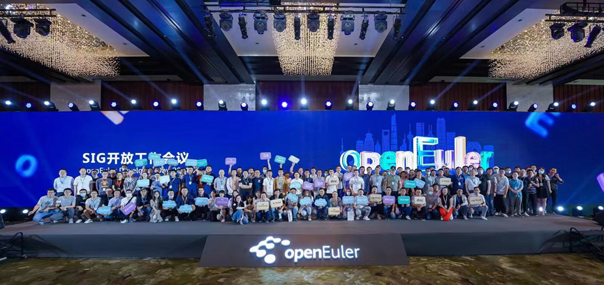
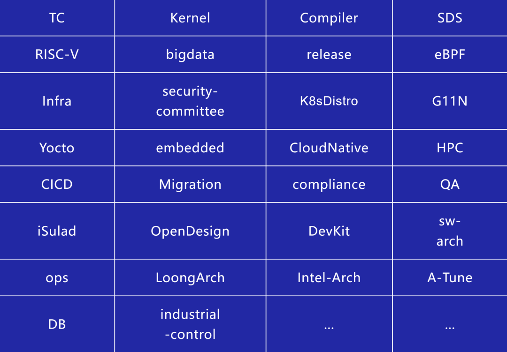

openEuler Developer Day
是由openEuler开源社区举办的开发者峰会。**旨在推动 openEuler
在多样性计算、云计算、边缘计算、服务器、嵌入式、开源硬件以及安全、迁移、运维等技术方向的持续探索和创新**。

 

# CALL FOR SIG

作为大会的重要环节之一，SIG组开放工作会议汇聚社区各个SIG组的用户和开发者，收集需求与问题，线下集中讨论**未来
6
个月的规划、技术方向、工作事项、任务分工、优先级等等**。本次SIG组开放工作会议期间讨论的工作内容，将在社区后续的任务分工中享有优先级，重点及亮点特性将有可能在后续峰会中进行发布和展示！

SIG组开放工作会议遵循开源、开放原则，议题收集、技术讨论、会议纪要等各讨论过程均对外开放，欢迎各SIG及开发者、爱好者报名参加。

**时间**：**4月21日 16:00-17:30**

**地点：上海浦东嘉里酒店**

扫码报名

SIG组开放工作会议

# 参会亮点

## 线下交流畅所欲言

工作例会都是线上举行？信息传达不方便？存在信息差？讨论不够充分？

openEuler社区将为各 SIG
组提供专门的场地，志同道合的开发者可以在线下畅所欲言地交流，一起探讨 SIG
组未来 6 个月的规划、技术方向等，欢迎各个SIG组报名参加。

往期盛况

## 行业专家进行技术支持

openEuler社区将为本次活动提供技术支持，在SIG
组开放工作会议期间，技术委员会委员以及相关行业专家将围绕各个SIG
的不同议题共同探讨。

往期盛况

## 吸引用户及开发者持续关注

作为openEuler社区一年一度的开发者盛会，openEuler Developer
Day将吸引广大用户及开发者的关注。SIG组开放工作会议作为其中重要的一部分，将吸引很多用户和开发者的关注和全程参与。欢迎各个SIG报名参加会议，现场与开发者进行交流。

往期盛况

# 跨SIG交流的绝佳场合

在SIG组开放工作会议期间，各个SIG的负责人和技术专家将齐聚一堂，是跨SIG交流的绝佳场合。参加这次会议可以和其他SIG组面对面交流，促进不同SIG未来的合作。

往期盛况

# 已报名SIG组

报名截止时间：4月5日

当前已有内核、安全、嵌入式、云原生等30+SIG报名参加SIG组开放工作会议。欢迎开发者们增加SIG，参加本次SIG组开放工作会议。[点击此处即可报名](https://shimo.im/forms/ajofLUZ8Wac7lOJY/fill)

如果您想现场参加SIG组会议，欢迎关注openEuler公众号消息，大会整体报名信息将于后期在公众号上发布。
