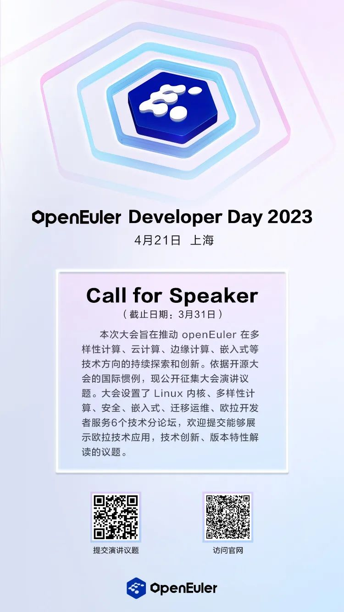
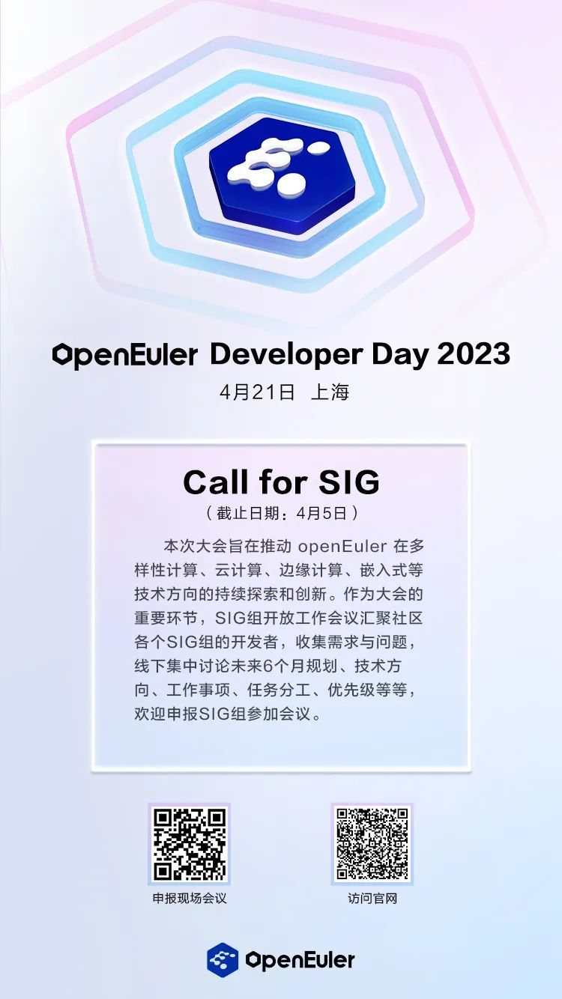
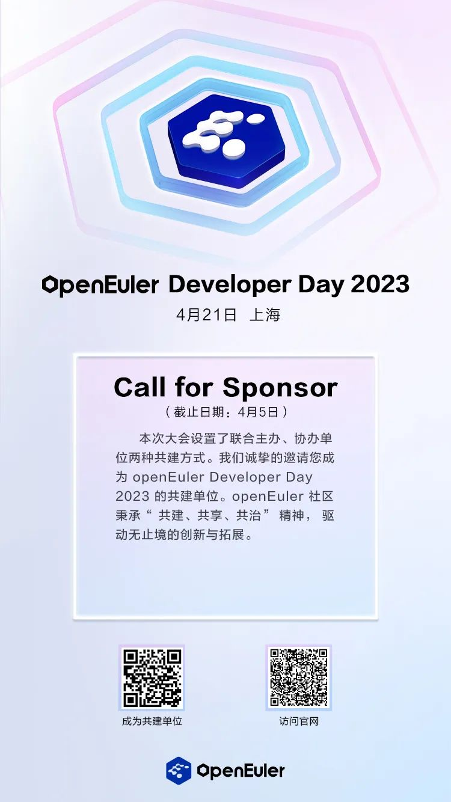
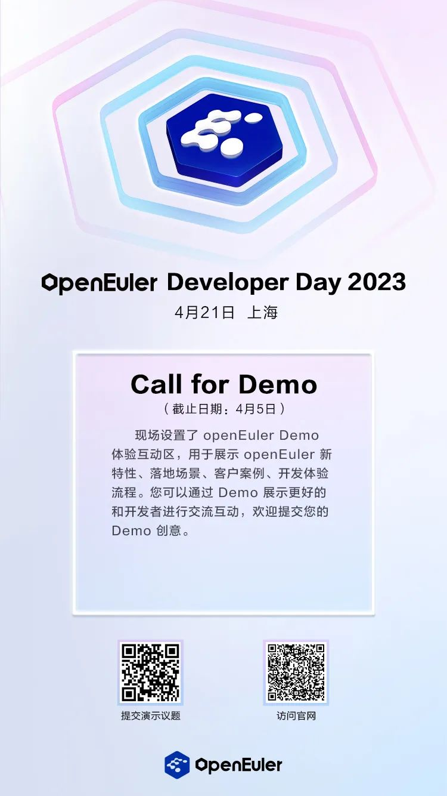

**openEuler Developer Day 2023 （简称 ODD
2023）是开放原子开源基金会旗下 openEuler
社区发起的顶级开发者峰会。ODD 2023
将于4月21日在上海浦东嘉里大酒店举办。**

ODD 2023 旨在持续推动操作系统乃至基础软件的创新和突破。本次 ODD 2023
将全面展示全新发布的 23.03
创新版本特性、多样性计算和全场景协同的技术成果、分享各行各业基于欧拉的商业实践、展示openEuler与国际开源社区和高校的合作以及研究进展。同时ODD也是社区的年度大型工作会议，协同讨论版本路线以及联合创新。openEuler
始终与开发者在一起，用欧拉构筑坚实的软件根基，成就属于每位开发者的欧拉时代。

开源是一种态度，分享是一种精神。**Call for Speaker、Call for SIG、Call
for Sponsor、Call for Demo** 现已全面开放报名。

我们诚挚的邀请您提交演讲议题、发表联合演讲、申报现场SIG会议、成为共建单位、贡献展示方案、参与社区建设。

