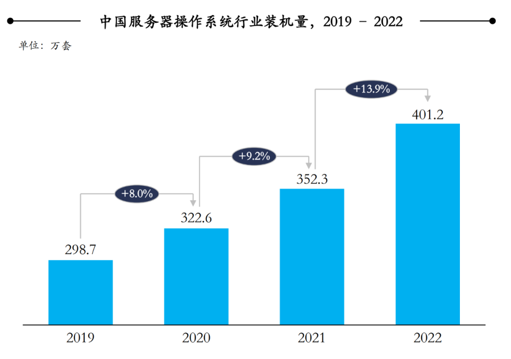
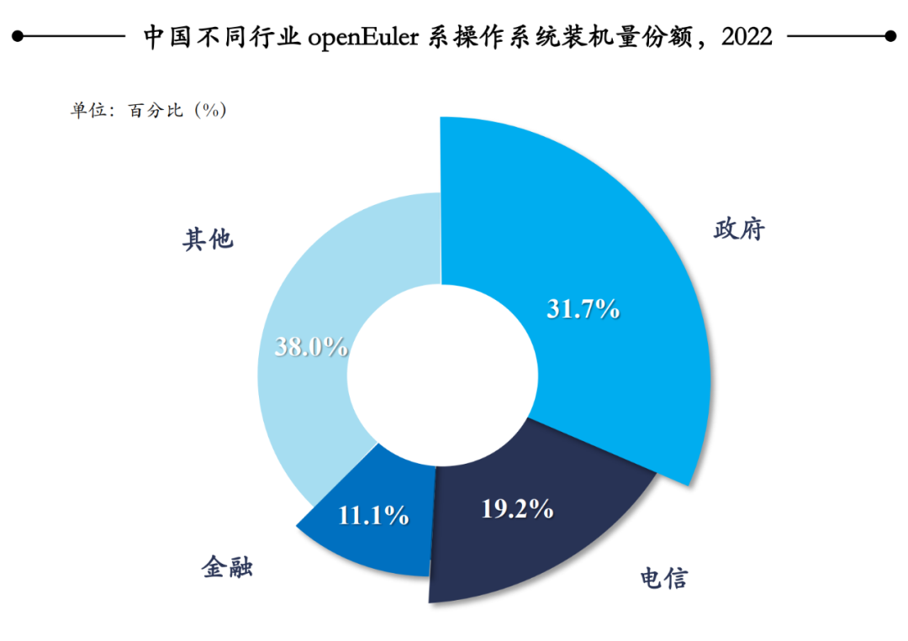
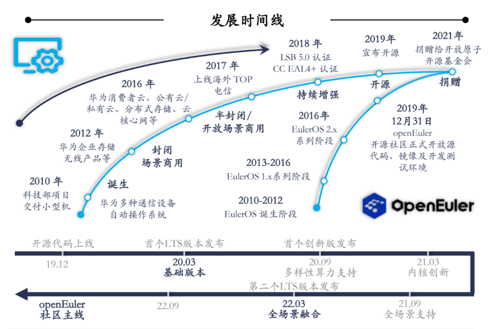
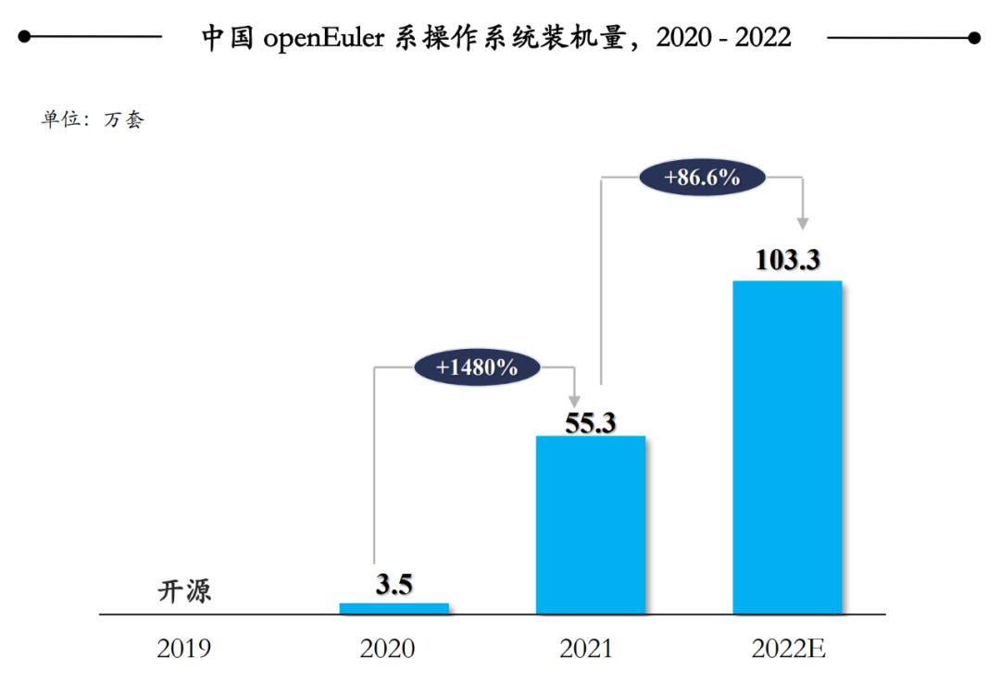

2月23日，沙利文发布的《2023年中国服务器操作系统行业市场研究报告》显示：受益于中国数字经济的增长效应，2022年中国服务器操作系统行业装机量达401.2万套，相较于2021年的352.3万套同比增长13.9%，市场保持了较高的增长速度。

其中，openEuler系服务器操作系统的贡献最为凸显，《报告》显示，openEuler的市场份额已由2021年的15.1%提升至25.7%，同比增长约70%，增长速度高达行业平均增速的5倍，成为了中国服务器操作系统产业发展的主要推动力。

经过过去两年的快速成长，欧拉已然是中国服务器操作系统的风向标，这是时代造就了欧拉，还是欧拉成就了时代？

#  "时代"是欧拉成长的源动力 

从上个世纪90年代，Linux凭借一种多任务处理的架构模式，和风靡全球的开源文化，打破了封闭式的商业操作系统的"封锁"。而从十几年前的云时代开始，分布式架构几乎让Linux在服务器端实现了"一统天下"。也是这种技术不断演进的时代变革中，欧拉诞生于2010年，并在2019年成立openEuler操作系统开源社区，欧拉正式开源。无疑，时代正在赋予欧拉成长的动力和特殊的"颜色"。

首先，正在召开的两会上，全国人大代表、麒麟信安董事长杨涛提出：当前国内主要操作系统厂商都在基于开源欧拉做商业发行版，国产操作系统"技术收敛"的基础已经坚实。这种收敛，会让生态建设会更加利于统一，包括整机、外设、数据库、中间件等庞大数量的软硬件可在根社区进行统一适配，构成国产操作系统的"统一生态"，避免国产操作系统生态的重复建设带来生态割裂。的确，在中国数字经济的大格局下，千行百业的数字化转型汹涌而来，对数字基础设施的需求与日俱增，在安全和稳定的诉求下，作为数字基础设施的重要组成部分，服务器操作系统势必会迎来最好的发展机遇。而欧拉则可以立足于中国数字经济成长的土壤，在足够多的场景下得到磨砺，这有机会让欧拉融入到世界操作系统系统发展的主流节奏。

其次，计算产业的变革机遇亦在出现。我们知道，操作系统是衔接应用和硬件的基础软件，但传统的操作系统通常较为封闭。在算力多样化的背景之下，上层应用的供应商也在逐步增多，原来芯片、整机、操作系统、中间件、数据库完全分层的模式产生了很大的变化，这意味着传统操作系统限制了新计算时代的发展和落地。因此，市场也需要开源、开放，并且生态社区完整性足够好的操作系统，来完成对市场空白的填补。显然欧拉早已意识到市场的变革，openEuler的市场表现已充分印证了这一点。

其三，服务器操作系统格局变化的机遇。2020年，CentOS宣布停服，这意味着很多老用户无法获得CentOS的安全和功能更新，为企业带来了供应链的安全风险。欧拉第一时间，承接了部分CentOS生态的后续发展和服务，但这个事件告诉我们，中国需要建设好自己的开源社区，形成可持续的开源文化，并在制定操作系统标准上掌握一定的话语权，才可以充分面对各种不确定的因素。

#  国产操作系统，如何按下前进的方向键？ 

过去一年，服务器操作系统行业发生了哪些变化？首先，算力的多样化发展趋势，推动操作系统向更开放的技术路线演进。《报告》指出：对于多样性算力的支持成为操作系统的普遍需求，云、管、边、端数字全场景的打通成为刚需。一颗芯片一个操作系统，一个场景一个软烟囱，已经不再适合，一个操作系统需要既支持X86，也支持ARM，还能支持RISC-V，对多种指令集都支持，需要操作系统实现多样性算力、全场景支持，数字世界全场景无缝协同。

其次，中国形成了良好的操作系统成长的基础。一方面，以5G、智能计算中心为代表的新兴基础设施的不断建设，持续推动中国服务器及服务器操作系统需求量增长。另一方面，中国基础软件根技术自主掌控能力重视程度不断提高，越来越多的中国企业已经意识到其重要性，正在以更加积极拥抱的态度面对以openEuler为代表的本土服务器操作系统。第三，服务器操作系统要在行业客户的场景中发挥价值。尽管开源社区拉通了产业生态，但基于真实客户需求创新方面的效率其实是欠缺的。运行在操作系统上的业务类型成百上千，应用形态千差万别，对资源的要求各不相同。所以面临了参数对象庞大，业务复杂度高，系统能力不够通用等现实性问题，对服务也提出了非常高的要求。因此成熟的操作系统，应该以行业落地为衡量基准。最后，国产操作系统群雄割据的状态由来已久，也的确该进入到"技术收敛"的阶段，围绕欧拉来进行统一的适配，制定中国标准，之于用户，之于产业，之于整个国家都是百利无一害。

# 欧拉创造的时代 

经过前文的剖析，我们也清晰的感受到，建立中国服务器操作系统统一生态的必要性。那么欧拉为什么在其中可以承担一个"轴心"的地位呢？

首先，发展的效率决定一切。从2020年至今，openEuler系产品年度物理机总装机量由2020年的3.5万套已增长至2022年的103.3万套。两年多的时间内获得了几十倍的增幅。在《报告》中，openEuler不仅以5倍的增速领跑市场，《报告》还预测2023年中国服务器操作系统的总装机量将达到447.3万套，其中openEuler系产品装机份额或将达到35.1%。这基本上奠定了欧拉在中国服务器操作系统领域的领导地位。其次，操作系统作为软硬件系统的核心，企业更倾向于选择有长期投入和愿景的产品。CentOS的停服历历在目，一个能够持续发展的操作系统对企业信心至关重要。而华为构建欧拉操作系统已投入超过十年，openEuler也已开源三年，一个真正属于全产业链的操作系统根社区，才能为企业提供长期稳定的支持，这是欧拉的信仰也是愿景。第三，作为开源操作系统的商业版，在行业场景中发挥作用是验证价值的最佳方式。越是成熟的操作系统，越需要大量的行业经验积累。欧拉恰是在政府、电信、金融等大行业增长迅速，并备受客户认可。

例如在政府领域，数字化进程的稳步推进直接带动了政府领域对于基础软硬件需求的高速增长，而政府在对安全性和自主可控的高度重视下，以及对高响应度外部支持团队的强烈需求中，已将作为国产服务器操作系统优秀代表的openEuler系产品作为重点选用对象。基于此，2022年openEuler系服务器操作系统在政府行业产品装机量高速增长，总计约32.7万套，较2021年的20.2万套增长61.6%；openEuler系产品市场份额达到50.3%，稳居第一。在电信领域，国内主要系电信类企业大多通过内部技术团队打造基于欧拉社区版本的自研版本。2022年openEuler系产品在中国市场的总装机量约为19.8万套，实现了57.1%的增长；openEuler系产品市场份额达到40.6%，稳居第一；同时，在金融领域，2022年openEuler在金融领域中装机量达11.5万套，同比增长61.6%；openEuler系产品市场份额达到30.6%，稳居第一。

过去这些年，国产基础软件经过很多年的彷徨与挣扎，始终很难走出自己的一片天。欧拉的诞生与快速发展，自然源于时代的馈赠，在特定的市场环境下，欧拉收获了超乎预想的发展。但真正让欧拉有机会立足中国，并投眼于世界舞台的，则是欧拉自己，十多年的技术积累，大量的行业验证，以及踏实投入开源社区的建设。积小胜为大胜的欧拉，已经有机会创造自己的时代。
