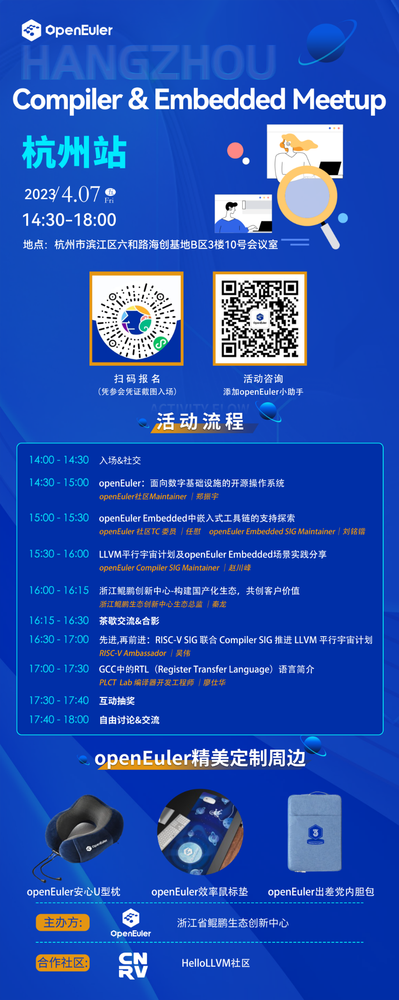
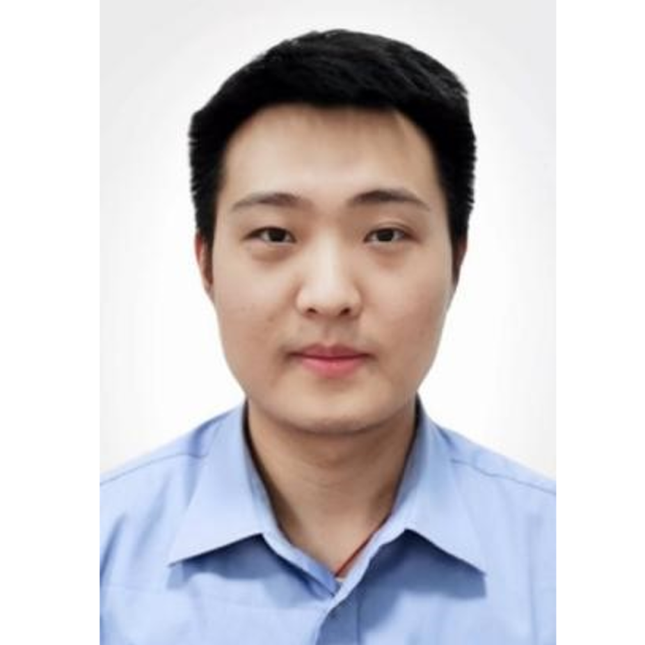

社区的小伙伴们快来集合啦！openEuler Compiler&Embedded
Meetup杭州站来啦，本次Meetup由openEuler社区发起，联合浙江省鲲鹏生态创新中心主办，CNRV社区、HelloLLVM社区合作参与。多位特邀嘉宾围绕编译器和嵌入式领域关键技术进行分享。

**立即扫描海报中的二维码报名吧～**

**时间**：2023/4/7（周五）14:30-18:00

**地点**：杭州市滨江区六和路海创基地B区3楼10号会议室

# 内容亮点

## openEuler Embedded中嵌入式工具链的支持探索

议题简介：本次分享将介绍openEuler
Embedded最新进展，同时重点探讨对嵌入式工具链的支持探索，包括gcc工具链构建，预构建工具链和构建系统的关系，基于LLVM工具链的镜像的实现，多种C库的支持，多操作系统的统一工具链构建，未来的计划等。

Speaker：

openEuler TC 委员 任慰  

openEuler Embedded SIG Maintainer 刘铭锴

## LLVM平行宇宙计划及openEuler Embedded场景实践分享

议题简介：近年来，LLVM编译器凭借其先进架构和友好协议，社区活跃度逐年增加，越来越多软件包支持Clang/LLVM构建（包括Linux
Kernel）。业界对Clang/LLVM构建OS软件包也进行尝试甚至商用。LLVM平行宇宙计划是尝试使用
Clang/LLVM 构建的
openEuler更多的软件包，此尝试独立于openEuler版本发布工作。本议题详细介绍该计划，以及分享华为的毕昇编译器和庞加莱团队基于openEuler
Embedded场景的具体实践。

Speaker：

openEuler Compiler SIG Maintainer 赵川峰

## 先进，再前进：RISC-V SIG 联合 Compiler SIG 推进 LLVM 平行宇宙计划

议题简介：RISC-V SIG 自2020年5月创建以来，经过短短三年的发展，已经成为
openEuler 最活跃的SIG之一，推出和维护了多个版本的 openEuler RISC-V
发行版，并成功衍生出了"傲来RV-2.0"、"Eulaceura" 等下游发行版。RISC-V SIG
的成员们对新技术挑战富有激情，今年也积极响应了 Compiler SIG
提出的LLVM平行宇宙计划，预期在今年2309版本发布时发布完全基于LLVM构建的
openEuler RISC-V
平行宇宙版（名称待定）。本次报告将介绍LLVM近年来在兼容GCC方面的进展、RISC-V架构上LLVM构建openEuler基础系统的状态和经验、并给出了2309和2403两步路线图。

Speaker：

RISC-V Ambassador  吴伟

## GCC中的RTL（Register Transfer Language）语言简介

议题简介：RTL语言是GCC内部的两个中间表示之一，它一端连接着GCC中与机器无关的中间表示GIMPLE，一端连接着具体机器的汇编指令生成。通过RTL语言可以了解GCC编译器如何做机器相关的优化，如何生成具体的汇编指令。

Speaker：

PLCT Lab 编译器开发工程师 廖仕华

# 线下福利

我们还给小伙伴们准备了精美的openEuler定制周边，只要来现场参与互动和抽奖，就有机会得到这些可爱的周边哦，快来线下面基，满载而归吧！
