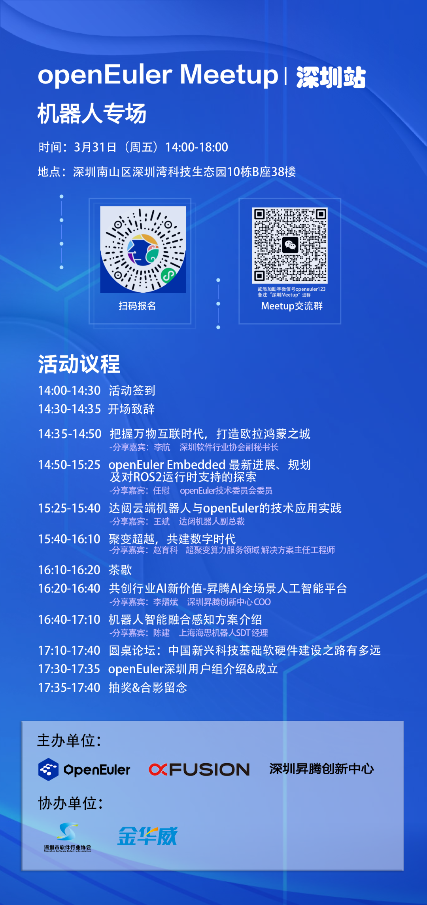
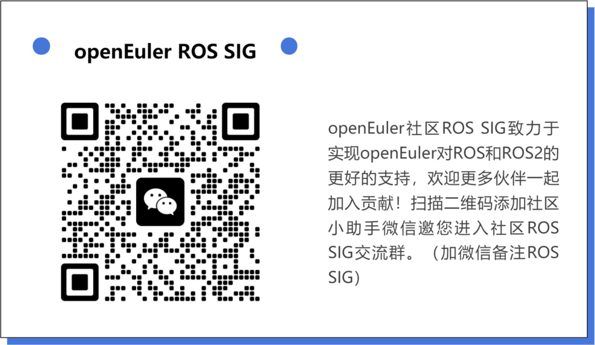

2022下半年，openEuler社区组织了首届ROS线下研讨会，邀请行业大咖共同探讨社区ROS发展规划；openEuler作为全场景操作系统，在对ROS的适配上一直在做积极的探索，2023年在深圳，让我一起期待openEuler在ROS上有哪些新的动向！

**活动目的：**

-   面向机器人厂商、操作系统用户企业，共同交流openEuler在机器人行业的前沿应用。

-   邀请openEuler社区深圳区域用户加入深圳用户组，与社区伙伴、用户，共同探讨openEuler生态发展。[[点击加入深圳用户组]](https://mp.weixin.qq.com/s?__biz=MzI2NDE4OTE2Mg==&mid=2247501432&idx=1&sn=c597cdad68e93566dd5c439cba0168e0&chksm=eab2e3fdddc56aeb4d0c96655fe174854a5465e4c97992506a929c46323bf0afa08e0f0a1ac7&token=1314059502&lang=zh_CN&scene=21#wechat_redirect)

**立即扫描海报中的二维码报名吧～**

# 内容亮点

-   政策专家解读产业发展政策，带你把握行业未来发展

-   openEuler社区技术专家解读操作系统前沿进展

-   企业用户呈现最新应用案例

-   深圳区域机器人领域企业齐聚，共同探讨ROS应用实践

---

## 议题：把握万物互联时代、打造鸿蒙欧拉之城

1）深圳软件产业情况及特色领域介绍，主要分享深圳软件产业的发展情况，横向对比情况和优势领域情况；

2）万物互联背景下嵌入式软件发展趋势，结合行业发展情况分享嵌入式的发展趋势；

3）深圳软件相关税收优惠和政策资金介绍，重点介绍与嵌入式软件和鸿蒙欧拉相关的税收政策和产业资金项目

Speaker：李航   深圳软件行业协会副秘书长

## 议题：openEuler Embedded最新进展、规划及对ROS2运行时支持的探索

1）第一部分将结合openEuler Embedded 23.03的最新发布，介绍openEuler
Embedded的最新进展、规划，包括23.03的内容、关键特性的刷新、架构上的调整，南北向生态的变化等等。

2）第二部分将就如何在openEuler
Embedded中实现对ROS2运行时的支持所在探索进行介绍，包括为什么要做、怎么做、挑战是什么、优势是什么、今后的计划等等。

Speaker：任慰  openEuler技术委员会委员、openEuler Embedded架构师

## 议题：达闼云端机器人与openEuler的技术应用实践

结合实践案例分享openEuler在机器人系统上的应用

Speaker：王斌    达闼机器人副总裁  

## 议题：聚变超越，共建数字时代

本次分享主要为超聚变服务器操作系统FusionOS，以高可靠、高性能、易运维、最佳迁移等方案介绍与实践，持续为客户、合作伙伴加速多样化算力释放服务

Speaker：赵育科   超聚变算力服务领域 解决方案主任工程师

## 议题：共创行业AI新价值-昇腾AI全场景人工智能平台

1）人工智能发展趋势分享，算力已成为新生产力驱动数字经济发展
，人工智能发展已从局部探索走向千行百业

2）昇腾AI产业及生态介绍，回顾昇腾发展历程，分享现阶段昇腾产业成果，携手昇腾，共筑人工智能产业共成长

Speaker：李熠斌     深圳昇腾创新中心 COO  

## 议题：机器人智能融合感知方案介绍 

上海海思芯片在机器人领域AI能力、双目视觉能力、DToF能力、激光雷达、MCU等方案介绍

Speaker：陈建     上海海思机器人SDT 经理

# 活动组织单位

**主办方**：openEuler社区、超聚变数字技术有限公司、深圳昇腾创新中心

**协办方**：深圳市软件行业协会、珠海金华威数码科技有限公司

