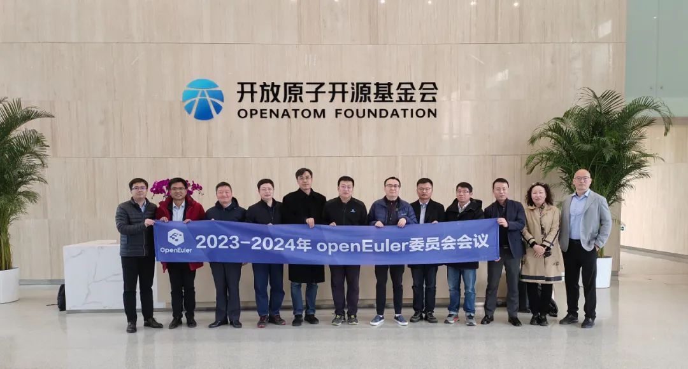

2023年3月19日，2023-2024年openEuler委员会第二次会议在开放原子开源基金会第一会议室召开，会议由openEuler项目群执行总监邱成锋主持。

根据《openEuler项目群开源治理制度》，openEuler委员会审议通过了openEuler项目群2023年业务规划和年度预算，审议了技术委员会、品牌委员会和用户委员会的2022年业务总结和2023年业务规划。

2023-2024年openEuler委员会第二次会议合照
