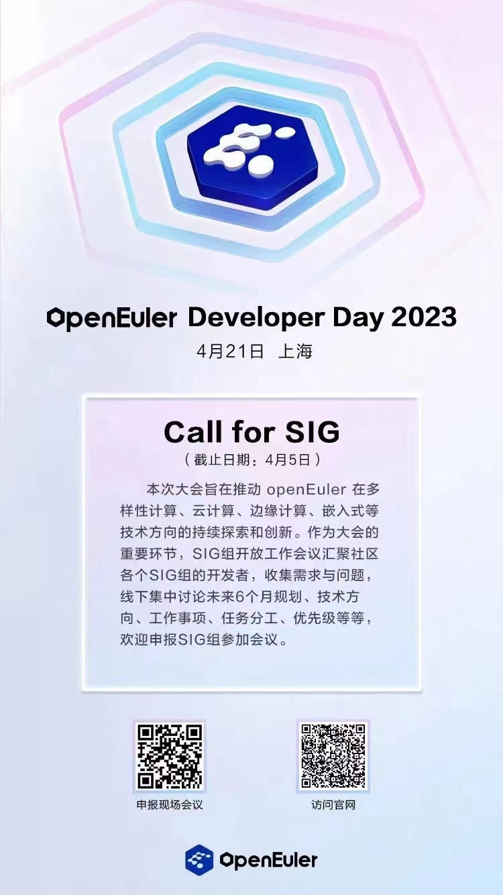
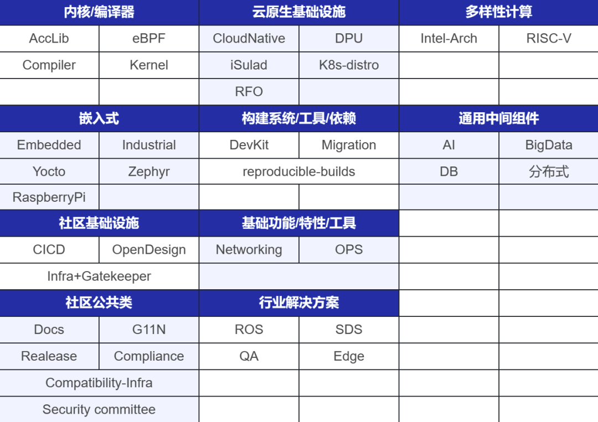

社区年度开发者大会openEuler Developer Day 2023（简称
ODD2023）将于4月20-21日首登上海！属于开发者们的狂欢日，期待您的到来！

作为大会的重要环节之一，SIG组开放工作会议汇聚社区各个SIG组的用户和开发者，收集需求与问题，线下集中讨论未来
6
个月的规划、技术方向、工作事项、任务分工、优先级等等。本次SIG组开放工作会议期间讨论的工作内容，将在社区后续的任务分工中享有优先级，其重点及亮点特性将有可能在年底Summit中进行发布和展示！

扫码报名SIG组开放工作会议

SIG组开放工作会议遵循开源、开放原则，议题收集、技术讨论、会议纪要等各讨论过程均对外开放。

**会议类型**

「单 SIG 组工作会议」：单一 SIG 组内的工作会议，由该 SIG 组 Maintainer
进行组织，包括议题收集、议程安排、主持讨论、会议纪要输出等。

「跨 SIG 组工作会议」：跨 SIG 组之间的协作工作会议，需要各相关 SIG 组
Maintainer 提前与会议组织者联系并沟通场地安排并由各相关 SIG 组
Maintainer
负责进行组织，包括议题收集、议程安排、主持讨论、会议纪要输出等。

**需求收集**

各 SIG 组 Maintainer 在 openEuler Etherpad
平台([https://etherpad.openeuler.org/](https://etherpad.openeuler.org/))创建相应的会议收集目录(命名方式为:
sig 名-版本名(例如
22.09)-Planning)用于收集工作会议的需求及计划，并将该会议目录反馈至会议组织者。

参考模板：[https://etherpad.openeuler.org/p/planning-template](https://etherpad.openeuler.org/p/planning-template)

任何人均可以在 SIG 开放工作会议中提出需求，通过在各SIG组工作会议指定的
Etherpad 共享文件中的 Topics
环节根据要求进行填写，通常需要包含以下内容：

-   需求发起人

-   需求的具体描述

-   Issue 反馈的在线地址

-   已有的技术方案或PR

-   已有的讨论纪要

需求收集完成后由SIG 组 Maintainers
按照所有收集到的需求的具体情况(类型、技术难度、工作量等)，根据会议时间安排指定会议议程，会议安排在工作会议召开前
3 天在 Etherpad 共享文件及社区邮件列表 Maillist
中公开发布，方便与会者了解会议议程。

**召开会议**

会议由各 SIG
组负责人主持召开，按照预先制定的会议议程进行会议，会议过程中需要注意时间控制，确保所有已经在会议议程中的需求都能得到相应的讨论时间。

各议题讨论可以分为下面几个阶段：

1.需求陈述：由需求发起人对需求进行陈述，包括需求目标、需求来源、提议的技术方案及既往的讨论及结果等，需求陈述阶段其余听众不允许打断。

2.讨论：由各参会者针对该需求进行相应的讨论，所有与会者均可参与讨论，主持人负责记录各方观点及重点意见。

3.总结：在达成共识后，由主持人根据共识输出该议题的结论。若现场没有达成共识，则应商议再次讨论的具体时间。

所有议题讨论完成后，由 SIG Maintainer 团队根据各议题讨论情况及 SIG
组实际情况对各需求进行优先级排序及分工，"任务分工"靠贡献者"认领任务"的方式完成。

**会议纪要**

各 SIG 组负责人在工作会议结束后一周内整理完成会议纪要，并在 Etherpad 及
SIG 组、dev, tc, release sig 邮件列表 Maillist
上公开发布该会议纪要，以便开发者、用户了解未来版本各 SIG
的工作计划，会议纪要需要包含以下内容：

-   工作会议与会者

-   所有参与讨论的议题及该议题的结论

-   各工作的负责人

-   后续工作优先级

会议纪要内容参考链接：

[https://mailweb.openeuler.org/hyperkitty/list/openstack@openeuler.org/thread/NR3O2ZUUNE46XFBTV4CND4HEYDCBPW33/](https://mailweb.openeuler.org/hyperkitty/list/openstack@openeuler.org/thread/NR3O2ZUUNE46XFBTV4CND4HEYDCBPW33/
)

**已报名SIG**

当前已有内核、安全、嵌入式、云原生等40+SIG报名参加SIG组开放工作会议。欢迎开发者们增加SIG，参加本次SIG组开放工作会议。

**报名方式**

如果您想申报SIG组，欢迎扫描下方二维码申报。

如果您想现场参加本次大会，请扫描下方二维码申报 。

