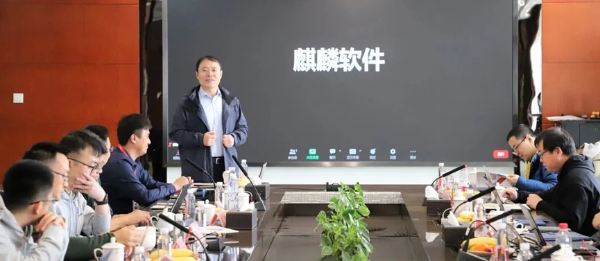

2023年3月24日，
2023-2024年openEuler技术委员会第一次线下会议在天津麒麟软件办公室顺利召开。本次会议有openEuler委员会副主席武延军，
openEuler技术委员会全体委员及部分往届委员、社区运营专家共29人参与。感谢麒麟软件承办本次会议。

麒麟软件高级副总经理孔金珠作为会议的承办方代表致辞，他在致辞中表示，麒麟软件全程参与了openEuler社区的建设，见证了社区的成长与壮大。openEuler社区秉承的"共建，共享，共治"理念，与麒麟软件建设开源社区的理念不谋而合。

在会议上openEuler技术委员会主席胡欣蔚对openEuler社区新章程进行了解读，总结了2022年技术委员会的工作成果，并传递了openEuler委员会对技术委员会2023年工作的要求。

熊伟委员针对下一阶段的重点工作做了进一步阐述，表示嵌入式领域开始进入成熟期，统一构建系统开始逐步支撑版本的发布和全场景覆盖。今年还需要持续推动社区的出海，扬帆远航。

谢秀奇委员代表内核SIG报告了下一代LTS版本内核选型的规划并提议内核的版本，经过与会的各位委员的充分讨论，TC就下一代内核版本选型方案达成一致。后续release
SIG将依照当前的内核版本选型方案进行LTS版本规划和发布时间讨论。

社区运营团队报告了openEuler社区的最新运营数据和下一阶段运营的整体规划。基础设施团队详细的说明了一下社区基础设施2.0的发展现状和未来的开发规划。委员们分别对这两个基础性议题提出了意见和建议。

会议还就安全漏洞管理，采取LLVM进行版本构建，嵌入式的技术规划，openEuler和OpenHarmony分布式设备协同等议题进行了深入的讨论。

考虑 SIG
的活跃程度和发展目标，经讨论并表决，技术委员会同意openboard和buildsystem两个
SIG 停止运作并归档。技术委员会将持续审视各个SIG
的日常运作、长期规划，对不活跃的 SIG
进行沟通和辅导。保持对各个SIG的持续推动，使得openEuler社区健康发展。

在会议过程中，议题充分发酵，与会人积极参与，热烈讨论，形成了很多技术共识，同时也对社区的各个方面提出了很多有益的建议。技术委员会针对这些建议都明确了责任人，会在后续工作中进行例行跟踪落实。

与会委员和专家共同参观了麒麟软件展厅，详细了解了麒麟软件发展历程、产品体系、发展布局、生态和社区建设与未来规划等情况，并对麒麟软件多年坚持打造自主创新的开源供应链体系表示肯定。

注：openEuler技术委员会是openEuler项目群的技术领导机构，技术委员会委员通过日常线上TC例会及定期开展线下会议共同决策社区技术发展方向事宜。
