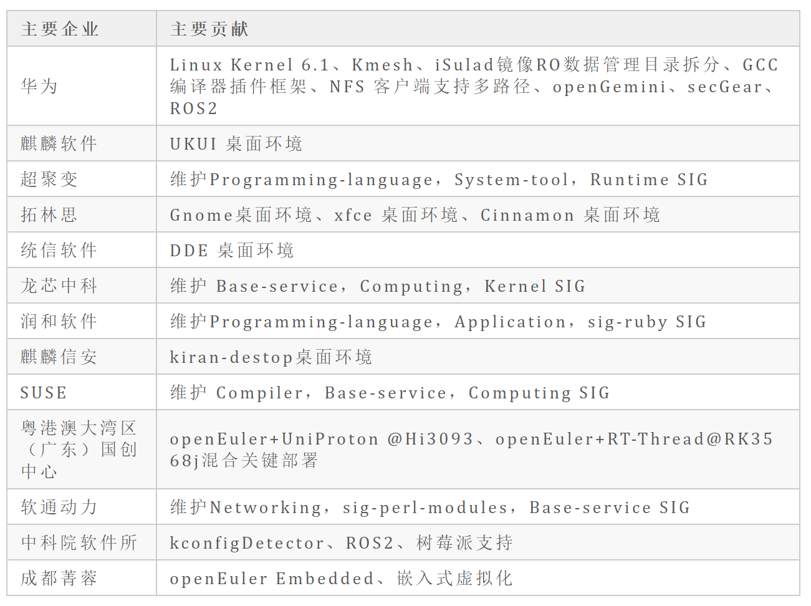

3 月 31 日，openEuler 23.03 创新版本正式发布。openEuler
作为一个凝聚全球开发者的创新平台，持续在多样性算力、基础技术、全场景和生态服务等方向持续创新。openEuler
23.03 是社区最新发布的创新版，版本代码总计 7.3 亿行，相比 openEuler
22.09，新增代码 5500 万行，新增代码主要集中在服务网格数据面 Kmesh
加速、openGemini 时序数据库、iSulad 支持镜像 RO
数据管理目录拆分等技术创新和基础软件包升级，其中内核原创代码新增 3
万行，主要集中 Linux 6.1 内核的调度系统、内存管理系统优化等新特性。

**openEuler 23.03 凝聚了社区 908 名开发者的力量，也离不开社区 800
多家企业的积极贡献，特别感谢华为、麒麟软件、超聚变、拓林思、统信软件、龙芯中科、润和软件、麒麟信安、SUSE、粤港澳大湾区（广东）国创中心、软通动力、中科院软件所、成都菁蓉等公司和科研院所对
openEuler 23.03 的代码贡献。**

## 基础技术创新

openEuler 23.03 采用 Linux Kernel 6.1 内核，为未来 openEuler
长生命周期版本采用 6.x
内核提前进行技术探索，也方便各位开发者进行硬件适配、基础技术创新和上层应用创新。为了能够在短时间内让大多数的开发者体验到
6.1 内核的功能，openEuler 23.03 目前支持
X86、Arm和树莓派等主流的芯片架构和硬件。

**openEuler 内核**集成了 Linux Kernel 6.1
的众多新特性，包括：调度子系统支持 CFS burstable 带宽控制器，改进
SCHED_IDLE 调度策略，优化 NUMA
负载均衡等，以改善系统的延迟和批处理性能；改进内存管理子系统，引入新算法，用于识别
NUMA
节点中冷热页，以便优化系统冷热页的分布，提升访存效率，改善系统性能；优化
XFS 日志同步机制、缓冲区缓存的无锁查找机制、异步缓冲写入机制等，大幅提升
XFS 的性能与扩展性；在内核易用性上，支持 BPF
程序一次编译，到处运行，解决 BPF 程序移植难的问题；PSI
机制提供了系统中资源使用的详细视图，新内核增加了对 per-cgroup
PSI、IRQ/SoftIRQ PSI
的支持和优化，帮助业务对系统资源使用做更准确评估，用以改善和优化资源调度策略。

**GCC 插件模块**支持 LTO 复杂优化插件，新增 14 类 GIMPLE 支持，实现
GIMPLE 覆盖率从 26%提升到 80%，大幅扩展 GCC
插件支持范围，帮助开发者针对不同硬件平台开发高效优化插件，充分发挥
openEuler 多样性算力。

**secGear 机密计算框架**支持鲲鹏 TEE
高级接口，通过屏蔽底层远程证明、密钥协商能力，支撑机密计算构建数据端到端的保护能力，实现高斯全密态数据库场景中用户密钥的全生命周期安全。

**NFS 客户端多路径特性**支持单个 NFS 挂载点使用多个 IP
进行访问，通过提出单个挂载点下客户端和服务端之间建立多条链路，支持 IO
在多条链路中进行传输，进而提升单个挂载点性能，同时周期性检测链路状态信息，支持链路故障
IO 快速切换。

## 场景协同创新

openEuler
是面向数字基础设施的全场景开源操作系统，支持服务器、云计算、边缘、嵌入式四大场景，持续致力于场景协同创新，消除操作系统生态割裂带来的软烟囱。

**在嵌入式场景**，来自中科院软件所和华为的开发者在 openEuler 23.03
中引入 Mate-ROS，完整支持 ROS2 核心包和相关依赖，目前 openEuler
已具备最小机器人系统集合，可以支持 SLAM
场景的导航应用；来自粤港澳大湾区（广东）国创中心的开发者实现了
openEuler+UniProton \@Hi3093、openEuler+RT-Thread@RK3568j
混合关键部署；来自成都菁蓉的开发者为 openEuler Embedded 引入
JailHouse，实现嵌入式虚拟化功能，混合关键部署支持外设分区管理；

**在云原生场景**，新增基于可编程内核构建的高性能服务网格数据面
Kmesh，服务间通信性能提升 5 倍，即时通讯类业务时延降低 1 倍。iSulad
支持镜像 RO
数据管理目录拆分，有利于用户对容器和镜像数据的灵活管理，为镜像数据分部署共享提供技术可能性。

**新增对 openGemini 时序数据库的支持**，通过 MPP
大规模并行处理分层架构，支持水平扩展，以应对海量时序数据给数据库带来性能和存储成本的巨大挑战，未来将与openEuler深度结合，打造面向物联网&运维监控打造数据存储分析一体化平台。

**在分布式协同场景**，分布式软总线新增传输文件和流接口，引入 nstack 和
fillp 协议，在一些不稳定网络等典型场景中明显提升数据传输效率。

## 欧拉开发者服务

**全场景统一构建平台
EulerMaker** 完成构建任务限流能力，实现百级用户并行调度。今日起，EulerMaker
的 RPM 编译、镜像定制板块正式对外开放 50
个试用名额，大家可以通过以下方式申请试用：

1.  订阅 CICD SIG
    邮件列表，如何订阅请参考：[https://www.openeuler.org/zh/community/mailing-list/](https://www.openeuler.org/zh/community/mailing-list/)

2.  主题为【申请统一平台访问权限+本机固定 IP】。

3.  收到邮件回复后可以登录 EulerMaker，最终审核和解释权归 CICD SIG.

使用 EulerMaker 过程中的问题发送至
compass-ci@openeuler.org,主题统一为【统一构建问题反馈】，正文为问题描述，越详细越好。CICD
SIG Maintainer
每日汇总新增问题，并反馈给社区测试团队，每周六通过邮件列表反馈。

**radiaTest** 是openEuler 社区孵化的基于 openEuler
操作系统环境开发的测试管理平台。其涵盖测试资产管理、测试任务管理、测试资源调度与执行等功能，以更深远的覆盖社区测试需求为目标，一体化承载社区测试流程。用户基于
Gitee Oauth2 服务进行身份鉴权，测试资源调度与执行能力可基于 Compass-CI
与
openQA，平台版本测试作业流可对接外部版本发布工程。将分散测试资产统一管理，将离散基础设施归一入口，将低门槛作业平台向广大社区测试团队/测试人员开放公共服务，以此使能社区可靠可追溯的高效测试。

**项目网址**

[https://radiatest.openeuler.org/](https://radiatest.openeuler.org/)

## 欧拉 DevKit 工具

**x2openEuler** 新增备份、评估、升级、回退等关键原子化能力，提供接口与业务管理平台集成，批量迁移端到端效率实现单业务从
2 台/人天提升到 12 台/人天，6 倍效率提升。

**项目网址**

[https://www.openeuler.org/zh/migration/](https://www.openeuler.org/zh/migration/)

**OmniVirt** 是由 openEuler
社区技术运营团队及基础设施团队孵化的开发者工具集，通过对主流桌面操作系统中的虚拟化技术(LXD、HyperV、Virtualization
framework)等技术进行有机整合，使用 openEuler
社区官方发布的虚拟机、容器镜像，为开发者在 Windows、MacOS、Linux
上提供统一的开发资源(虚拟机、容器)发放和管理体验，提升主流桌面操作系统上
openEuler 开发环境使用的便利性和稳定性，有效提升开发者体验。

**项目网址**

[https://gitee.com/openeuler/omnivirt](https://gitee.com/openeuler/omnivirt)

## 感谢

再次感谢参与 openEuler 23.03
版本贡献的 **908** 名开发者、**800**多家厂商和来自全球的几十万用户对欧拉开源社区的贡献和信任。欧拉开源社区的每一步成长离不开大家的努力，在未来社区将持续在服务器、云计算、边缘计算和嵌入式场景推动创新和发展。

**为了更好的回合到openEuler 22.03 LTS SP 版本，openEuler Embedded
基于 5.10 内核开发。**
