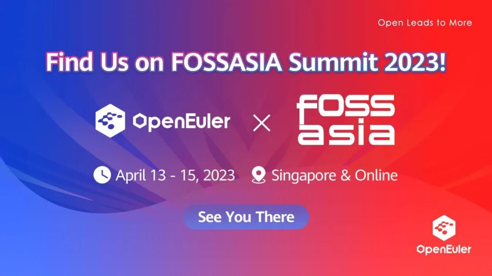
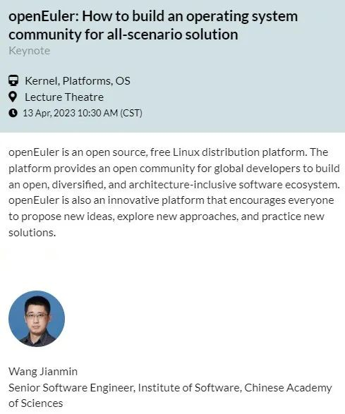
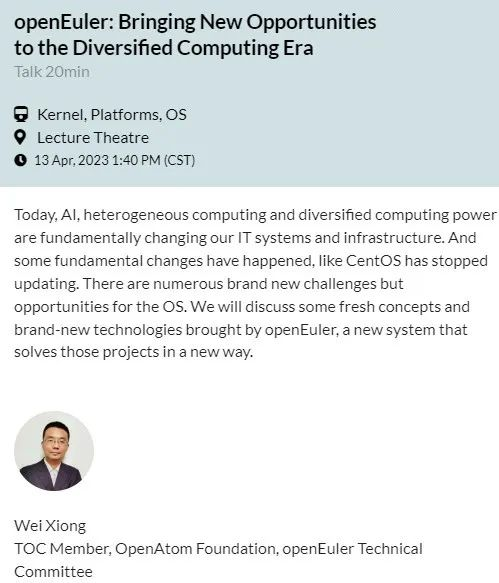
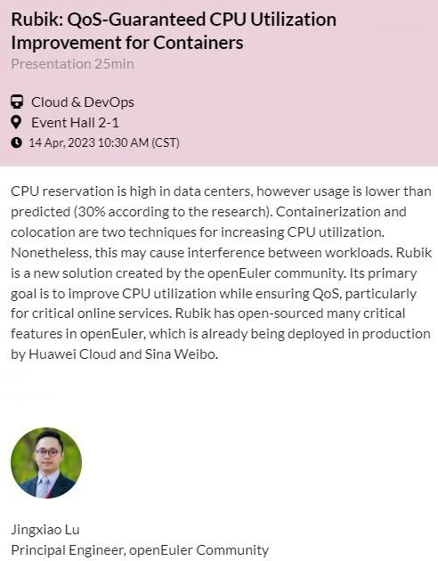
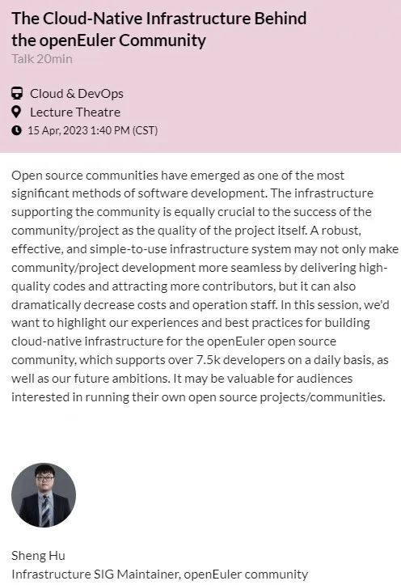
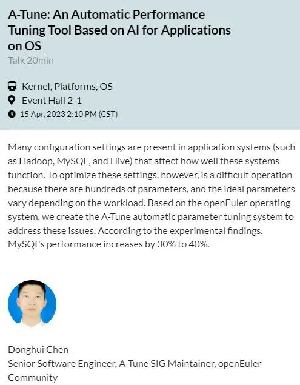
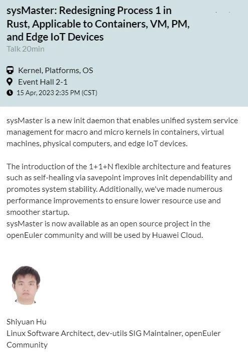

国际开源盛会 FOSSASIA Summit 2023 将于4月13日-15日新加坡的 Lifelong
Learning
Institute 举办。作为一个支持多样性算力的Linux发行版，openEuler将给来自东南亚的金融、互联网等行业用户带来openEuler在多样性算力支持方面的优势，并寻找当地的OS提供商和服务提供商，共同探索服务客户之道。

FOSSASIA
Summit，一个致力于开源方案及专案的技术型聚会，自2009年以来已持续举办十多年。本届峰会以线上会议形式举行，主题涵盖云计算、人工智能、区块链、开源文化、开源硬件、Linux
内核、网络安全、开放科学等多个领域。openEuler参与其中，与大家交流社区项目最近的进展和计划，欢迎加入我们。

**活动官网:**

[http://summit.fossasia.org](http://summit.fossasia.org)

**活动日程&预约:**

[https://eventyay.com/e/7cfe0771/schedule](https://eventyay.com/e/7cfe0771/schedule)

**Thursday, 13th April**

**10:30 AM (CST)**

**1:40 PM (CST)**

**Friday, 14th April**

**10:30 AM (CST)**

**Saturday, 15th April**

**1:40 PM (CST)**

**2:10 PM (CST)**

**2:35 PM (CST)**

**活动官网:**

http://summit.fossasia.org

**活动日程&预约:**

[https://eventyay.com/e/7cfe0771/schedule](https://eventyay.com/e/7cfe0771/schedule)
