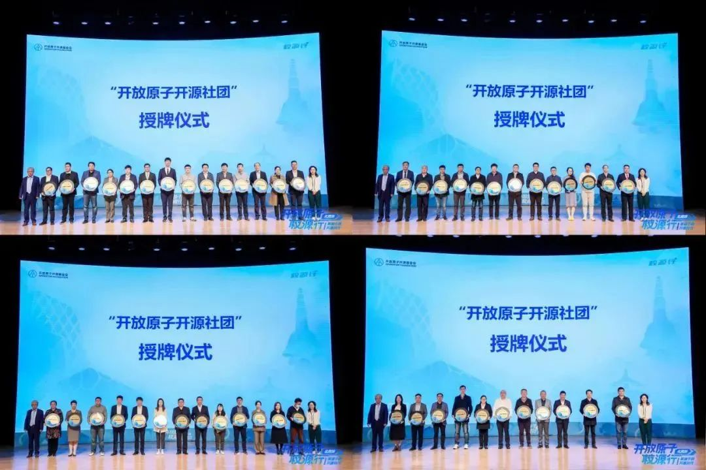
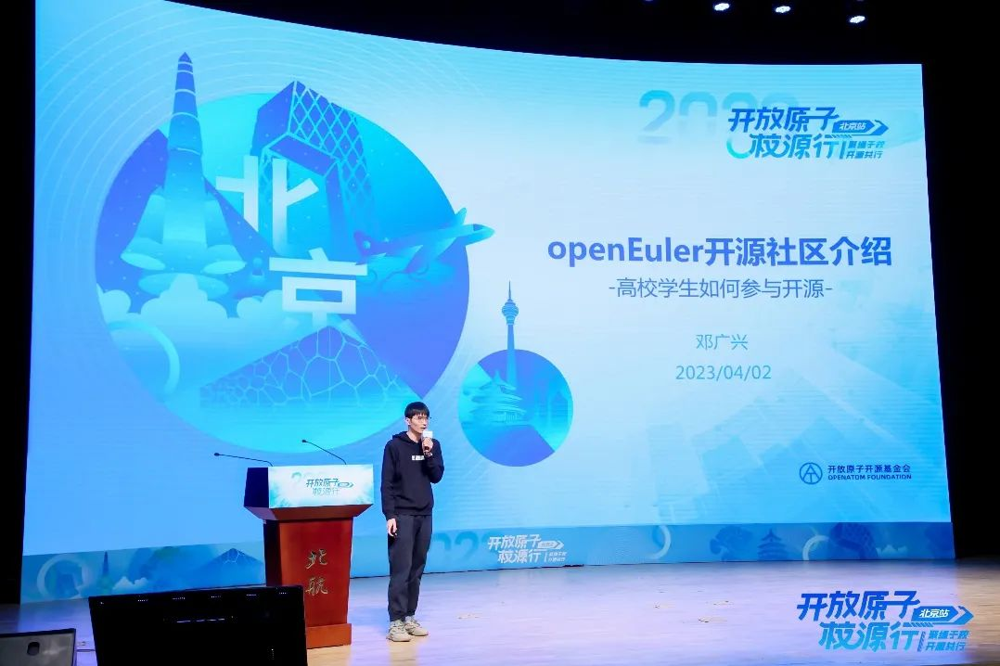
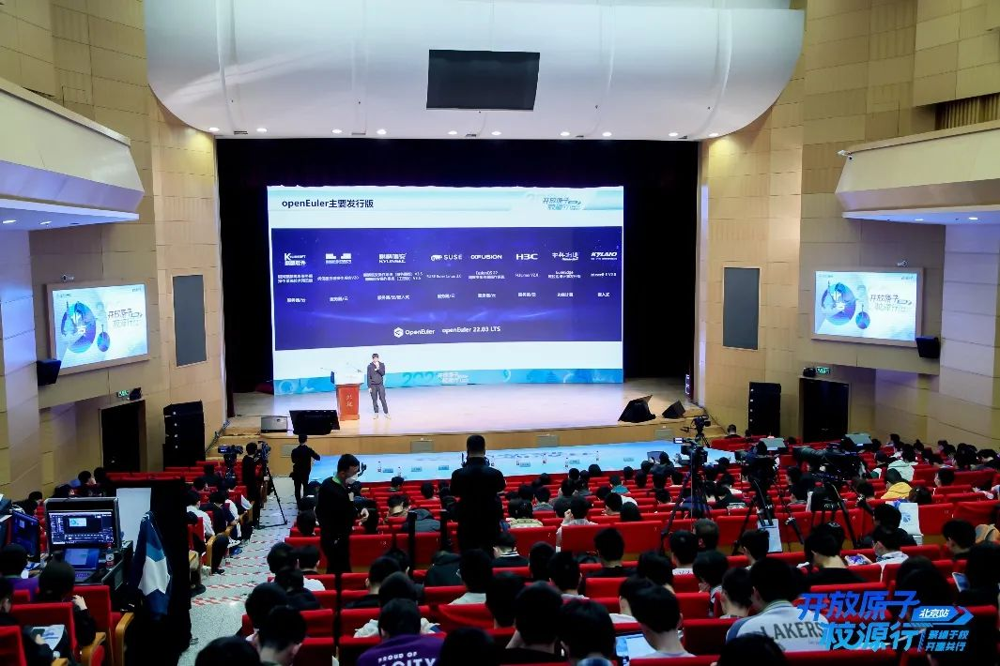
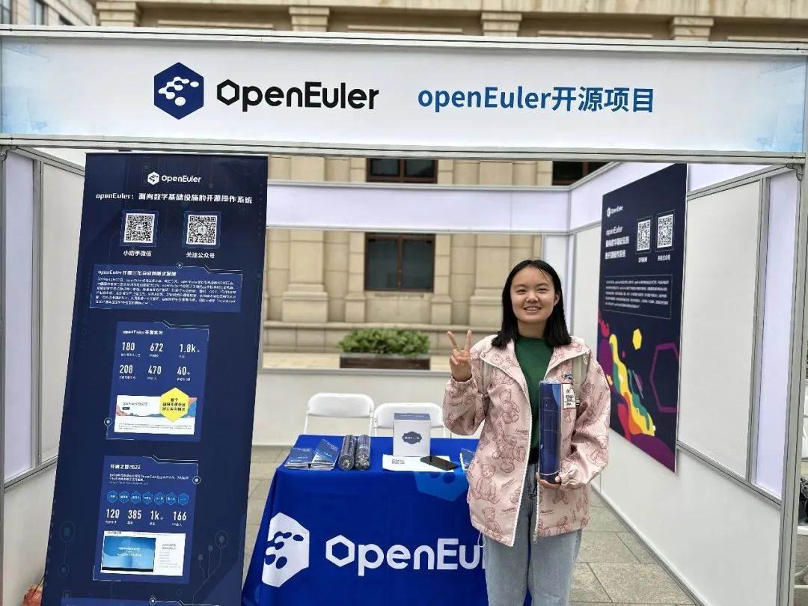
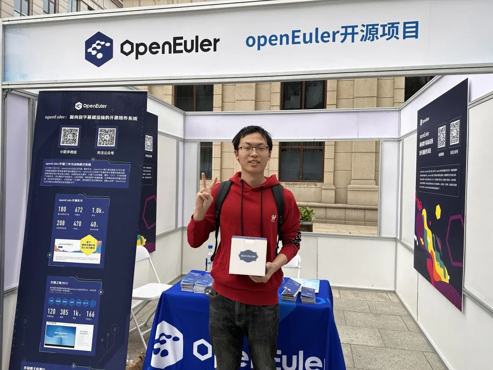

4月2日，以"**聚缘于校，开源共行**"为主题的开放原子校源行（北京站）活动在北京航空航天大学举行。工业和信息化部党组成员、副部长王江平，北京航空航天大学党委书记赵长禄，教育部高等教育司副司长王启明出席活动并致辞；开放原子开源基金会理事长孙文龙发布"开放原子校源行"总体方案；63所高校、央视网与基金会签署合作协议；与会领导为53个"开放原子开源社团"授牌。

活动由开放原子开源基金会、央视网联合主办，北京航空航天大学承办，openEuler受邀参与活动。

北航副校长吕卫锋在央视网接受专访中提到在基础软件领域，依托北航华为关键软件联合实验室，深度参与openEuler社区发展，在虚拟化软件、工业机器人等领域丰富开源生态。

openEuler作为开放原子开源基金会孵化的项目，同样积极参与到开源人才的培养当中，**openEuler SIG-DPU
Maintainer邓广兴**在此次活动中向现场师生详细介绍了**openEuler项目、高校学子如何参与社区贡献及openEuler目前正在开展的高校活动**。

他介绍到openEuler是面向数字基础设施的操作系统，支持服务器、云计算、边缘计算、嵌入式等应用场景，支持多样性计算，致力于提供安全、稳定、易用的操作系统。同时openEuler社区通过开放的社区形式与全球开发者共同构建一个开放、多元和架构包容的软件体系。

openEuler社区致力于培养开源人才，截至2022年已有超过80所学校加入社区人才发展加速计划，超过130位老师进行课改创新，覆盖数万名学生。openEuler与中国科学院软件研究所连续三年联合主办国内最大规模高校开源活动\--开源之夏，2022年开源之夏官网访问量100w+，受到开源圈和高校的关注，极大提升了高校学生对开源的认知度。

社区联合多家人才评定合作伙伴先后在东莞、广州、深圳、西安、沈阳、南京、上海等地组织了15场openEuler社区线下人才评定考试，共覆盖业内专家500+人次。openEuler-OECA线上课程学习达到2000+人次。openEuler社区同时联合华为鲲鹏社区，上线了openEuler社区开源贡献实践微认证，完成认证
3300+ 人。

# openEuler目前开展的课程&高校活动简介

**1）开源软件供应链点亮计划-暑期2023（简称"开源之夏"）**

开源之夏是由中国科学院软件研究所与openEuler社区共同举办的一项面向高校学生的暑期开源活动，旨在鼓励在校学生积极参与开源软件的开发维护，促进优秀开源软件社区的蓬勃发展。

主办方联合各大开源社区，针对重要开源软件的开发与维护提供项目，并向全球高校学生开放报名。学生在社区导师指导下，按计划完成开发工作，并将成果贡献给社区。根据项目的难易程度和完成情况，参与者将获取由主办方发放的6000-12000元的项目奖金。

项目详情链接：[https://summer-ospp.ac.cn](https://summer-ospp.ac.cn)

**2）开源实习**

openEuler开源实习是openEuler社区和社区合作单位共同发起的线上实习项目，旨在鼓励在校学生积极参与开源社区，在实际的开源环境中提升实践能力，在社区中成长为优秀的开源人才。由社区提供实习任务，并提供导师辅导，学生通过实习申请后，可在社区领取任务，每完成一个任务可获得相应积分，积分累计达规定量后，可获得实习证明和实习工资。

项目详情链接：[https://www.openeuler.org/zh/internship](https://www.openeuler.org/zh/internship)

**3）openEuler社区开源贡献实践微认证**

为让高校师生更进一步了解掌握参与开源社区开发的方法，openEuler社区联合华为鲲鹏社区，上线了openEuler社区开源贡献实践微认证课程，在学习完本次课程并通过认证考试后，将获得官方鲲鹏微认证证书。

通过参与openEuler社区贡献指导学员掌握参与主流开源社区的基本方法，掌握Linux环境下软件开发的基本能力。本认证流程包含在线学习、在线实验、认证考试三部分。

微认证链接：

[https://www.hikunpeng.com/learn/micro-certification/detail/ad537279d82b4d38bcd96afbdb2181d3](https://www.hikunpeng.com/learn/micro-certification/detailad537279d82b4d38bcd96afbdb2181d3)

 

**4）openEuler开设课程**

 开源基础软件学习培训-openEuler精品课程

openEuler社区联合伙伴共同打造openEuler人才评定体系，推动高校新生、技术爱好者踊跃融入社区技术生态建设。在官网上传有openEuler精品课程，供高校学子进一步了解社区。

链接：[https://training-assessment.osinfra.cn/portal/1519850993951571970?sxz-lang=zh_CN](https://training-assessment.osinfra.cn/portal/1519850993951571970?sxz-lang=zh_CN)

  

openEuler MoocStudio

MoocStudio是集计算机课程编写和学习一体的教育平台，供大家能够在浏览器中使用真实环境学习新技术。

链接：[https://moocstudio.openeuler.org/zh](https://moocstudio.openeuler.org/zh)

**5）欧拉人才加速计划**

欧拉人才发展加速计划是华为公司基于"智能基座-产教融合协同育人基地"的教学实践成果，围绕操作系统方向向应用本科进一步深化推进的一项人才发展举措。该项目已联合各大高校共同建设了74个教学实践平台，开设超过1300门课程，覆盖20万名学生。 

项目详情链接：[https://edu.hicomputing.huawei.com/openeuler-opengauss-talent](https://edu.hicomputing.huawei.com/openeuler-opengauss-talent)

**6）鲲鹏众智计划**

鲲鹏众智计划主要围绕 鲲鹏DevKit、openEuler
Devkit开发套件、BoostKit开源应用使能套件等
发布100+众智任务，百万美金激励。目前首批任务及相应的激励计划已经在鲲鹏社区发布，开发者可以在线提交申请，参与鲲鹏众智合作计划，成功提交代码并通过验收即可获得激励。

社区链接：[https://kunpeng.huawei.com/zh/#/ecosystem/ecology_remit](https://kunpeng.huawei.com/zh/#/ecosystem/ecology_remit)
