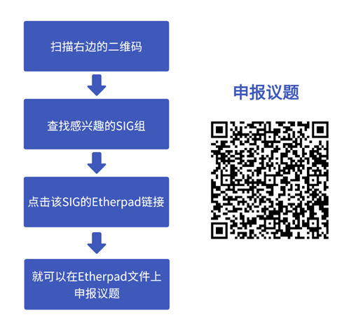

一年一度的开发者盛会

openEuler社区超强阵容

40+ SIG轮番头脑风暴

内核、云原生、虚拟化、多样性计算、Devkit

安全、大数据存储、边缘计算、嵌入式.....

多个技术话题

它终于来了！

 

史上最强阵容SIG组工作会议

**邀您一起为社区出谋划策！**

问：

Hi\~小助手

最近社区都被SIG组工作会议的信息刷屏了！

我看你们这次大会有不少动作！

答：

被你发现了！朋友

---

问：

什么是SIG组工作会议呢？

答：

开发者们将以SIG组为单位，邀请社区朋友们共同探讨SIG组接下来的开发规划，即openEuler
SIG组工作会议。**任何人均可参加**！会议内容包括各个SIG组的**用户需求收集、未来6个月的技术规划，工作事项与创新成果**等等。

---

问：

SIG组工作会议都有哪些看点呀？

答：

那亮点可多了，且听我细细道来。

---

**1. 超强阵容，40+ SIG组，预计上千开发**

作为openEuler Developer Day
2023大会的其中一环，SIG组工作会议参与人数最多，涉及话题最广。40+SIG组、40场不同技术方向的会议同期举行，汇聚各行各业上千位开发者，有高校学者，业内技术专家，开源大牛等等，阵容强大。您可以与开发者一起交流，一起协作，参与社区工作，与他们一起完成自己的开发任务。

**2. 话题多样，总有一款是您喜欢的**

本次工作会议，SIG组成员将围绕SIG接下来的技术规划与运营工作，探索技术发展的更多可能性，包含行业场景应用、社区联合创新案例、云原生、云计算、产品技术与社区生态等多个话题，包括Kernel、CloudNative、OPS等SIG组。

**3. 跨界交流，更深入地讨论**

在SIG组开放工作会议期间，各个SIG技术专家将齐聚一堂，对于某些技术领域，SIG专家们采取了跨SIG工作会议的模式，让你一次性与多个SIG讨论，一次性聊到畅快，满足您的需求。

**4. 线下讨论，拒绝信息差**

每次工作例会都是线上举行？信息传达不方便？存在信息差？

本次SIG组开放会议将在线下举办，志同道合的开发者可以畅所欲言地交流。如果您在讨论中有任何疑惑，可以现场提出，拒绝信息差。

**5. 我参与，我做主**

SIG组开放工作会议，任何人均可以是参与者，组织者，也可以是需求发起人。如果您有任何话题需求，可以找到对应的SIG组，在其Etherpad文件中的Topics环节提出，SIG组织者将在SIG工作会议上根据该Topic内容进行交流，共同探讨，寻求解决方案。

问：

这么有用，怎么参加呀？

答：

扫描下方二维码报名，4月21日 16:00-17:30 上海浦东嘉里酒店 不见不散\~

扫码报名
