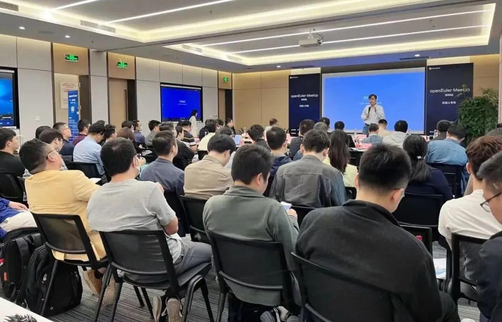
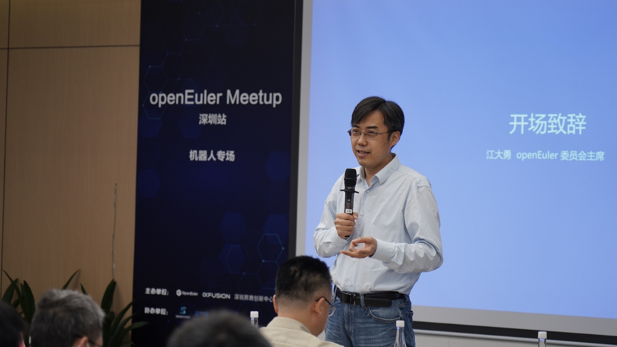
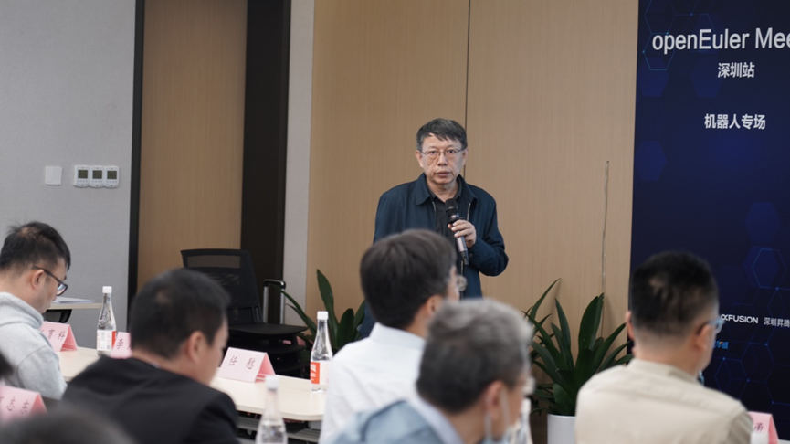
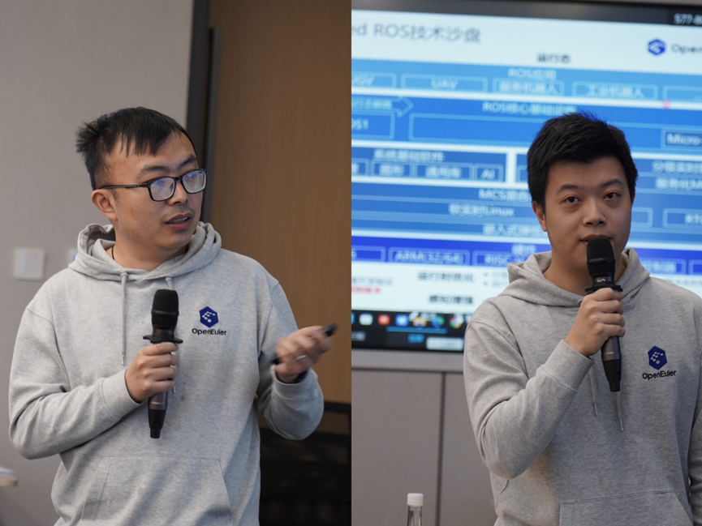
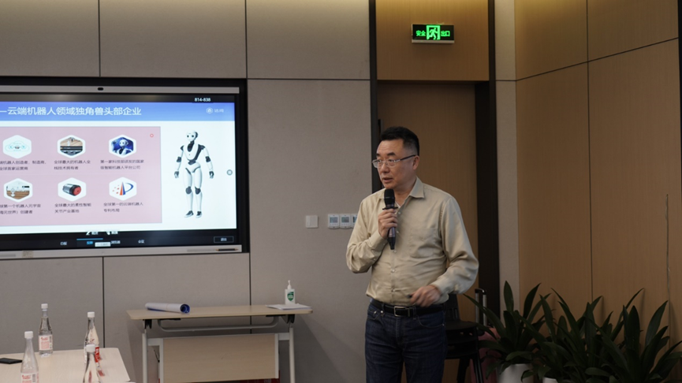
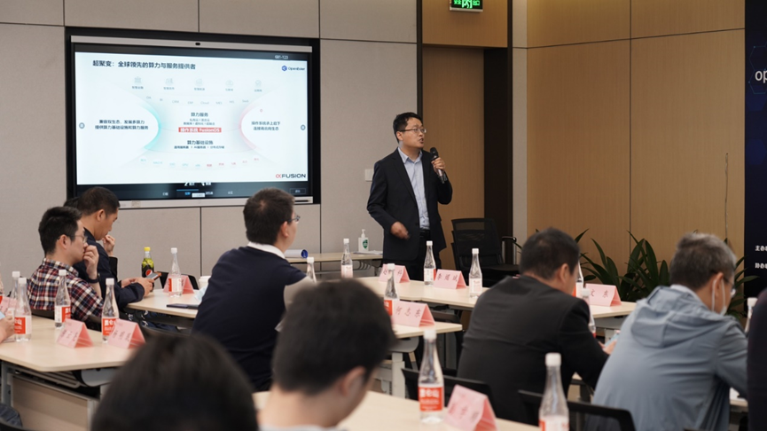
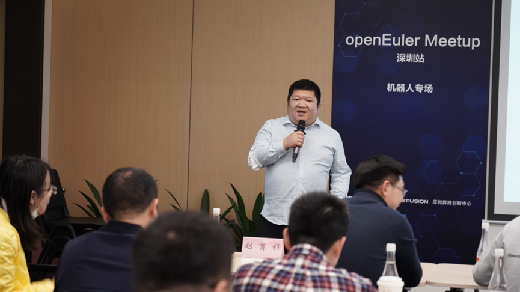
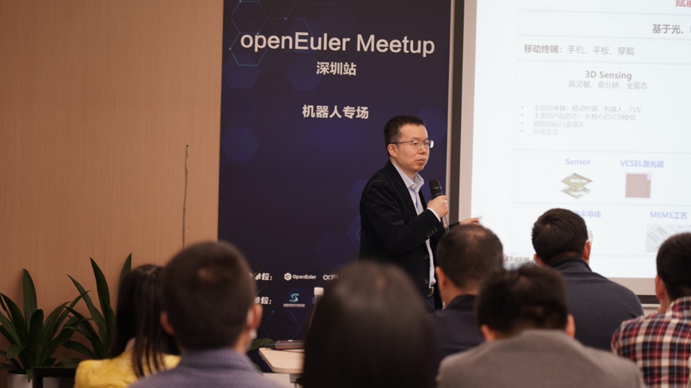
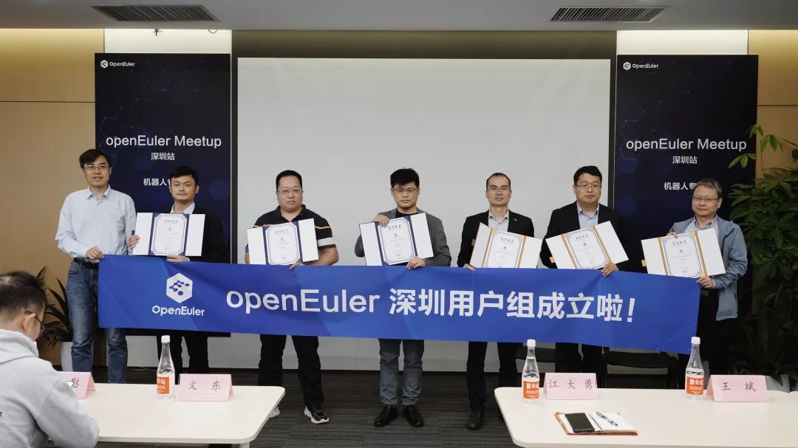
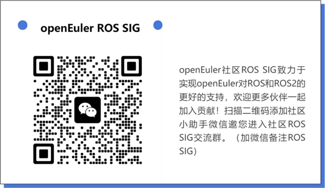

3月31日，openEuler
Meetup深圳站-机器人专场成功举办，本次Meetup由openEuler社区、超聚变、深圳昇腾创新中心联合主办，现场40+企业80余人到场，聚集深圳地域的机器人厂商、openEuler用户探讨openEuler在机器人领域的应用与发展。

openEuler
委员会主席江大勇为本次活动致辞，为大家介绍了openEuler发展近况，特别提到了openEuler嵌入式将成为今年社区重要的发力点。在刚刚发布的23.03中，openEuler嵌入式南北向生态都有很大的改进。在机器人领域应用上，社区在大力推进ROS适配，未来还有更多发展创新，欢迎更多伙伴共同投入社区，面向未来一起携手构造国内机器人操作系统根社区。

本次活动邀请到深圳市软件行业协会副会长余江分享深圳软件产业发展情况及嵌入式产业发展趋势，并介绍了深圳市软件产业政策支持，尤其在鼓励加入国内重点开源社区关键技术贡献方面，未来将会有更多政策扶持。

openEuler技术委员会委员、openEuler
Embedded架构师任慰分享了openEuler嵌入式的最新进展和规划，介绍了最新23.03版本中在基础设施、Linux框架、关键特性、南北向生态上的重要进展。由openEuler
Embedded SIG Maintainer方林旭分享了ROS生态和趋势，以及openEuler
Embedded对ROS2的支持，面向机器人领域openEuler不仅是做ROS适配，在长期规划上还要逐步打造自主可控机器人操作系统A-ROS。

openEuler已开始在机器人领域应用，本次活动中由达闼机器人副总裁王斌带来了达闼云端机器人与openEuler的应用实践案例分享，达闼在基于昇腾端侧硬件平台+openEuler软件系统来打造国产机器人控制软硬件生态系统上已迈出一大步，未来将继续推进openEuler操作系统+ROS框架国产化替代，加强机器人基础软件平台合作。

openEuler生态合作伙伴超聚变的算力服务领域解决方案主任工程师赵育科带了超聚变服务器操作系统FusionOS的主题分享，解读了FusionOS高可靠、高性能、易运维的技术实力，展示了FusionOS持续为客户、合作伙伴加速多样化算力释放服务的能力。

深圳昇腾创新中心COO李熠斌带来了"共创行业AI新价值"
主题分享。并表示在算力需求快速增长的当下，人工智能也在快速的发展，已从局部探索走向千行百业当中。而华为坚定人工智能的投入，坚持昇腾AI战略，持续打造几极致性能，极简应用的全场景人工智能平台。同时分享了现阶段昇腾发展现状及成果，在未来深圳昇腾创新中心也将与伙伴携手，共同推动人工智能产业生态建设和发展，构建万物AI的美好世界，共享行业数字未来！

上海海思机器人SDT经理
陈建在机器人智能融合感知方案介绍议题里，分享了上海海思芯片在机器人领域AI能力、双目视觉能力、DToF能力、激光雷达、MCU等方案。

圆桌论坛环节邀请到华锐技术副总经理何志东、超聚变算力服务领域解决方案主任工程师赵育科、openEuler技术委员会委员任慰、广东产业发展与生态部欧拉CTO共同探讨国内基础软件发展该如何发力，以及openEuler目前在行业内的优势和待改进点，各位专家分别从各自所在的行业视角出发表了精彩观点，对openEuler寄予了厚望。

同时，在本次活动上成立了openEuler深圳用户组，旨在聚集深圳区域的openEuler用户，打造一个本地化交流平台，拓展区域用户生态。现场openEuler委员会主席江大勇为到场的首批openEuler深圳用户组成员颁发成员证书，各成员表示未来在用户组内会进一步分享openEuler的使用案例和经验，期待在组织内获得更多学习交流机会，一起推动openEuler在各行业内的应用生态。

欢迎更多深圳及周边城市的openEuler用户加入深圳用户组！

**扫码加入深圳用户组**

如您想加入openEuler ROS SIG 贡献，欢迎添加openEuler小助手邀您加入ROS
SIG交流群

