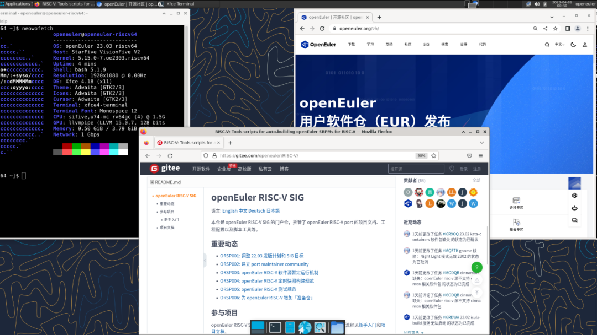
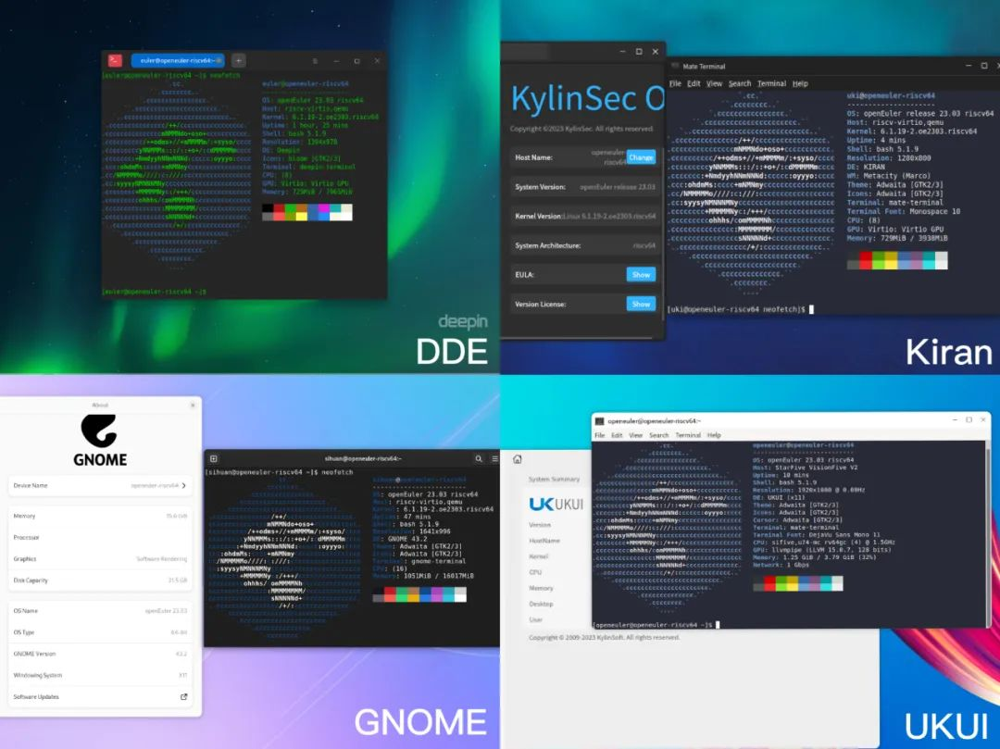
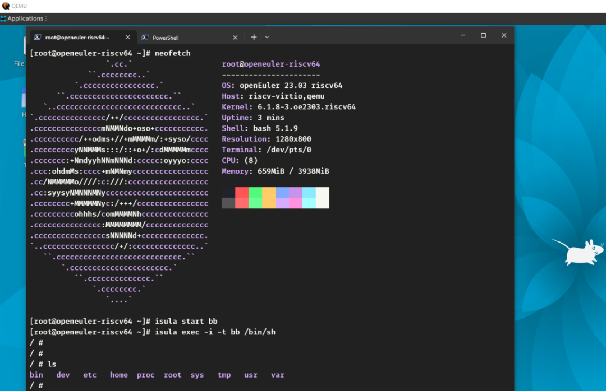
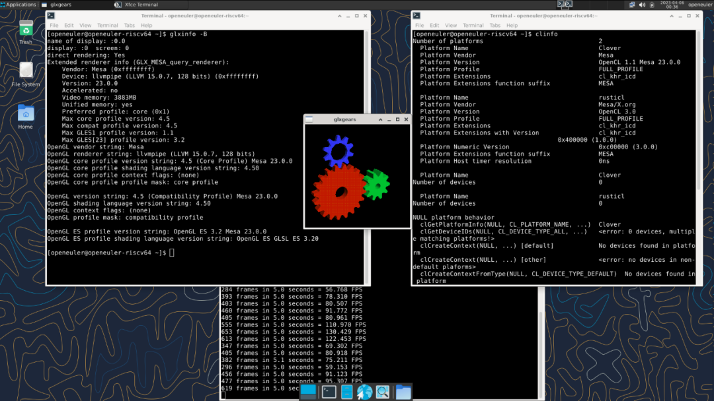

近日，openEuler RISC-V 23.03 创新版本正式发布。openEuler RISC-V SIG 作为
openEuler 系统在 RISC-V 架构上的维护组织，主要致力于 openEuler 在 RISC-V
软硬件方面的适配，一直跟随 openEuler 版本节奏提供 openEuler 的 RISC-V
镜像版本。本次更新带来更好的硬件支持，更多的软件适配，包括 VisionFive 2
，SG2042 等多款新开发板的默认支持、UKUI，GNOME
等多个桌面环境的新增适配、容器及其工具的适配，另外，还默认新增 JIT
支持以及针对性优化。

**镜像下载链接**

*https://mirror.iscas.ac.cn/openeuler-sig-riscv/openEuler-RISC-V/preview/openEuler-23.03-V1-riscv64/*

## 硬件支持

在硬件方面，openEuler RISC-V 23.03 继承性支持和更新了全志哪吒 D1，矽速
Lichee RV，SiFive Unmatched，赛昉 VisionFive 1
等开发板，同时更新与支持了赛昉 VisionFive 2 和算能 SG2042 两款设备。

### 支持 SG2042

openEuler RISC-V 23.03 创新版本成功接入 RISC-V 64 cores 高性能处理器
SG2042(EVB) 服务器板卡，是 RISC-V
服务器领域生态发展的重要一步，经测试，基础系统、有线网络、USB
接口等组件已可流畅使用。SG2042 本地构建方式相较于 qemu user
模式具有显著速度优势，为本次发版的 openEuler RISC-V 23.03
大幅缩短了构建时长。RISC-V SIG 计划将 SG2042 与 OBS 构建系统结合，提升
openEuler RISC-V 软件包构建效率。

### 更新 VisionFive 2

openEuler RISC-V 23.03 对 VisionFive 2
开发板进行了重大修复，在先前测试镜像的基础上修复了图形界面、HDMI
输出等部分，可用功能已与其他开发板相匹配，运行整体较为流畅。

## 软件支持

### 内核升级

openEuler 23.03 采用 Linux Kernel 6.1 内核，为未来 openEuler
长生命周期版本采用 6.x 内核提前进行技术探索，RISC-V SIG
跟进这一重要更新，为 openEuler RISC-V 环境提供了 6.1 内核的适配，方便
RISC-V 开发者使用最新的内核开发。

### 支持多个桌面环境

在桌面方面，openEuler RISC-V 23.03 创新版本支持
XFCE、UKUI、DDE、Kiran、GNOME、Cinnamon
桌面环境，为用户提供优秀的桌面用户体验。RISC-V SIG 还对部分桌面组件如
GNOME 的 gjs，进行了针对性优化。

### 适配 iSulad 容器

RISC-V SIG 增加了对 iSulad 的 RISC-V 支持，并成功测试 iSulad 容器引擎在
openEuler RISC-V 23.03 创新版本的可用性。iSulad
是开放原子开源基金会旗下容器引擎项目，由华为庞加莱实验室发起，于 2019
年在 openEuler 社区开源。

相比 Docker，iSulad
通用容器引擎是一种新的容器解决方案，提供统一的架构设计来满足 CT 和 IT
领域的不同需求。其使用 C/C++
实现，具有轻、灵、巧、快的特点，不受硬件规格和架构的限制，底噪开销更小，可应用领域更为广泛。

### 实验性 JIT 支持

在 openEuler RISC-V 23.03 创新版本中，RISC-V SIG 添加针对性的 JIT
优化并测试，相关工作涉及 Mesa、GNOME 桌面优化以及 LuaJIT 相关软件。

目前，RISCV SIG 将 Mesa 升级至 23.0.0 版本，并在此基础上引入了基于
LLVMpipe 且支持 RISC-V 优化的新 JIT 引擎，同时在 RISC-V 环境运行了
glxgears 测试，确认性能已显著提升。开发者正在补丁基础上添加 Cache
优化，后续进展我们将持续跟进。

在桌面方面，RISC-V SIG 已在 mozjs102 上回溯移植了 SpiderMonkey RISC-V 的
JIT 补丁，从而显著提升 gjs 的性能，并进一步优化 GNOME 桌面体验。

在实验性添加 LuaJIT 支持的基础上，RISC-V SIG 成功地为 RISC-V
架构构建了一系列依赖于 LuaJIT 的软件包，包括 openResty 和 Minetest
等，相关支持仍在持续开发中。

RISCV SIG 将继续关注最新的 JIT
进展，并致力于桌面优化和服务器软件生态的完善。对此感兴趣的朋友们可以尝试更新至最新的镜像体验，欢迎大家提供测试反馈，共同助力提升
RISC-V 桌面生态体验。
