# 概述

2023年3月，openEuler社区活跃度持续上升，用户超过110万。3月亮点颇多，重点包括：

社区年度大会openEuler Developer Day 2023将在4月20日首登上海，openEuler
23.03创新版以及RISC-V版本发布。此外，openEuler将参加国际开源大会FOSSASIA
Summit 2023，展示多样性算力优势。

社区治理方面，openEuler委员会审议通过了openEuler项目群2023年业务规划和年度预算。在技术层面，社区不断推进创新，包括SIG-AccLib启动加解密模块适配Accelerator硬件引擎项目、新项目oec-cloud开源等。人才培养方面，软通教育openEuler-OECA工程师认证考试平台上线，助力人才发展。随着不断推出的新功能和优化，openEuler正助力开源生态健康发展。

# 社区活跃度

2023年3月，openEuler社区用户**超过110万**，累计产生**54.2K**条Issue，**100.2K** 个PR。当前，加入openEuler社区的单位成员已超过 **812** 家，3月新增 **30**家。

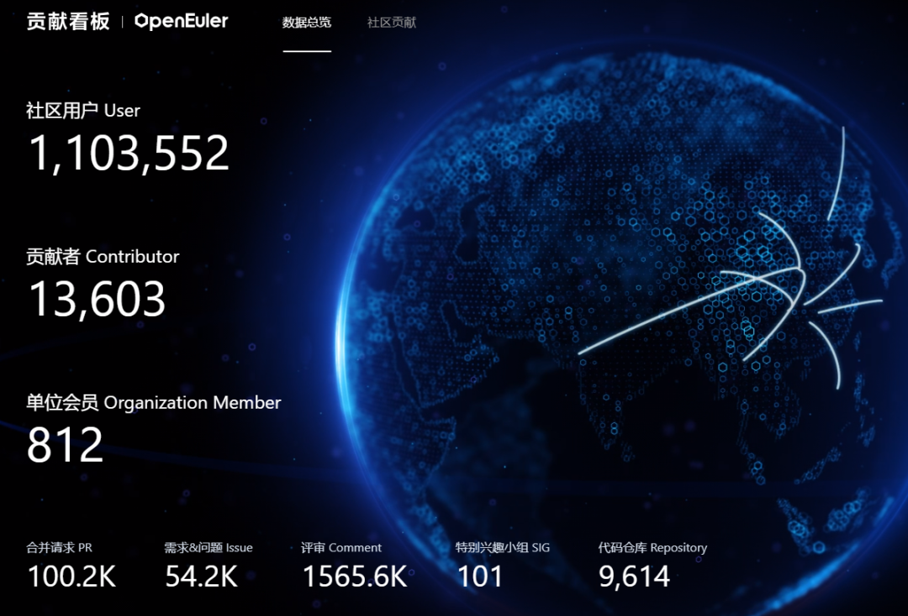

社区贡献看板（截至2023/3/31）

# 社区大事件

## openEuler Developer Day 2023首登上海

## 报名通道已开启，欢迎朋友们参加

2023年4月20-21日，openEuler Developer Day 2023
将首登上海！这是openEuler社区年度顶级会议，旨在持续推动操作系统乃至基础软件的创新和突破。

本次大会将展示全新发布的23.03创新版本特性、多样性计算和全场景协同的技术成果、分享各行各业基于欧拉的商业实践、展示openEuler与国际开源社区和高校的合作以及研究进展。

4月21日下午，社区的年度大型SIG组开放工作会议将在大会现场进行。40+ 个 SIG
组，涵盖内核、安全、嵌入式、云原生多方技术领域，社区开发者们现场协同讨论版本路线、未来规划与联合创新。SIG组已进入需求征集阶段，如果您有议题、方案想在这次会上讨论，可以在以下Etherpad文件中选择想参加的SIG，并按照格式在文件的"topic"中填写议题名。

当前，大会报名通道已开启，欢迎大家报名参会。

大会官网：

https://www.openeuler.org/zh/interaction/summit-list/devday2023/

选择感兴趣SIG组的Etherpad文件，按照求填写您的Topic：

https://etherpad.openeuler.org/p/ODD-2023-SIG-Meeting

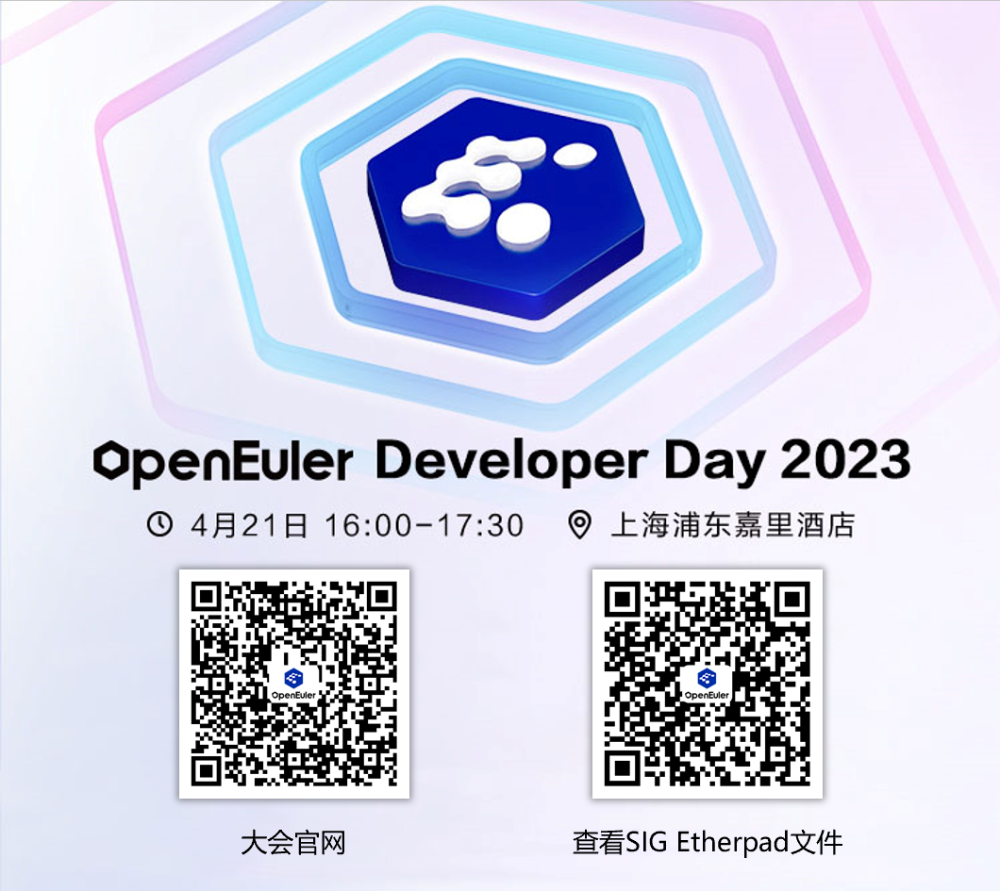

## openEuler 23.03 创新版发布

## 增强基础技术能力，协同全场景创新

3 月 31 日，openEuler 23.03
创新版本正式发布。这是社区最新发布的创新版，版本代码总计 7.3 亿行。相比
openEuler 22.09，openEuler 23.03 创新版新增代码 5500
万行，新增代码主要集中在服务网格数据面 Kmesh 加速、openGemini
时序数据库、iSulad 支持镜像 RO
数据管理目录拆分等技术创新和基础软件包升级，其中内核原创代码新增 3
万行，主要集中 Linux 6.1 内核的调度系统、内存管理系统优化等新特性。

[原文阅读
\>\>\> ](https://mp.weixin.qq.com/s?__biz=MzI2NDE4OTE2Mg==&mid=2247502428&idx=2&sn=8b34093be533c6a4ccc8f7af51f52785&chksm=eab2efd9ddc566cf6723c4106e58f8fbc8d864247f881429f951eb0d293f5e2bf219d44ae149&token=1241301648&lang=zh_CN&scene=21#wechat_redirect)

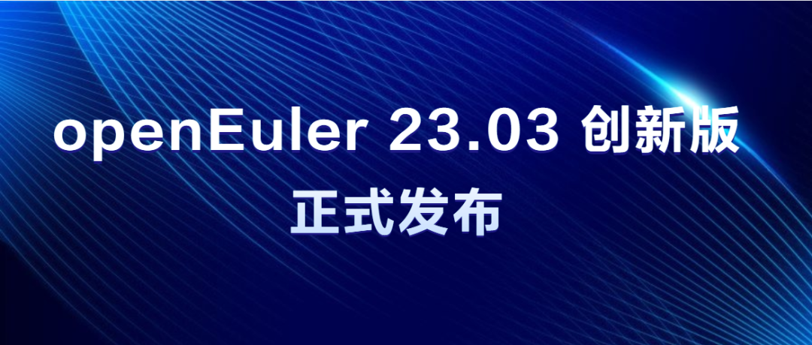

## openEuler RISC-V 23.03 创新版发布

## 全面提升硬件兼容性和桌面体验

近日，openEuler RISC-V 23.03 创新版本正式发布。openEuler RISC-V SIG 作为
openEuler 系统在 RISC-V 架构上的维护组织，主要致力于 openEuler 在 RISC-V
软硬件方面的适配，一直跟随 openEuler 版本节奏提供 openEuler 的 RISC-V
镜像版本。

本次更新带来更好的硬件支持，更多的软件适配，包括 VisionFive 2 ，SG2042
等多款新开发板的默认支持、UKUI，GNOME
等多个桌面环境的新增适配、容器及其工具的适配，另外，还默认新增 JIT
支持以及针对性优化。

镜像下载链接：

https://mirror.iscas.ac.cn/openeuler-sig-riscv/openEuler-RISC-V/preview/openEuler-23.03-V1-riscv64/

## openEuler 将亮相国际开源大会

## FOSSASIA Summit 2023

国际开源盛会 FOSSASIA Summit 2023
将于4月13日-15日新加坡举办。作为一个支持多样性算力的Linux发行版，openEuler将给来自东南亚的金融、互联网等行业用户带来openEuler在多样性算力支持方面的优势，并寻找当地的OS提供商和服务提供商，共同探索服务客户之道。

[原文阅读
\>\>\> ](https://mp.weixin.qq.com/s?__biz=MzI2NDE4OTE2Mg==&mid=2247502428&idx=1&sn=f0cfda337a27604239acd031b08aed36&chksm=eab2efd9ddc566cfbc52019a93c8179e2fa3517ac82cde7bf9be7fe21d3dea0e65c729d1039d&token=1241301648&lang=zh_CN&scene=21#wechat_redirect)

## openEuler 机器人专场举办，推动嵌入式用户生态发展

3月31日，由openEuler社区、超聚变、深圳昇腾创新中心共同发起的openEuler
机器人专场在深圳举办，现场40+企业80余人到场。本次活动聚集深圳地域的机器人厂商、openEuler用户探讨openEuler在机器人领域的应用与发展。同时，openEuler深圳用户组在本次活动上成立。

[原文阅读
\>\>\> ](https://mp.weixin.qq.com/s?__biz=MzI2NDE4OTE2Mg==&mid=2247502479&idx=2&sn=665cfdeae2178c3a736cc1ffe0b27ebf&chksm=eab2ef0addc5661cd3da36356d25f472840bde4833b1efa8dcfcc08b3d3e991f8f776523fb87&token=1241301648&lang=zh_CN&scene=21#wechat_redirect)

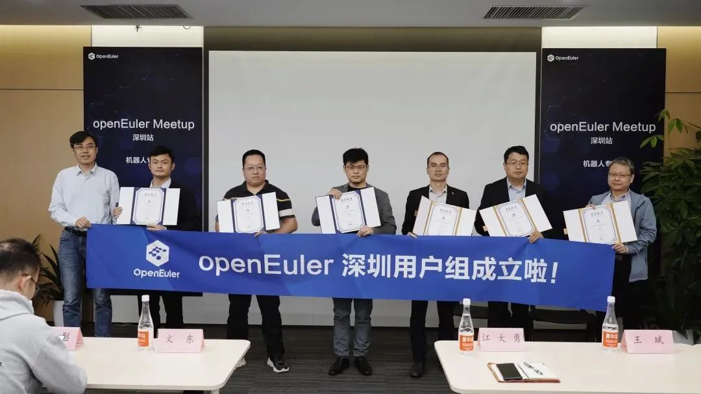

# 社区治理

## 2023-2024年openEuler委员会第二次会议召开

2023年3月19日，2023-2024年openEuler委员会第二次会议在开放原子开源基金会第一会议室召开，会议由openEuler项目群执行总监邱成锋主持。

根据《openEuler项目群开源治理制度》，openEuler委员会审议通过了openEuler项目群2023年业务规划和年度预算，审议了技术委员会、品牌委员会和用户委员会的2022年业务总结和2023年业务规划。

[原文阅读
\>\>\> ](https://mp.weixin.qq.com/s?__biz=MzI2NDE4OTE2Mg==&mid=2247502311&idx=1&sn=cd08ba2eb00c2353c3a277899c559b69&chksm=eab2ec62ddc565743168dd2dad03f84d0a4387336db1fc628c26e64144baa94f6aef04f45c5f&token=222391752&lang=zh_CN&scene=21#wechat_redirect)

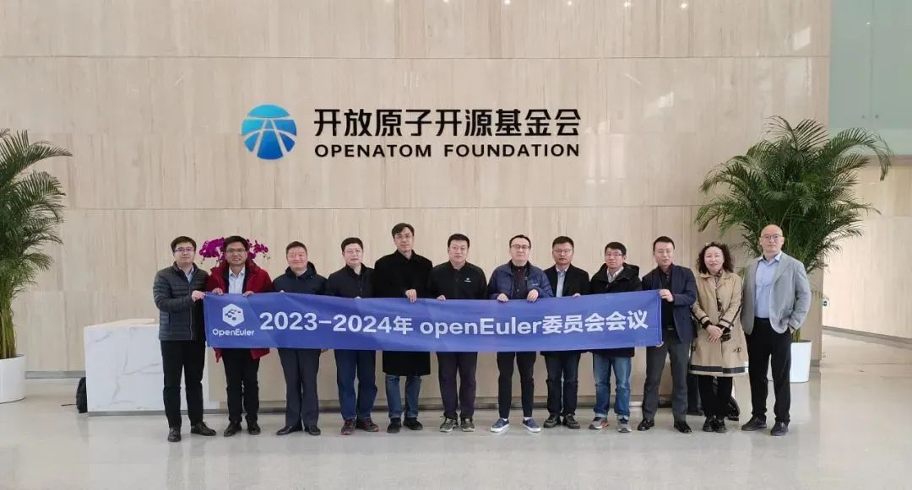

## 2023-2024年openEuler技术委员会会议

3月24日，
2023-2024年openEuler技术委员会在天津召开会议。openEuler委员会副主席武延军，
openEuler技术委员会全体委员及部分往届委员、社区运营专家共29人出席本次会议。感谢麒麟软件的大力支持。

会议围绕openEuler新章程、社区运营规划、新一代技术设施规划、下一代LTS内核选型、LLVM平行宇宙计划等多个议题展开讨论。同时，基于社区
SIG
的活跃程度和发展目标的考虑，TC委员会委员全体成员讨论并表决，同意openboard和buildsystem两个
SIG 停止运作并归档。

技术委员会将持续审视各个SIG 的日常运作、长期规划，对不活跃的 SIG
进行沟通和辅导。保持对各个SIG的持续推动，使得openEuler社区健康发展。

[原文阅读
\>\>\> ](https://mp.weixin.qq.com/s?__biz=MzI2NDE4OTE2Mg==&mid=2247502377&idx=2&sn=1e822114f01daccc398022d212a0af0e&chksm=eab2efacddc566ba786e712881fdab69f7e4ab1113b500b0815125f2e3c12033295c3687419e&token=222391752&lang=zh_CN&scene=21#wechat_redirect)

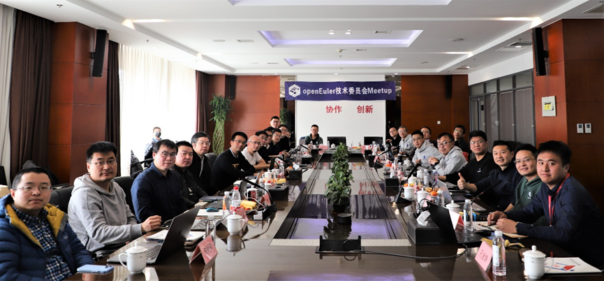

## 吕从庆 接替 叶青龙 成为openEuler技术委员会委员

3月初，经技术委员会全体委员确认同意，吕从庆 接替 叶青龙
成为openEuler技术委员会委员。原TC委员会委员叶青龙因个人工作原因，申请退出TC委员会并推荐
吕从庆 接任。

吕从庆是 SIG DDE Maintainer、SIG Release
Commiter，统信软件服务器操作系统与云计算产线研发主管，具有十多年基于自主可控平台的系统研发经验，目前主要聚焦于操作系统的版本、桌面环境、迁移等研发工作。未来，他将尽自己的绵薄之力，积极投入到TC、release、DDE
等SIG组的工作中，参与技术项目的研发与优化，继续为社区服务。

openEuler委员会委员：

https://www.openeuler.org/zh/community/organization/

## 马威 接替 魏东 担任安全委员会委员

3月中旬，经安全委员会全体委员确认同意，魏东 卸任安全委员会工作，由 马威
接替其职责，担任安全委员会委员。

马威任职统信服务器产线安全技术部，负责云原生安全，商密，机密计算，社区对接相关工作。后续他将积极投入到openEuler社区产品安全工作中，继续为社区服务。

\* openEuler安全委员会（SC）是负责接收和响应openEuler产品安全问题报告、提供社区安全指导，开展安全治理的组织，旨在为openEuler用户提供最安全的产品和开发环境。

## 分布式协同SIG组开始筹备

2023年3月，经openEuler社区技术委员会决议批准，由华为发起，润和、诚迈公司响应的分布式中间件SIG（SIG
Distributed Middleware）开始筹备成立。

边端设备之间的互联是实现设备协同工作的基石，涉及设备的发现、连接、组网、传输等环节。分布式中间件SIG以欧拉鸿蒙协同为切入点，构建openEuler原生全场景支持多设备协同能力，解决端设备形态不一、稳定快速组网难、传输损耗大及接口不统一等一系列边端设备互联难点问题，为设备之间的互联互通提供统一的分布式通信能力开放标准，达成自动发现、即连即用、高带宽、低时延、稳定可靠的目标。

4月21日，SIG Distributed
Middleware将与Embedded、Yocto、Zephyr等嵌入式SIG组在openEuler Developer
Day大会上组织线下工作会议，探讨未来版本工作计划。如果您有议题需求，请在以下链接中填写，现场与SIG组成员讨论：

https://etherpad.openeuler.org/p/sig-Embedded-23.09-planning

## 跨平台图形用户界面应用程序开发框架SIG正式成立

经openEuler社区技术委员会决议批准，由麒麟软件发起，多个友商响应的跨平台图形开发框架SIG
(SIG QT) 正式成立。

该SIG组旨在推动openEuler社区中QT最新版本的引进维护以及QT相关软件包的规划、升级。及时响应用户反馈，解决相关问题。

3月初，SIG
QT完成相关筹备工作，确定SIG组的工作目标、运行方式以及Maintainer等核心成员组成员。当前QT组正在运行中，4月将会开始进行QT6基础组件引进工作。

相关链接：

https://gitee.com/openeuler/community/pulls/4450

# 技术进展

## SIG AccLib启动加解密模块适配Accelerator硬件引擎项目

SIG
AccLib致力于社区化开发维护，围绕Accelerator硬件引擎和加速指令打造多样性算力，为大数据加解密、分布式存储压缩、网络链接通信、视频转码等应用场景提供高性能加速。

本月，为了扩大硬件加解密加速的业务生态，启动ifm_nettle项目。ifm_nettle项目通过提供开源软件nettle的适配层接口，在保持同原有nettle接口兼容的基础上，将部分加解密算法调用鲲鹏硬件提供的加速能力，从而在鲲鹏场景下提供更高的加解密效率。该项目旨在扩大硬件加速业务生态的目标下，减少对于原有软件的侵入式修改以及减少上层依赖软件的适配工作量，简化业务软件的适配成本。该项目后续会逐步发布开源实习项目，欢迎大家参与。

通过邮件列表可关注 SIG AccLib 的动态。

项目地址：

https://gitee.com/openeuler/ifm_nettle

SIG AccLib:

https://www.openeuler.org/zh/sig/sig-detail/?name=sig-AccLib

Maillist：

acc@openeuler.org

4月21日，SIG AccLib将在openEuler Developer
Day大会上组织线下工作会议，探讨未来版本工作计划。如果您有议题需求，请在以下链接中填写，现场与SIG组成员讨论：

https://etherpad.openeuler.org/p/sig-AccLib-23.09-planning

## 社区安全委员会和基础设施联合孵化新的社区签名服务Signatrust

新的项目旨在提供一个高效，安全，管理易用的签名服务，计划覆盖X509和PGP体系，同时支持RPM，ISO，EFI，KO，Image等文件的签名，当前项目正处于初始设计开发阶段，如果你对该项目感兴趣，欢迎参与贡献。

项目地址：

https://gitee.com/openeuler/signatrust

## 移动云携手openEuler社区发布BC-Linux迁移工具

BC-Linux 迁移工具是一款基于欧拉社区 x2openEuler
工具深度定制开发的迁移工具套件，具有批量化原地升级能力，当前支持将
BC-Linux、CentOS 和 RHEL 7 全系列升级至 BC-Linux for Euler
版本，支持命令行和图形化两种操作模式，提供迁移原子化能力，支持容器、虚拟化及大数据等复杂应用场景。移动云结合本身在操作系统上的积累，贡献了环境巡检部分代码，已在社区建立仓库env_check，将日常运维过程中的用例持续贡献到社区。

相关链接：

https://gitee.com/openeuler/env_check

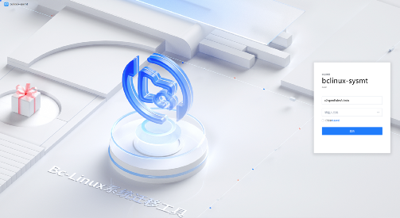

## 天翼云团队孵化新项目CTinspector

2023年3月，由中国电信天翼云团队原创的新项目CTinspector在openEuler
SIG-eBPF
中开始孵化并持续运作，该项目为多结点巡检、运算场景链式传递提供了一个基础框架。目前该项目已经实现了主题框架，提供了少许测试demo，OBS编译构建和集成测试均已通过。

与普通的巡检工具相比，该项目的特点在于可以在预设的剧本中调用内核中的ebpf埋点获取数据，并把结果及剧本直接传向下一个操作结点，最大程度的提高了巡检的效率。

欢迎感兴趣的朋友参与进来：

https://gitee.com/openeuler/CTinspector

## 星云智联N1045XS智能网卡驱动在openEuler开源

2023年3月，星云智联N1045XS智能网卡驱动在openEuler驱动源码仓和制品仓成功建仓，准备合入release发布版本。

N1045XS是基于星云智联自主研发芯片方案的一款10GE智能网卡。该产品集成4个万兆以太网媒介存取控制器（MAC）和SFP+端口，既具有以太网MAC与PHY层的功能，又可以对网络流量进行有效管理。该产品主要用于云计算、网络安全和工业控制等场景，提供内核态，用户态驱动，适配不同操作系统。该产品支持硬件虚拟化、多队列等卸载功能，可有效减少CPU开销，
满足网络流量、业务分流、加速处理及虚拟化与大数据运算的需求。此次星云智联N1045XS智能网卡驱动在openEuler开源，将进一步丰富openEuler的国产硬件生态。

相关链接：

https://gitee.com/src-openeuler/m1600-driver

https://gitee.com/openeuler/m1600-driver

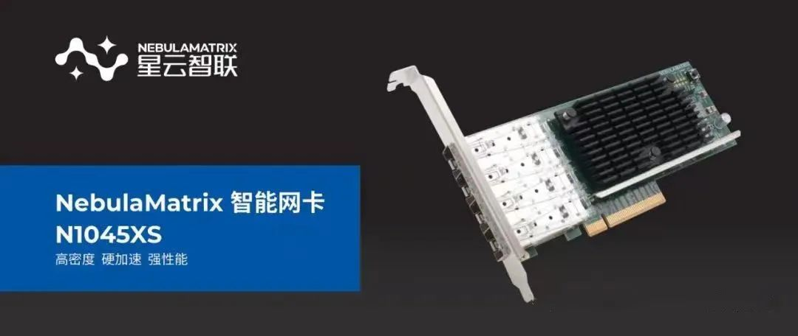

## 新项目oec-cloud在openEuler社区开源

2023年3月，新项目oec-cloud在SIG-Compatibility-Infra下创建并持续运作。

该项目是openEuler社区提供的一款虚拟化、容器化等部件和硬件兼容性测试框架和工具，提供基于整服务器的兼容性验证测试。

oce-cloud项目正在逐步开发中，目前以对齐基础用例和框架的开发节奏，云化部件初步确认为stratovirt、iSula等。预期完成后，将实现工具化测试，用户搭建基础环境后运行测试套件、选择测试任务、输出并上传测试结果等简单操作，即可完成与硬件的兼容性测试，操作简单，结果明了。

欢迎对兼容性感兴趣的朋友关注兼容性SIG，涵盖操作系统/虚拟化对硬件、网卡等的兼容性验证内容，通过测试后openEuler社区官网会发布相应的兼容性清单：

https://www.openeuler.org/zh/sig/sig-detail/?name=sig-Compatibility-Infra

4月21日，SIG-Compatibility-Infra将在openEuler Developer
Day大会上组织线下工作会议，探讨未来版本工作计划。如果您有议题需求，可以在以下链接中填写，现场与SIG组成员讨论：

https://etherpad.openeuler.org/p/SIG-23.09-planning

## openEuler 成功适配 SG2042 服务器板卡加速软件包构建

近日，RISC-V SIG 成功将 openEuler 操作系统适配至 SG2042(EVB)
服务器板卡，为 RISC-V
生态发展迈出重要一步，经测试，基础系统、有线网络、USB接口等组件已可流畅使用。

RISC-V SIG 计划将 SG2042 与 OBS 结合，加速 RISC-V 软件包构建进程。SG2042
本地构建方式相较于 qemu user
模式具有显著速度优势，大幅缩短构建时长。此外，RISC-V SIG
将与中科院软件所 RuyiSDK
团队合作，优化科学运算软件应用，挖掘RISC-V领域潜力。

未来，RISC-V SIG 将继续与算能合作，推动 SG2042
获得更多主流发行版和基础软件支持，并将其接入 RISC-V Lab，探索 RISC-V
在服务器级芯片领域的应用潜力，同时为更多 RISC-V 开发者提供 "RuyiSDK"
支持。

## 算能 SG2042 RISC-V 镜像下载：

https://mirror.iscas.ac.cn/openeuler-sig-riscv/openEuler-RISC-V/preview/openEuler-23.03-V1-riscv64/SG2042/

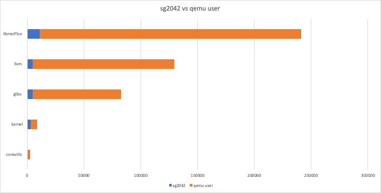

## SIG-SDS支持Ceph的汉化

Ceph
Dashboard以WebUI方式提供对Ceph集群的监控和管理功能，包括但不限于集群监控、存储池管理、块设备管理、文件系统管理、对象网关管理等功能，已经被广大Ceph爱好者所接受和喜欢。

但随着Ceph在国内快速发展，暴露出一个需求：Ceph原生社区的Dashboard只提供英文界面，无法满足中国用户运维的需求，目前openEuler
SIG SDS基于原生ceph社区通过patch方式支持Ceph dashboard的汉化。

详见PR：

https://gitee.com/src-openeuler/ceph/pulls/185

汉化界面：

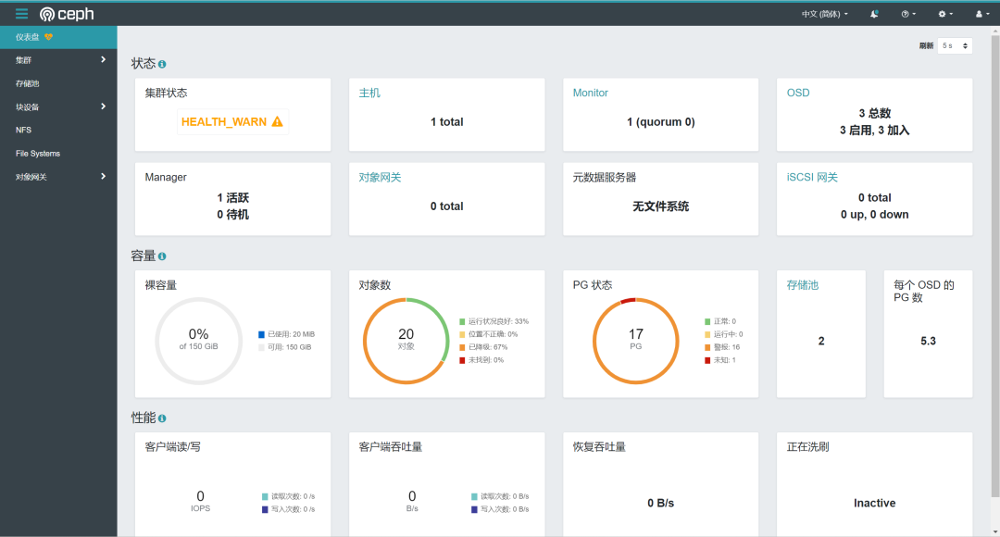

## SIG dev-utils推出sysMaster：打造下一代系统服务管理

SIG
dev-utils推出sysMaster项目，重新定义服务管理，实现了故障秒级恢复，保障系统24小时在线。

sysMaster项目不断发展完善，最新版本引入了1+1+N架构，即init(pid1) +
core(manager) +
exts(组件)。通过极简的init进程实现僵尸进程回收和保活监控功能，从而保证了1号进程的极致可靠性。同时引入了devMaster组件，可以灵活处理设备的变化，当前框架已经开发完成，实现了设备管理的uevent事件监听和worker的调度分发等功能。下一步的工作计划是完成对规则支持。

如果您对系统可靠性和1号进程感兴趣，sysMaster项目是您不容错过的选择。

项目地址：

https://gitee.com/openeuler/sysmaster

devMaster架构：

## Jailhouse支持图形化配置

在最新发布的openEuler 23.03创新版中，来自菁蓉联创的开发者为 openEuler
Embedded 引入
JailHouse，实现嵌入式虚拟化功能，混合关键部署支持外设分区管理，丰富嵌入式应用场景。

Jailhouse-gui是一个用Python编写的图形用户界面程序，分为两个部分：核心模块和GUI模块。核心模块主要负责业务逻辑和数据处理，而GUI模块则负责与用户的交互和显示。

核心模块主要负责管理Jailhouse虚拟化环境的配置和状态信息，并提供用户操作的底层接口。

GUI模块则负责与用户进行交互和显示相关信息。它提供了一个用户友好的图形用户界面，让用户能够直观地了解Jailhouse虚拟化环境的状态和配置信息，并进行必要的操作。GUI模块通常包括图形界面元素、菜单、对话框、工具栏等组件。

Jailhouse-gui具有以下主要功能：

-   硬件平台展示功能，可显示CPU信息以及板级信息配置；

-   可对查看cell的配置信息并进行修改；

-   可实现对cell的图形化监控，通过jailhouse-gui可远程查看、管理cell的加载、运行和停止

目前jailhouse-gui支持加载以下程序：

-   Linux

-   FreeRTOS

-   Baremetal

软件功能模块架构：

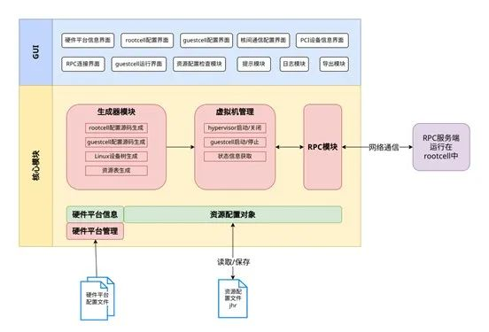

界面：

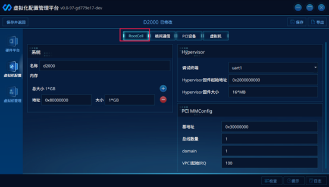

## SIG Wayca持续推动openEuler与鲲鹏的生态构建

作为构建openEuler与鲲鹏生态的主要阵地，WayCa仓主要包含了高速网络功能、加速器、调测工具、鲲虚拟化和基础IO等鲲鹏项目的运作和维护。通过openEuler
SIG WayCa
，建立鲲鹏硬件使能爱好开发者、应用者沟通交流渠道；让鲲鹏硬件能力应用到鲲鹏OS厂商、ISV和各鲲鹏客户场景中，吸引更多科研开发团队挖掘鲲鹏优势场景；达到共同构建鲲鹏和openEuler的生态目标。

近期，SIG
WayCa已完成故障处理系列（RAS/rasdaemon）等相关议题的社区讨论，后续持续完善openEuler与鲲鹏的生态构建。

openEuler SIG WayCa 规划如下：

一期：故障处理系列 \--RAS/rasdaemon

二期：CPU特性系列\-- SC/LSE/BTI\...

三期：调测工具系列\--perf/hikptool

四期：高速网络系列\--nic

五期：高速网络系列\--roce rdma-core

欢迎感兴趣的朋友参与进来，通过邮件列表可关注 SIG WayCa 的动态。

项目地址：

https://gitee.com/openeuler/WayCa

Mailist：

wayca@openeuler.org

# 社区基础设施

## 软件包贡献平台上线

软件包贡献平台旨在为全球的贡献者提供一个统一的，可视化的，便捷的服务，用于将软件包贡献到openEuler社区。

该平台实现了软件包贡献申请，测试，审批，发布流水线；并通过流水线视图，做到贡献过程透明化。

平台支持将软件包代码发布到Gitee或Github，海外贡献者可在Github上可进行后续的版本开发，保证软件包贡献的连续性。该平台必将促进更多的软件包贡献到openEuler社区。

软件包贡献平台：

https://software-pkg.openeuler.org/zh/package

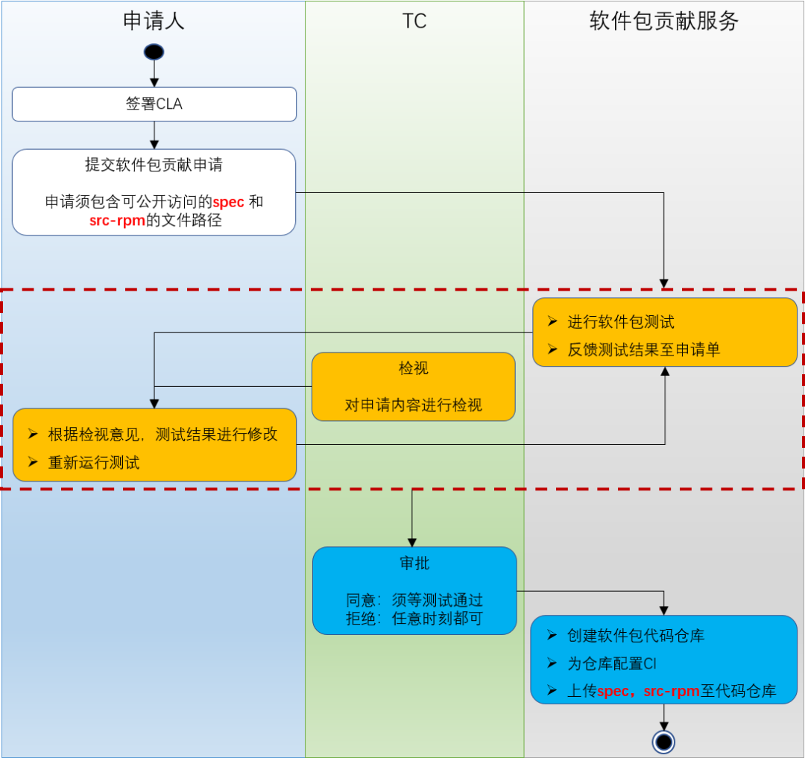

## 在线编辑服务EasyEditor

为降低openEuler官网开发门槛，及时更新SIG、活动等页面的动态信息，SIG-Infra与SIG-OpenDesign上线了在线编辑服务平台------EasyEditor。目前，EasyEditor已支持相关用户在线实时编辑SIG页面，满足各SIG及时更新简介、会议等信息，新增自定义图文展示楼层等的便利工作流。后续，在线编辑服务将陆续增加支持更多内容与页面类型的自主编辑能力，敬请期待！

地址：

https://easyeditor.openeuler.org/

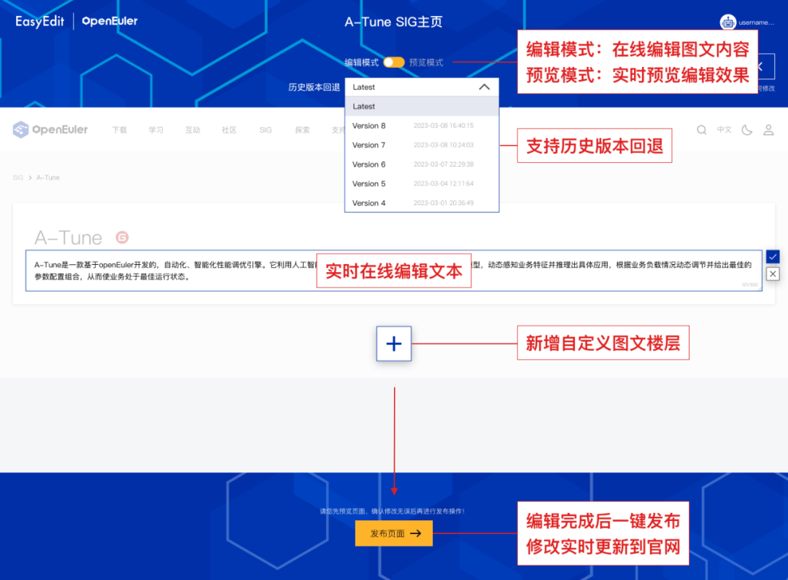

## 官网搜索增加版本筛选功能

openEuler官网搜索功能优化，新增版本筛选功能

【官网】→【搜索】

地址：

https://www.openeuler.org/

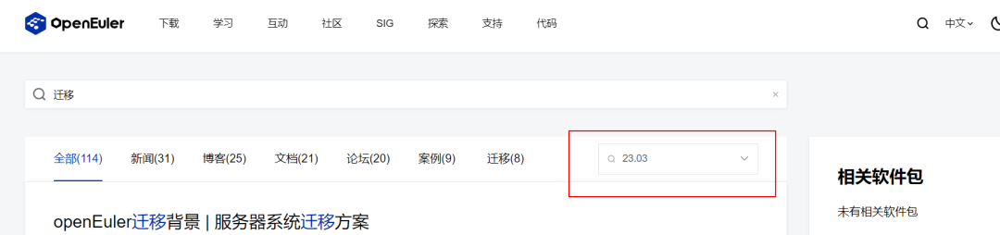

## 软硬件兼容性清单

截至2023年3月，当前兼容性方案**806**个，其中北向**439**个，南向**368**个，OS **59**个；3月新增北向**48**个，南向**10**个，OS **3**个。

社区兼容性清单：

https://www.openeuler.org/zh/compatibility/

# 安全公告

2023年3月社区共发布安全公告**67**个，修复漏洞**86**个（其中
Critical **3**个，High **46**个，其它 **37**个），公告不受影响CVE **57**个。

## 重点漏洞提醒

如下漏洞评估影响较大，请重点关注：

emacs任意命令执行漏洞（CVE-2023-28617），CVSS评分为9.8分。

公告链接：

https://www.openeuler.org/zh/security/cve/detail/?cveId=CVE-2023-28617&packageName=emacs

影响范围：

openEuler-20.03-LTS-SP1

openEuler-20.03-LTS-SP3

openEuler-22.03-LTS

openEuler-22.03-LTS-SP1

clamav远程执行任意代码漏洞（CVE-2023-20032），CVSS评分为9.8分。

公告链接：

https://www.openeuler.org/zh/security/cve/detail/?cveId=CVE-2023-20032&packageName=clamav

影响范围：

openEuler-20.03-LTS-SP1

openEuler-20.03-LTS-SP3

openEuler-22.03-LTS

openEuler-22.03-LTS-SP1

 

glibc 缓冲区溢出漏洞（CVE-2023-0687），CVSS评分为9.8分。

公告链接：

https://www.openeuler.org/zh/security/cve/detail/?cveId=CVE-2023-0687&packageName=glibc

影响范围：

openEuler-20.03-LTS-SP1

openEuler-20.03-LTS-SP3

openEuler-22.03-LTS

openEuler-22.03-LTS-SP1

## 漏洞防护

openEuler社区针对在维版本例行修复漏洞，发布安全补丁。建议用户关注openEuler官网安全公告，及时安装漏洞补丁进行防护。

openEuler安全公告：

https://www.openeuler.org/zh/security/security-bulletins/

# 人才培养

## 软通教育openEuler-OECA工程师认证考试平台上线

为了繁荣openEuler生态，加速培养业界所需的尖端人才，提供高质量的服务，openEuler开源社区人才与服务SIG组
联合openEuler社区人才评定合作伙伴构建了人才评定体系。

2023年3月7日，软通教育考试系统已与openEuler证书管理系统完成IT系统对接并上线。同时，在openEuler开源社区人才与服务SIG组联合人才评定合作伙伴的推广下，新增openEuler-OECA认证工程师188人。

软通教育openEuler-OECA工程师认证考试平台报名链接：

https://www.itongxue.net/itxcertificationdetails?id=26c81b6ed7f11be0b2491f9c58d8b22c

# 感谢每一位朋友、开发者的支持

因为大家的辛勤贡献，openEuler的每一天都发生着好的事情。小编限于视野和能力，难免有所遗漏，在此表示歉意。同时，衷心感谢以下社区朋友、openEuler
SIG组成员以及开发者们对本月月报的贡献：

\* 以上不分先后顺序

如果您希望在月报中增加您的工作内容，或对内容有任何改进建议，请联系wengqiaozhen@openeuler.sh。
