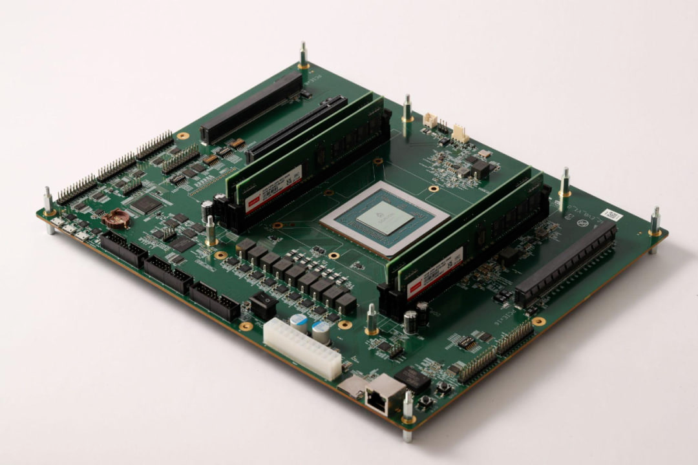
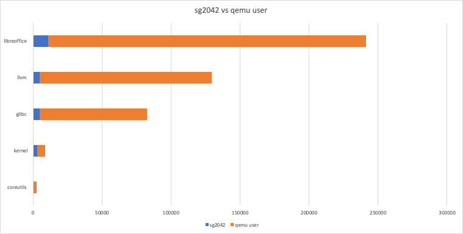

近日，RISC-V SIG 取得重要成果，成功在算能 SG2042 (EVB)
服务器板卡上成功适配 openEuler 操作系统，这是推动 RISC-V
生态发展的重要进展。

## SG2042 服务器板卡适配 openEuler 成功

RISC-V SIG 宣布成功将 openEuler 操作系统适配至性能卓越的 SG2042 (EVB)
服务器板卡。SG2042 硬件特性包括 120W 功耗、64 个 RISC-V 内核、2GHz
主频、大容量 Cache、PCIe Gen4 接口和 DDR4 内存等。openEuler RISC-V 基于
openEuler 22.03 LTS 版本和最新的 23.03 创新版本，分别制作了 SG2042
板卡的体验镜像，集成 openEuler
的基础功能，采用最新的厂商固件和内核分支。经过测试，基础系统、有线网络、USB
接口、PCIE 等组件已可流畅使用，HDMI 可正常显示。作为服务器板卡，RISC-V
SIG 正积极探索其适用于不同场景的云原生应用，预计不久后，SG2042
将作为先行服务器板卡，广泛应用于服务器领域。

算能 SG2042 RISC-V
镜像下载：[https://mirror.iscas.ac.cn/openeuler-sig-riscv/openEuler-RISC-V/preview/openEuler-23.03-V1-riscv64/SG2042/](https://mirror.iscas.ac.cn/openeuler-sig-riscv/openEuler-RISC-V/preview/openEuler-23.03-V1-riscv64/SG2042/)

## SG2042 作为构建服务器 接入 OERV OBS 加速构建

SG2042 服务器板卡的适配成功是 openEuler 推动 RISC-V
生态发展的重要里程碑。RISC-V SIG 计划将 SG2042 服务器板卡与 OBS（Open
Build Service）相结合，充分利用其性能优势，加快 RISC-V
软件包的构建进程，为软硬件生态体系的完善奠定基础。目前，OERV OBS（Open
Build Service）构建 openEuler Packages 的主要方法是 qemu user 和 qemu
system 的混合方式，这也是大部分 RISC-V 发行版采用的构建策略。相较于
system 模式，user 模式的性能普遍要高出 5 倍以上，而 SG2042
的本地构建方式相较于 qemu user 模式又具有显著的速度优势。RISC-V SIG 将
SG2042 服务器板卡接入 OERV OBS 进行构建测试， 在小型软件包构建方面，如
coreutils，SG2042 可实现 6 倍以上的加速，仅需 300
多秒完成一次构建，速度可媲美原生 AArch64 和 x86_64
架构。对于大型软件包的构建，加速效果更为显著。例如，常见的 glibc 和 LLVM
通常在普通的 qemu user 环境中需要 1 至 2 天才能完成构建，而 SG2042
可将此过程缩短至 2 小时以内。对于像 LibreOffice 这样的大型应用，SG2042
可将原本在 qemu user 环境中需耗费 3 天左右的构建时间缩短至 3
小时左右，大幅减少构建时长。

具体数据对比可参考上图，需要说明的是，所展示的时间数据(单位 s)来自于
OERV OBS
的最佳构建结果，即时间越少构建越快。实际使用中，由于服务器构建包数量的影响，本对比仅作为使用角度的差异参考，并非严格控制变量的性能评测。

## 推动 RISC-V 高性能应用持续落地

尽管 SG2042 服务器板卡上的 openEuler
操作系统已取得良好的兼容性和稳定性，RISC-V SIG
仍致力于解决已知问题，进一步提升系统性能和用户体验。当前，基于 SG2042 的
openEuler RISC-V 操作系统在 GPU
适配及云原生应用方面尚有优化空间，需进一步丰富 SG2042 作为 PC
服务器的生态环境，并提高部分软件包构建和应用的稳定性。此外，RISC-V SIG
将利用 RISC-V 向量扩展指令（RVV 0.7）的支持，使用 RVV 0.7 GCC
构建整个系统，发掘更多性能潜力。为实现这一目标，RISC-V SIG
将与中科院软件所 RuyiSDK 团队合作，共同优化科学运算软件应用，充分挖掘
RISC-V 领域的潜力。未来，RISC-V SIG 将继续与算能合作，推动 SG2042
获得更多主流发行版和基础软件支持，并将其接入 RISC-V Lab，探索 RISC-V
在服务器级芯片领域的应用潜力，同时为更多 RISC-V 开发者提供 "RuyiSDK"
支持。

## 联系我们

如果您对 RISC-V 感兴趣，欢迎加入 RISC-V SIG 交流群，讨论更多关于 RISC-V
的更多内容，为推动 openEuler & RISC-V
生态贡献力量 **中科院软件所吴伟微信**

添加请备注  oerv

## 关于作者

杨延玲，中科院软件所 PLCT 实验室实习生，欧拉开源社区 RISC-V SIG
成员，目前在温州大学读研二，负责协助 RISC-V SIG 和 ROS SIG 的日常运营。
