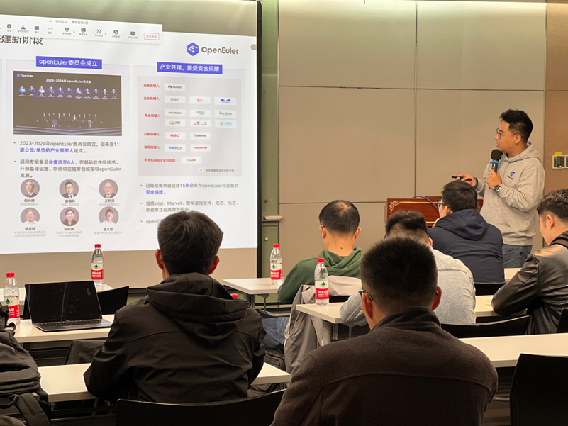
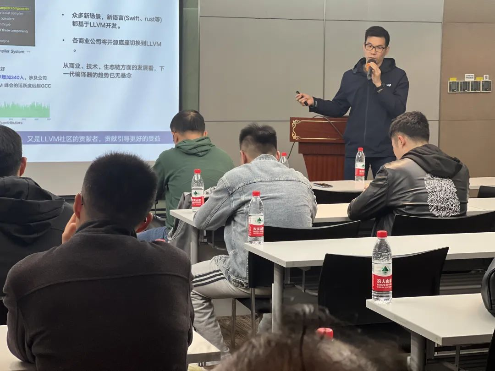
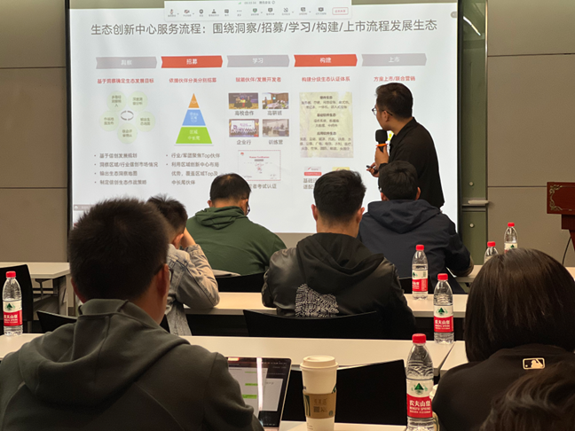
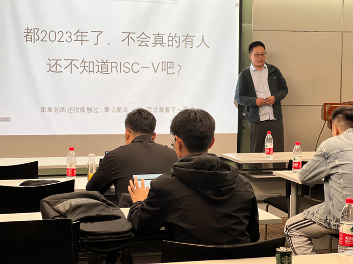
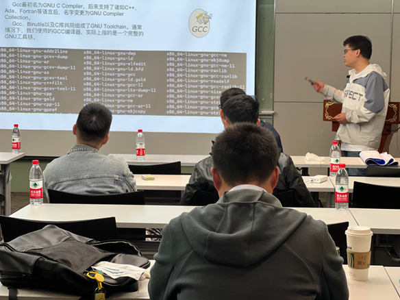
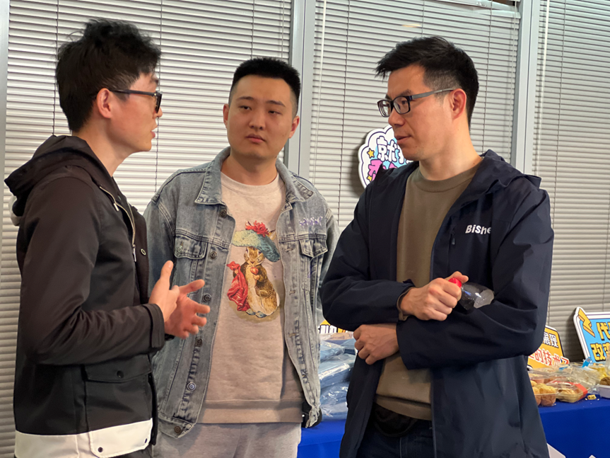

2023年4月7日，openEuler Compiler&Embedded
Meetup杭州站圆满举行。openEuler希望搭建一个开放的平台，鼓励开发者们积极互动、交流经验、碰撞思想、激发创新，共同推动openEuler社区的发展。本次Meetup由openEuler社区的Compiler
SIG及Embedded
SIG发起，联合浙江省鲲鹏生态创新中心主办，CNRV社区、HelloLLVM社区合作参与。

本次线下Meetup受到了杭州开发者的关注和喜爱，报名参与者包括金融、教育、互联网等行业的用户和开发者。同时，我们在openEuler
B站及毕昇编译器视频号同步直播本次Meetup，让无法到现场的开发者们也能第一时间get到满满干货。

为了探讨嵌入式系统和编译器技术在openEuler领域的最新进展与创新应用，多位特邀嘉宾围绕编译器和嵌入式领域关键技术进行分享。

下面就让我们来回顾本次Meetup杭州站的精彩内容（文末有彩蛋）！

**Part 1:  openEuler：面向数字基础设施的开源操作系统**

openEuler社区Maintainer
郑振宇从多方位给大家介绍了openEuler是面向数字基础设施的开源操作系统，让现场开发者对openEuler有了进一步的认识。郑振宇还向大家介绍了4月21日的SIG组工作会议，作为ODD2023重要的一环，**SIG组工作会议参与人数最多，涉及话题最广，**40+场不同技术方向的会议将同期举行，汇聚各行各业上千位开发者，有高校学者，业内技术专家等等，阵容强大，欢迎大家报名参与！

[[\>\>\>点击参看报名方式]](http://mp.weixin.qq.com/s?__biz=MzI2NDE4OTE2Mg==&mid=2247502525&idx=1&sn=409fe6203be2af17508e8ff153293fe3&chksm=eab2ef38ddc5662ea5a26cf27b45fb56782dfcad6ec6c24f691d8a93e2f8cb279e7fb4b08562&scene=21#wechat_redirect)

**Part 2: openEuler Embedded中嵌入式工具链的支持探索**

openEuler TC委员任慰和openEuler Embedded SIG
Maintainer刘铭锴带来联合分享，他们介绍了openEuler
Embedded的最新进展，同时重点探讨对嵌入式工具链的支持探索，包括gcc工具链构建，预构建工具链和构建系统的关系，基于LLVM工具链的镜像的实现，多种C库的支持，多操作系统的统一工具链构建，未来的计划等。

**Part 3: LLVM平行宇宙计划及openEuler Embedded场景实践分享**

LLVM平行宇宙计划是尝试使用 Clang/LLVM 构建的
openEuler更多的软件包，此尝试独立于openEuler版本发布工作。openEuler
Compiler SIG Maintainer
赵川峰老师的分享详细介绍了LLVM平行宇宙计划，以及分享华为的毕昇编译器和庞加莱团队基于openEuler
Embedded场景的具体实践。

**Part 4: 浙江鲲鹏创新中心-构建国产化生态，共创客户价值**

浙江鲲鹏创新中心生态总监秦龙给大家介绍了鲲鹏产业发展及浙江鲲鹏生态创新中心运营情况，还分享了2023年鲲鹏生态规划和合作研讨，诚邀广大企业和开发者参加鲲鹏应用创新大赛、鲲鹏开发者创享日等活动。

**Part 5: 先进，再前进：RISC-V SIG 联合 Compiler SIG 推进 LLVM
平行宇宙计划**

openEuler RISC-V Maintainer & RISC-V
Ambassador吴伟老师用风趣幽默的语言向大家介绍LLVM近年来在兼容GCC方面的进展、RISC-V架构上LLVM构建openEuler基础系统的状态和经验、并给出了2309和2403两步路线图。

**Part 6：GCC中的RTL语言简介**

来自PLCT Lab
的编译器开发工程师廖仕华老师分享了通过RTL语言可以了解GCC编译器如何做机器相关的优化，如何生成具体的汇编指令。

能量茶歇&精美礼品

畅所欲言自由交流

***彩蛋！！***

*添加openEuler小助手，回复【杭州
Meetup】，即可领取本次杭州Meetup部分讲师授权分享的演讲PPT。*

*本次活动回放也可在 openEuler B 站合集中上找到回放。*

*点击[链接](https://space.bilibili.com/527064077/channel/collectiondetail?sid=1275271)即可跳转～*

欢迎关注openEuler公众号，获取社区活动最新资讯。openEuler期待与你下次再见！
