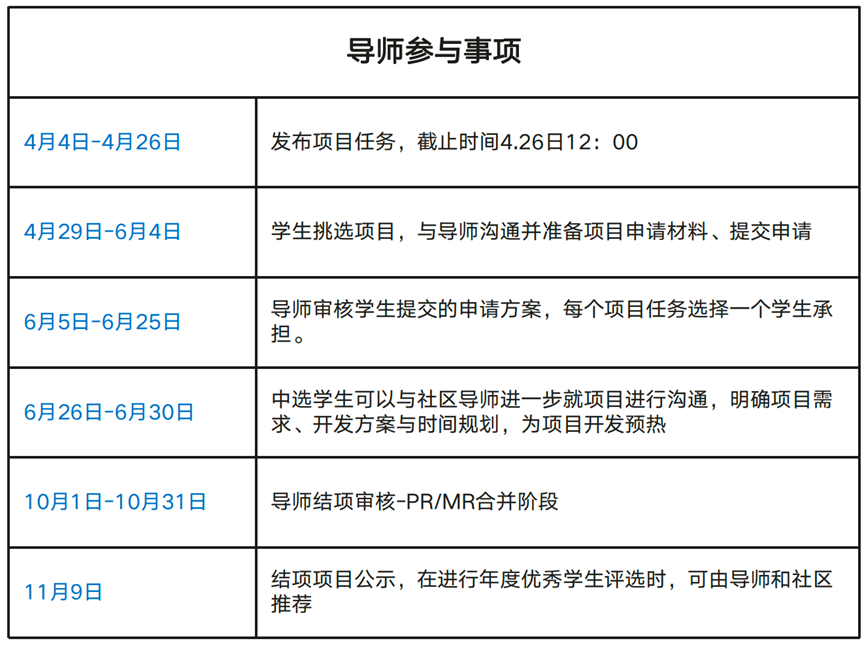
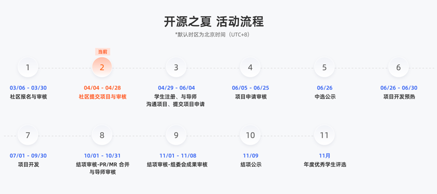
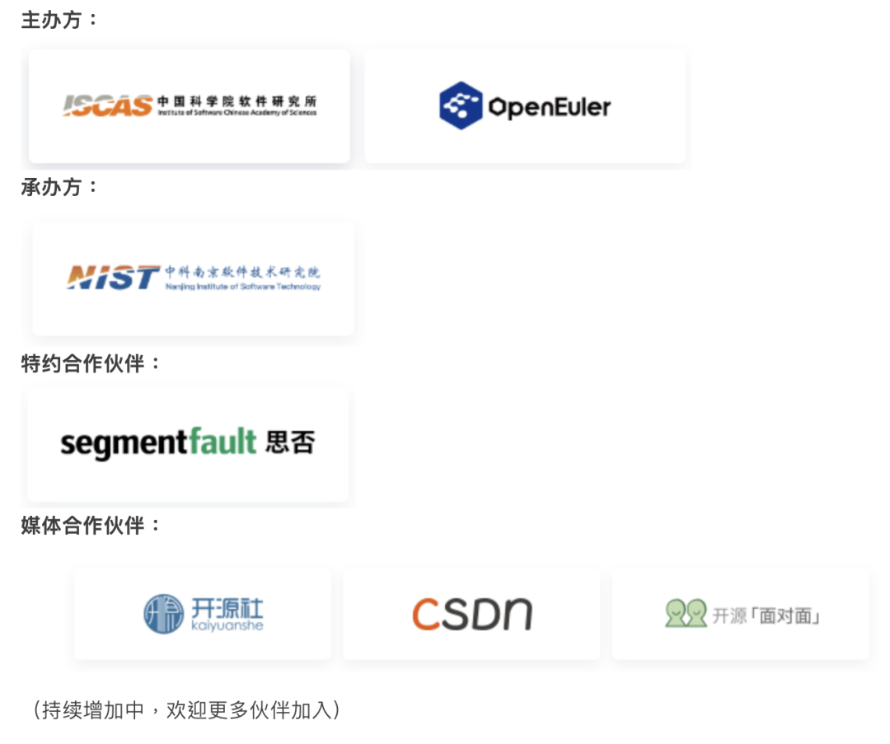

开源之夏是"开源软件供应链点亮计划"下面向高校学生的暑期开源活动，由**中国科学院软件研究所**与**openEuler社区**联合主办，旨在鼓励在校学生积极参与开源软件的开发维护，培养和挖掘更多优秀的开发者，促进优秀开源社区的蓬勃发展，助力开源软件供应链建设。

自2020年正式启动，openEuler社区牵手开源之夏已走过三个年头，成为**每年暑期前最受高校开发者关注、国内规模最大、影响力最强**的开源活动之一。

 

2022年有来自385所海内外高校的**1800名学生**报名，在**124家开源社区**发布的**502个项目**任务中选择感兴趣的进行申请。其中openEuler社区上线87个项目任务，收到196份申请书，最终76名学生中选，57个项目任务成功结项，为openEuler社区**内核、云原生、虚拟化、编译器、嵌入式、基础设施**等方向贡献了优秀成果。

 

点此查看开源之夏盛况：

**2022年**：[https://mp.weixin.qq.com/s/G5YgYL_l63CxWexuOCq51Q](https://mp.weixin.qq.com/s/G5YgYL_l63CxWexuOCq51Q)

**2021年**：
[https://mp.weixin.qq.com/s/-HozMl0_pBBVNRPBTWettg](https://mp.weixin.qq.com/s/-HozMl0_pBBVNRPBTWettg)

 

今年openEuler社区将继续携手各位资深导师，为社区继续带来新生力量。

# 导师招募

目前活动正在项目征集阶段，盛情邀请社区各位资深开发者成为本次【开源之夏】项目导师。

**导师出题**：导师可结合openEuler社区的开发与维护设计mini任务，开放给全球高校学生报名申请。项目任务可以为openEuler的功能性完善，或者基于openEuler
做创新性开发等，结项标准以PR合入社区仓库为目标。

**导师招募对象**：

-   在openEuler社区有贡献经验的社区开发者

-   高校老师

-   往届开源之夏优秀学生

**导师激励**：活动组委会将为成功带领学生完成项目任务并将成果贡献至社区的导师提供**项目奖金（税前3000元人民币）与荣誉证书**。

具体详情可参考官网导师指南：

[https://summer-ospp.ac.cn/help/mentor/](https://summer-ospp.ac.cn/help/mentor/)

**注意：**

**一个导师仅能出一个项目任务；**

**导师报名&项目任务提交截止时间：2023年4月26日12:00**

# 导师申请通道

请填写以上表格信息进行申请，

社区审核后会统一邮箱联系。

# 学生相关

学生可自由选择项目，与社区导师沟通实现方案并撰写项目计划书。被选中的学生将在社区导师指导下，按计划完成工作，并将成果贡献给社区。社区评估学生的完成度，主办方根据评估结果发放资助金额给到学生。

学生可获得的奖金：

**进阶**：奖金人民币 12000 元

**基础**：奖金人民币 8000 元

**难度分级由社区根据项目任务决定。**

对openEuler开源之夏项目

感兴趣的同学可扫码入群

若群已满，可私戳小助手号

备注**开源之夏**进入交流群。

# 更多活动信息

**活动整体流程**

**合作单位**

活动官网：

[https://summer-ospp.ac.cn/](https://summer-ospp.ac.cn/
)
