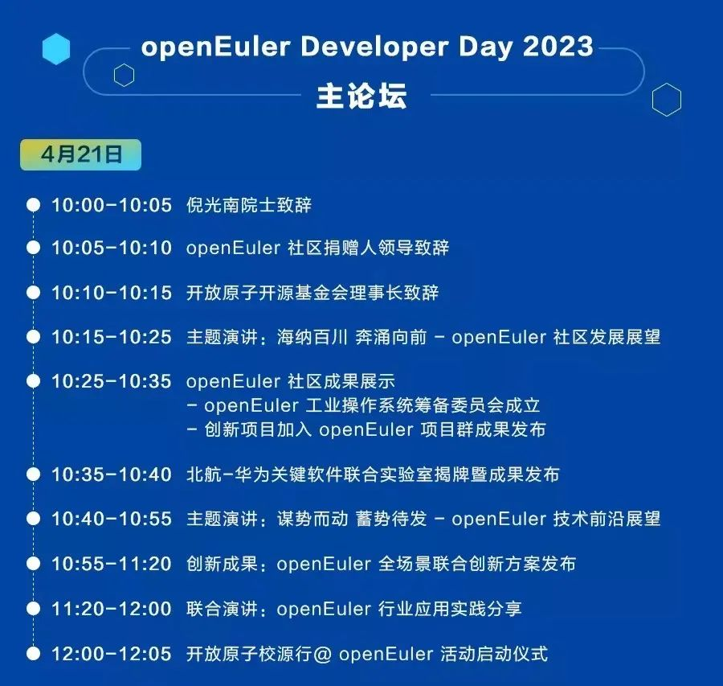
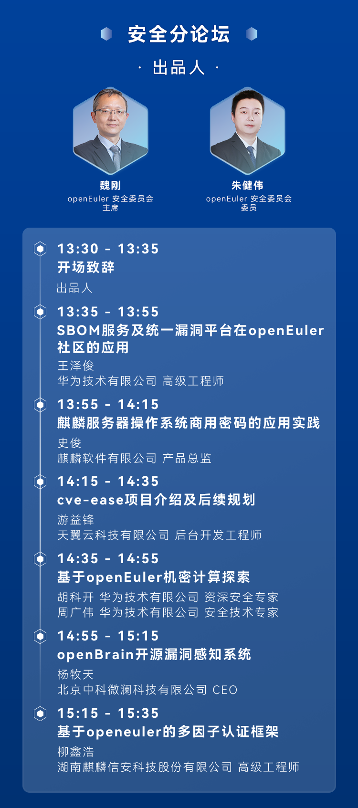
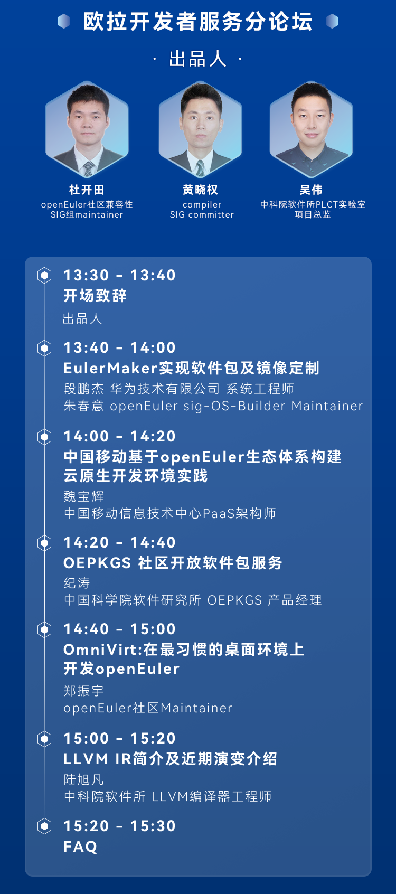
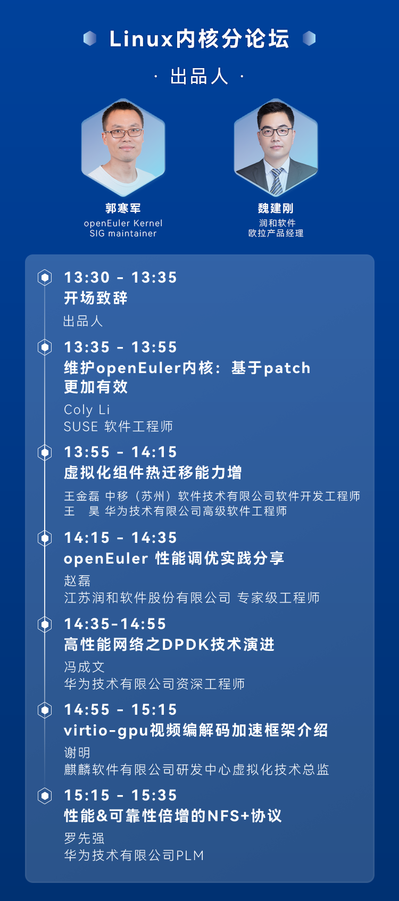
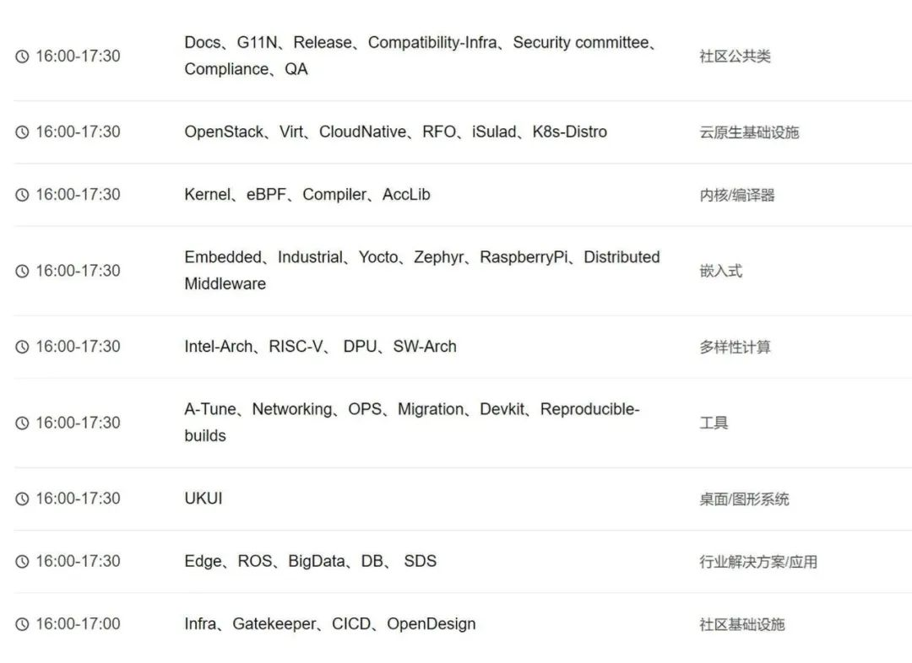
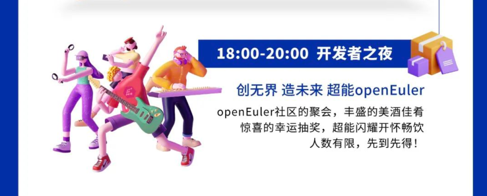
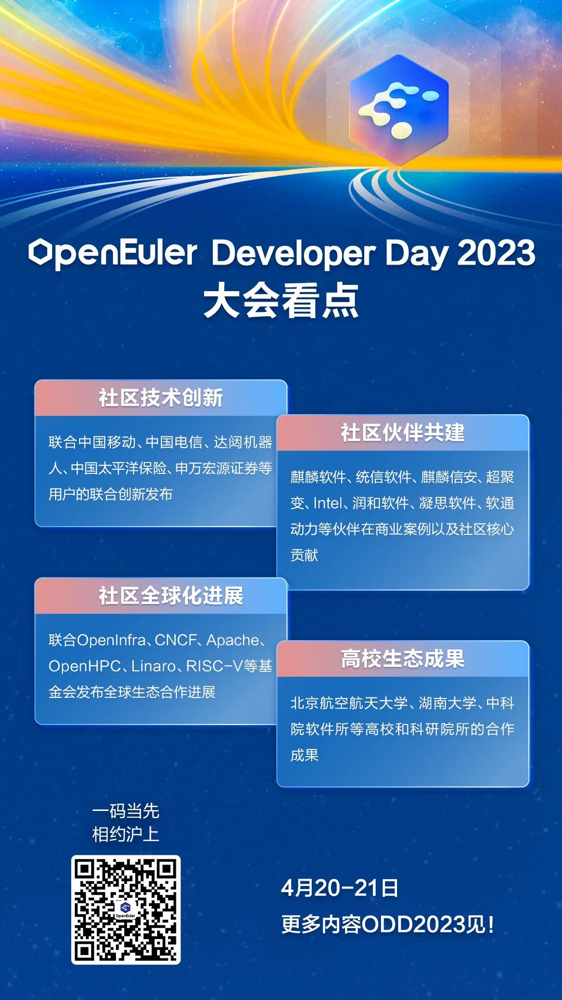
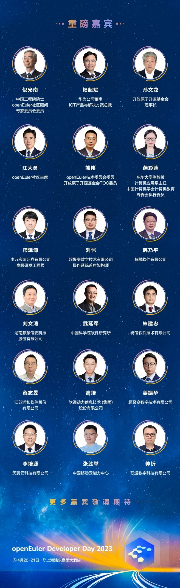

openEuler Developer Day 2023 （简称 ODD 2023）是开放原子开源基金会旗下
openEuler 社区发起的顶级开发者峰会。ODD 2023
将于4月20日-21日在上海浦东嘉里大酒店举办。整体大会以线下会议及线上直播方式进行。

大会看点满满，赶紧来一睹为快

# 活动丰富，目不暇接

## 1场主论坛 

## 6场技术分论坛

## 欧拉开源社区的开放工作会议 

-   社区委员会闭门会

-   社区用户委员会开放会议

-   社区40+SIG组工作会议等

## 1场开发者派对

### 干货十足，让你满载而归

### 重磅嘉宾齐聚，不虚此行

技术弄潮儿

院士、技术大牛、行业top客户

共同探讨欧拉开源操作系统前沿技术

4月20日-21日 

openEuler Developer Day

我们在上海，与你不见不散

立即扫码报名参会吧
