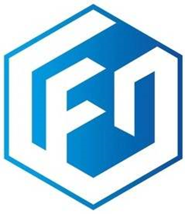

openEuler Developer Day 2023 （简称 ODD 2023）是由 openEuler
社区发起并举办的年度开发者大会。旨在推动 openEuler
在多样性计算、云计算、边缘计算、服务器、嵌入式、开源硬件以及安全、迁移、运维等技术方向的持续探索和创新。

本次ODD大会，openEuler社区非常荣幸能够邀请到OpenInfra基金会，并在现场设置OpenInfra基金会展区。未来openEuler将与OpenInfra基金会展开进一步的合作，共同促进开源基础设施发展。

## 关于OpenInfra基金会

OpenInfra基金会致力于构建多元化的开源社区，推动开源基础设施软件在实际生产中的应用。OpenInfra基金会在全球187个国家/地区110,000余名社区成员的支持下，托管开源项目并展开社区实践，涉及人工智能、容器云原生应用、边缘计算及数据中心云等基础设施领域。

OpenInfra基金会秉承其帮助人们构建和运营开源基础设施的使命，托管开源项目，为当今基础设施的发展做出贡献。从云托管到5G背后的驱动力，这些项目都是代码优先的，并在我们称之为"四个开放"的指导原则下运作。这些项目包括OpenStack，Airship，Kata
Containers，OpenInfra Labs，StarlingX和Zuul。

## 关于算力网络开源工作组

算力网络开源工作组（CFN
WG）为直属于开源基础设施基金会下的工作组，成立于2022年7月，汇集了运营商、主流云厂商、设备商等18+企业，
聚焦于构建算力网络的开源生态，各参与方一起协作推动算力网络相关技术发展以及构建算力网络开源原型。

目前CFN
WG已成立需求与架构子组，泛算调度子组，DPU子组，总体上由需求与架构组牵动从典型算力网络应用场景出发，提出技术需求并推动相关技术子组输出开源实现，
迭代丰富算力网络应用场景，输出算力网络端到端开源原型。

## 参会信息

**时间**：4月21日  

**地点**：上海浦东嘉里酒店

如果您想现场参加OpenInfra基金会展区，扫描下方二维码即可报名。

扫码报名
