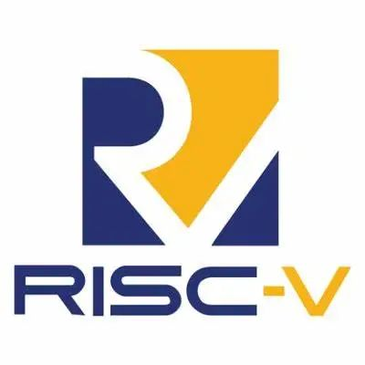

openEuler Developer Day 2023 （简称 ODD 2023）是由 openEuler
社区发起并举办的年度开发者大会。旨在推动 openEuler
在多样性计算、云计算、边缘计算、服务器、嵌入式、开源硬件以及安全、迁移、运维等技术方向的持续探索和创新。

本次ODD大会，openEuler社区非常荣幸能够邀请到RISC-V国际基金会，并在现场设置RISC-V国际基金会展区。未来openEuler将与RISC-V国际基金会展开进一步的合作，共同促进处理器创新发展。

## 关于RISC-V国际基金会

RISC-V国际基金会是一个非营利性组织，负责管理开放标准 RISC-V 指令集架构
(ISA)、相关规范和相关方社区，致力于推广RISC-V架构的开源生态系统。

## 参会信息

**时间**： 4月21日  

**地点**：上海浦东嘉里酒店

如果您想现场参加RISC-V国际基金会展区，扫描下方二维码即可报名。

扫码报名
