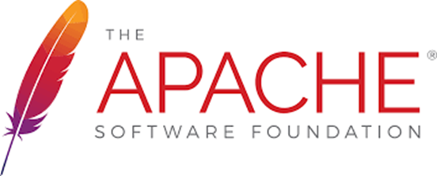

openEuler Developer Day 2023 （简称 ODD 2023）是由 openEuler
社区发起并举办的年度开发者大会。旨在推动 openEuler
在多样性计算、云计算、边缘计算、服务器、嵌入式、开源硬件以及安全、迁移、运维等技术方向的持续探索和创新。

本次ODD大会，openEuler社区非常荣幸能够邀请到Apache软件基金会，并在现场设置Apache软件基金会展台。未来openEuler将与Apache软件基金会展开进一步的合作，共同促进开源软件项目发展。

# 关于Apache软件基金会

Apache软件基金会（也就是Apache Software
Foundation，简称为ASF），是专门为支持开源软件项目而办的一个非盈利性组织。ASF的开源软件在世界各地广泛使用，超过8,400名提交者为320多个活跃项目做出了贡献。

# 参会信息

**时间：** 4月21日  

**地点**：上海浦东嘉里酒店

如果您想现场参加Apache软件基金会展区，扫描下方二维码即可报名。

扫码报名
