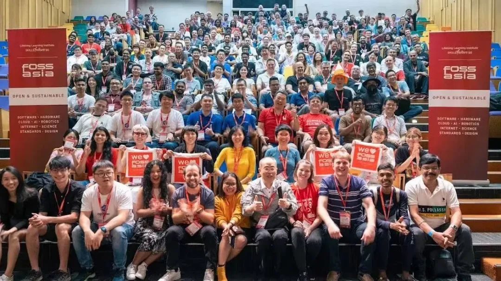
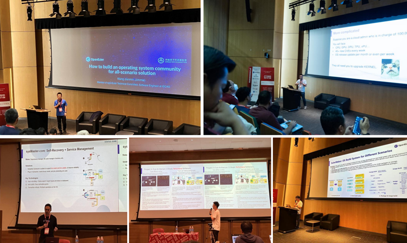
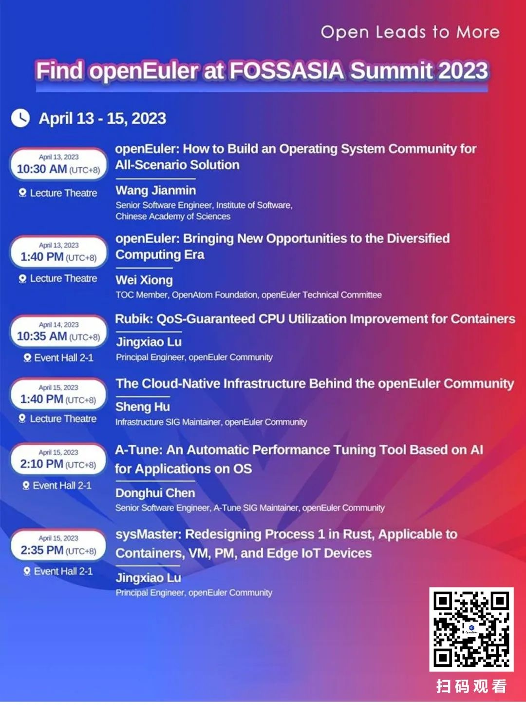
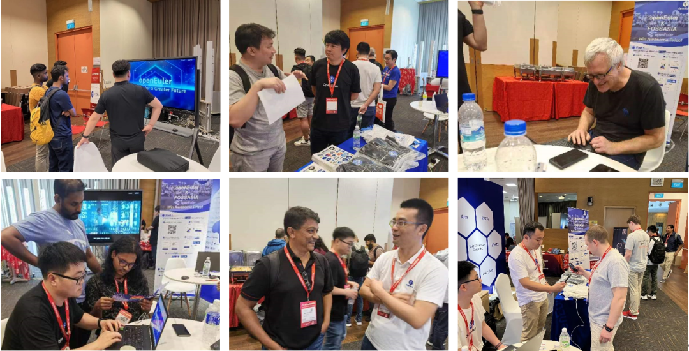
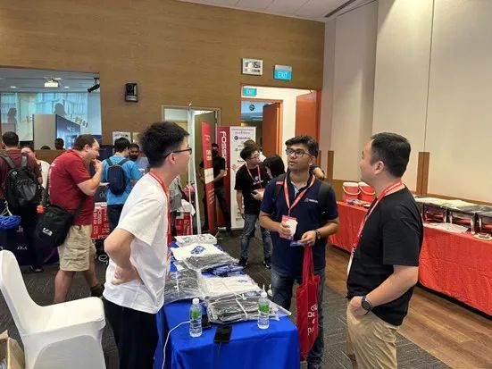
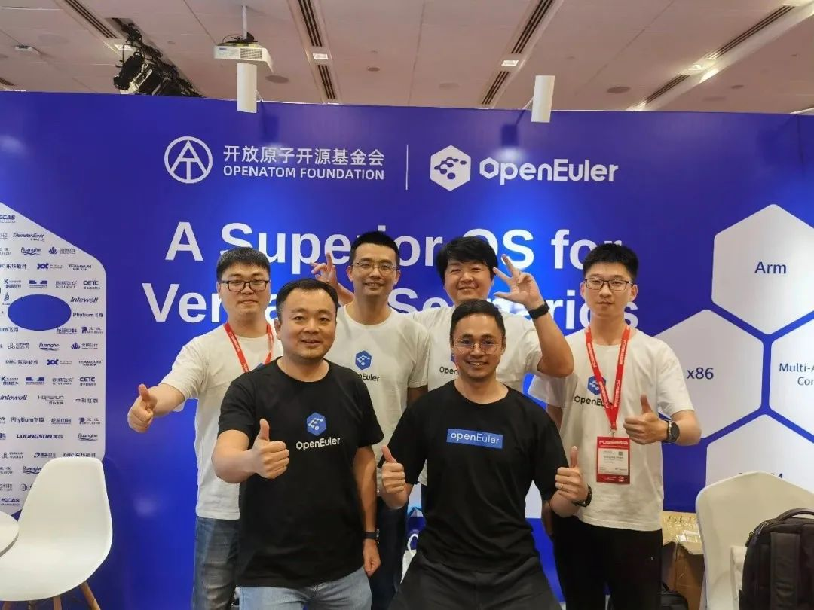

2023年4月15日，亚洲顶级开源盛会FOSSASIA Summit 2023在新加坡落幕。openEuler作为白金赞助级别参会。

自2009年成立以来，除因疫情中断3年之外，FOSSASIA
Summit已累计举办11年。作为亚洲年度开源技术旗舰活动，FOSSASIA
Summit吸引着全球开源爱好者和社区的参加。

# 出发前的忐忑，如何向当地的用户和开发者介绍自己？

openEuler项目于2019年年底开源，发展至今已构筑了关键的技术根基和创新机制，规模部署在各行各业核心系统，形成商业的正循环，基本达到同类社区的国际水平。2022年在 [OSSEU](https://mp.weixin.qq.com/s?__biz=MzI2NDE4OTE2Mg==&mid=2247496360&idx=1&sn=79f1a53f54504339fbbcea7818e0dcf5&chksm=eab2d72dddc55e3b126035264a3b3aff15ee768a9a6d26d310136acbf98151cb0cf6b62c00ed&token=2009440492&lang=zh_CN&scene=21#wechat_redirect) 上也向大家介绍过，但在亚太地区还是首次。

-   当地用户对Linux发行版的使用情况是怎么样了？

-   多样性算力的需求是否是当地用户的重点需求？

-   他们需要一个新的操作系统吗？

-   当地的开发者会有兴趣使用和贡献openEuler吗？

带着这些疑惑，openEuler技术委员会委员熊伟、王建民带队做了充分准备，6大议题涵盖社区建设、产品、技术等多个维度参加该会议。

# 惊喜，居然很多用户已经认识openEuler！

在正式会议前的筹备阶段，我们就惊喜地发现，已经有很多朋友认识openEuler。

来自RedHat开发者准确地说出了openEuler在三年前开源。来自斯里兰卡的开发者主动过来参观openEuler展区，表示早在大会前就已经开始在用openEuler。

来自俄罗斯的开发者在openEuler展区留下了联系方式，希望后续能够有更进一步的交流。来自RedHat、Debian、MySql、RT-Thread等社区开发者，也在openEuler展区驻足交流了许久，Debian社区开发者亲身体验openEuler，并现场研究起来。

▲ 前来参观openEuler展区的开发者们

大会期间，openEuler
6场精彩的演讲让现场开源朋友们充满期待和赞誉，前来openEuler展台咨询、体验交流的开发者与用户络绎不绝。

▲ openEuler议题分享结束后，现场开发者前来交流技术细节

# 我们做对了什么，能够被海外的朋友认识？

在跟他们交流的过程中，我们发现，openEuler之所以能够被大家所认识，并非偶然。

## 走"最难"的路，开源之初就坚持打造自主演进、多样性算力最优的操作系统根技术

在当今数字经济的时代下，openEuler不仅致力于打造自主演进的操作系统根技术，还将多样性算力纳入其核心目标。这意味着openEuler不仅需要支持X86，还需要支持ARM、RISC-V等多种指令集，为数字世界的全场景无缝协同提供强大的支持。

## 发起人不做商业发行版，让社区伙伴可以抓住国内服务器操作系统的市场空间

独行快，众行远。操作系统作为一个生态体系，生态的繁荣程度决定着操作系统能走多远。在openEuler发展过程中，发起人始终不做商业发行版，这一策略使得社区伙伴能够充分发挥自身优势，抓住国内服务器操作系统的市场空间。在这个过程中，中国本土服务器操作系统逐渐形成了一个独特的竞争态势，以openEuler为代表的本土服务器操作系统在国内市场占据越来越重要的地位。

## 上游优先的策略，始终处于全球主流生态

openEuler始终遵循"上游优先"的策略，紧密跟随全球主流生态。这使得openEuler能够在全球范围内保持技术竞争力，为国内企业提供了一个既符合国际标准又具备中国特色的操作系统解决方案。截止目前，openEuler已经支持高达95%的主流开源项目。

综上，openEuler的成功源于它敢于走一条与众不同的道路。作为一个免费的Linux发行版，openEuler凭借自身准确清晰的定位与独特的技术优势，秉承"共建、共享、共治"的开源理念，凝聚多种力量，吸引着世界各地的开发者不断加入共建。openEuler在内核、云原生、多样性计算、嵌入式等多方面的创新，是根据实际需求与使用痛点不断发展，也是社区成员之间不断沟通和深入合作的结果。

# 面向越来越多的国际用户，openEuler深感重任在肩。

有来自全球的这么多用户和开发者关注，openEuler深感重任在肩，我们必须服务好每一个我们知道或者不知道的开发者。

在即将召开的[openEuler Developer Day
2023](https://mp.weixin.qq.com/s?__biz=MzI2NDE4OTE2Mg==&mid=2247503137&idx=1&sn=b9b9ac4bad479d5d482c5fba23161637&chksm=eab2e8a4ddc561b2a0bdeb54aeae049f41143b958406389bcba17d8e8ada7f4f7be21e1634c9&token=2009440492&lang=zh_CN&scene=21#wechat_redirect) 上，openEuler将继续发布一系列面向全球开发者的技术：

-   支持多场景构建的EulerMaker

-   支持多个代码托管平台的软件包贡献平台

-   为开发者提供本地开发环境的EulerLauncher

-   轻量级用户软件仓库开发平台EUR

> ......

同时，openEuler将积极与Linux、Apache、OpenInfra、Eclipse等国际基金会合作，共同推进开源生态的发展。我们坚信，凭借开源精神和全球开发者的共同努力，openEuler必将迎来更加辉煌的未来。

# 相关资料

\[1\] FOSSASIA Summit 2023：

[https://eventyay.com/e/7cfe0771](https://eventyay.com/e/7cfe0771)

\[2\] 视频回顾 \| openEuler B站：

 [https://b23.tv/TwqpAuH](https://eventyay.com/e/7cfe0771)
