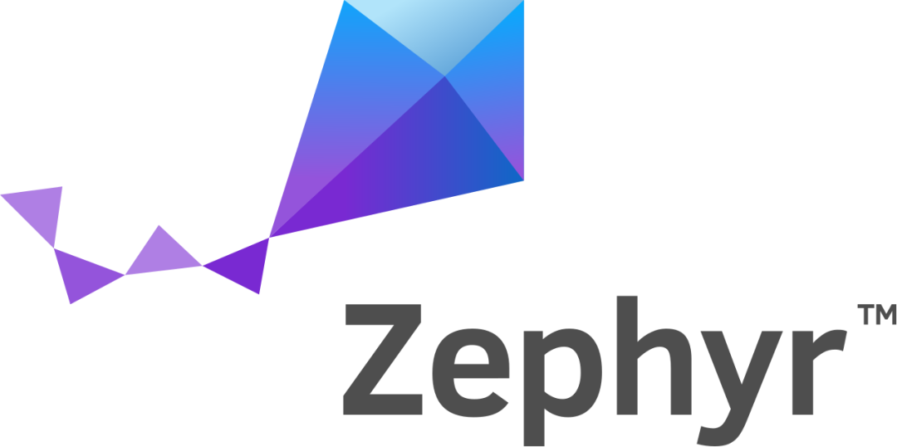

openEuler Developer Day 2023 （简称 ODD 2023）是由 openEuler
社区发起并举办的年度开发者大会。旨在推动 openEuler
在多样性计算、云计算、边缘计算、服务器、嵌入式、开源硬件以及安全、迁移、运维等技术方向的持续探索和创新。

本次ODD大会，openEuler社区非常荣幸能够邀请到Zephyr，并在现场设置Zephyr展台。未来openEuler将与Zephyr展开进一步的合作，共同促进开源操作系统的发展。

# 关于Zephyr

Zephyr是Linux基金会旗下面向物联网时代的新一代实时操作系统，支持在资源受限的系统中使用，支持多种架构。开发人员能够自己裁剪和优化。Zephyr是一个名副其实的开源项目，社区不断发展该项目，以支持新的硬件，开发工具，传感器或者设备驱动。在安全性、设备管理能力、通讯协议栈以及文件系统方面，都很有优势。

# 参会信息

**时间：** 4月21日  

**地点**：上海浦东嘉里酒店

如果您想现场参加Zephyr展区，扫描下方二维码即可报名。

扫码报名
