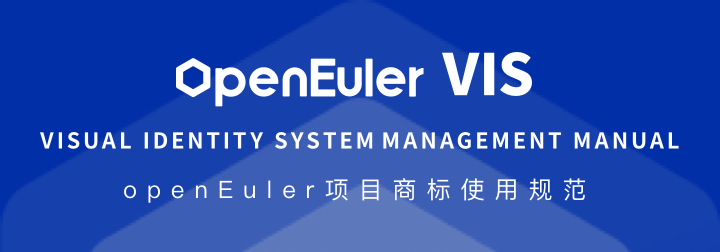
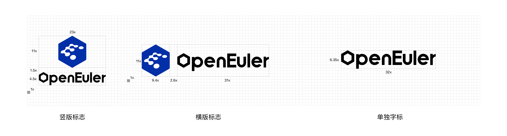
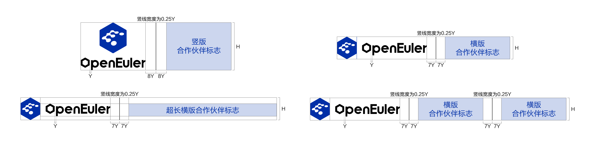

### 标志诠释

**openEuler自身定位：** 面向数字基础设施的开源操作系统，openEuler 品牌标志由图形标志和字体标志两部分组成。

**图形标志：** 由水滴形状字母 E 和六边形构成。

**水滴形状字母E：** E代表Euler，科学家 Euler 通过推动数学与物理的碰撞融合，带来改变世界的力量；而定位面向数字基础设施开源操作系统的 openEuler，希望通过开源开放，汇聚更多力量，不断探索科技创新的边界，驱动物理世界与数字世界的深度融合，构建万物互联的智能世界。

**六边形：** 从欧拉定律抽象而来，六边形是自然界最稳固的结构之一，象征 openEuler 操作系统的可靠、稳定、安全特性；同时，六边形具有朝向六方无限扩展的特点，象征 openEuler 以开源开放为原则，驱动无止境的创新与拓展。

**字体标志：** 将 openEuler 图形化，其中字母 O 以六边形来呈现，确保单独使用时也能体现 openEuler 开源开放、无止境创新与拓展的原则与目标。openEuler 标志颜色是克莱因蓝与黑色和白色的结合，克莱因蓝是更为纯粹的蓝色，象征开源开放无止境，也象征 openEuler 希望源源不断的注入科技创新力，联合所有伙伴共赴科技创新的星辰大海。

### 标志形态

**标准标志：** 图形标志与字体标志的组合是 openEuler 的标准标志，代表 openEuler 操作系统和开源社区，适用于介绍 openEuler 品牌营销物料，例如平面广告、社区网站、线上海报等。在所有标志的使用中，务必确保使用标志源文件，不得自行创造、设计、调整标志。单独字标：适用于介绍 openEuler 操作系统产品，以及品牌视频尾板定帧。图形标志不可单独使用。

**单独图标：** 适用于礼品定制等物料制作。

### 标志网格的正确比例

标志是一个平衡的整体，使用中不得改变其形状、结构和比例。六边形标志圆角半径为0.04*六边形宽度。

**竖版标志：** 设定标志图标的高度为17x,标志的宽度为23x,字标中O为六边形，E为大写字母，字标与图标的距离1.5x。

**横版标志：** 设定标志图标的高度为11x,标志图标的宽度为43x,字标中O为六边形，E为大写字母，字标与图标的距离2.6x。

### 标志的最小尺寸和空间保护

标志的四周设置有最小保护空间，该空间不能与其他图形元素连接。最小尺寸的设置是为了确保标志使用过程中的品质，使其清晰、易识别。

**保护空间原则：** 示例中设定字标首字母“O”的高度为x,竖版和横版标志的安全距离为x。

**最小尺寸使用原则：** 竖版标志的最小打印尺寸为长度17mm,最小数码尺寸为50px。横版标志的最小打印尺寸为长度35mm,最小数码尺寸为100px。单独字标的最小打印尺寸为长度25mm,最小数码尺寸为72px。单独图标的最小打印尺寸为长度11mm,最小数码尺寸为32px。

在所有标志的使用中，务必确保使用标志源文件，不得自行创造、设计标志。

### 标志颜色

列举了 openEuler 克莱因蓝标志的色彩控制，色彩模式包括 CMYK 模式、Pantone 色模式、RGB模式、网络安全色模式。

所有视觉应用设计应优先使用克莱因蓝标志，在特殊情况下可以使用单色黑、反白标志。

### 单色黑和反白标志

所有视觉应用设计优先使用克莱因蓝标志，单色黑和反白标志是对 openEuler 标志使用形式的有力补充，它适用于特定场景。

**适用场景：**

1 .适用于因材质、工艺、成本等问题不能使用克莱因蓝标志的应用场景（如周边产品、环境导视等）

2 .适用于当克莱因蓝标志与背景色冲突、识别不清晰时

3 .其他应用场景

### 联合品牌标志规范

联合品牌是指分属不同公司的两个或多个品牌的短期长期联系或组合。从视觉上看，联合品牌主要表现为多个品牌名称或标志的组合形式，华为公司内部的产品名称、部门名称、活动名称等，与 openEuler 品牌的关系不属于联合品牌，请勿套用本页联合品牌标志的规范。

**联合品牌标志规范：**

1 .当合作伙伴标志为竖版时，openEuler 标志使用竖版；当合作伙伴标志为横版时，openEuler 标志使用横版

2 .当华为是展会等相关活动主办方时，openEuler 标志位于合作伙标志的左侧；当主办方是合作伙伴或行业协会等时，openEuler 标志的摆放位置需遵循对方的相关规范或双方的合作协议；如合作伙伴对联合品牌标志无明确定义时，合作伙伴的标志可置于 openEuler 标志的左侧

3 .合作伙伴标志高度与 openEuler 标志的高度相等

4 .在联合品牌标志中，如合作伙伴和场景条件允许，联合品牌标志优先放在版面的右下角，和本手册中 openEuler 标志优先置于版面右下角的规范保持一致

5 .合作公司标志与 openEuler 标志两者间必须使用竖线隔开，竖线与标志高度相等，具体比例关系参看下图示例

### 标志的错误用法

openEuler 标志的比例、颜色以及图形是经过精心考虑的，在任何情况下都不得改变。在标志的使用中，务必确保使用标志源文件，不得自行创造、设计标志。

A、改变了标志的颤色

B、改变了 "openEuler" 字标字体

C、压缩、拉伸了标志形状

D、改变了图标与字标的位置与比例关系

E、部门名称、活动名称、业务名称等和 openEuler 标志绑定使用（当添加的名称与标志距离小于标志图标高度时视为绑定使用）

F、改变了六边形标志圆角半径

G、过度使用标志，将 openEuler 标志用作装饰元素

H、把标志放置于任何轮廓或色块中

